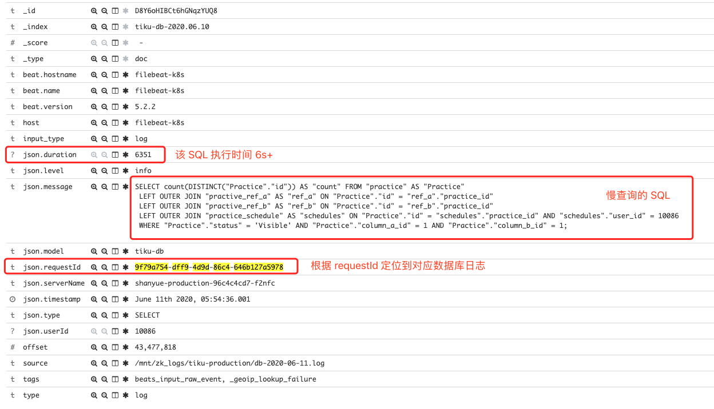

date: 2020-04-10 14:00

---

# ORM 层分页查询过慢优化

这是山月修改的第三千七百六十五个bug

## 情景再现

今天产品在生产环境例行巡视并且与往常一样点点点时，发现某一页数据加载过慢，于是照例找到了我。

借助于山月我自己搭建的高效率的性能查询平台，很快就根据慢接口的 API 与 requestId 定位到了瓶颈相关 SQL，并分析如下。

相关 API 是关于请求数据库某资源的分页数据，但并不是 offset 过大问题，而问题出现在 ORM 生成的 SQL 上。

## 捉虫



该 API 请求资源 `Practice` 分页数据，在 `ORM` 层使用了 `sequelize`，并通过 `findAndCountAll` 获取资源总数及列表。

``` js
Practice.findAndCountAll({
  where: {
    status: 'Visible',
    column_a_id: 1,
    column_b_id: 1
  },
  distinct: true,
  include: [{
    model: PracticeRef
  }, {
    model: PracticeSchedule
  }],
  limit: 0,
  offset: 10
})
```

由上可见，`Practice` 资源关联了四个表，从日志中可以得知生成的 `SQL` 如下

``` sql
SELECT count(DISTINCT("Practice"."id")) AS "count" FROM "practice" AS "Practice"
LEFT OUTER JOIN "practice_ref" AS "ref" ON "Practice"."id" = "ref"."practice_id"
LEFT OUTER JOIN "practice_schedule" AS "schedules" ON "Practice"."id" = "schedules"."practice_id" AND "schedules"."user_id" = 10086
WHERE "Practice"."status" = 'Visible' AND "Practice"."column_a_id" = 1 AND "Practice"."column_b_id" = 1;
```

通过 `exaplain` 分析，发现 `schedule` 全表扫描，导致 `totalCost` 过大，从执行计划还可以看出与 schedules 表关联还没有索引，造成数据索引时间过长

``` sql
+-------------------------------------------------------------------------------------------------------------------------+
| QUERY PLAN                                                                                                              |
|-------------------------------------------------------------------------------------------------------------------------|
| Limit  (cost=14500.36..14500.38 rows=1 width=4)                                                                         |
|   ->  Aggregate  (cost=14500.36..14500.38 rows=1 width=4)                                                               |
|         ->  Nested Loop Left Join  (cost=0.29..14500.36 rows=2 width=4)                                                 |
|               ->  Nested Loop Left Join  (cost=0.00..14496.02 rows=1 width=4)                                           |
|                     Join Filter: ("Practice".id = schedules.practice_id)                                                |
|                     ->  Seq Scan on practice "Practice"  (cost=0.00..561.19 rows=1 width=4)                             |
|                           Filter: (((status)::text = 'Visible'::text) AND (subject_id = 1) AND (topic_id = 111))        |
|                     ->  Seq Scan on practice_schedule schedules  (cost=0.00..13934.06 rows=61 width=4)                           |
|                           Filter: (user_id = 7411238)                                                                   |
|               ->  Index Only Scan using ref_practice_index on practice_ref ref (cost=0.29..4.32 rows=2 width=4) |
|                     Index Cond: (practice_id = "Practice".id)                                                           |
+-------------------------------------------------------------------------------------------------------------------------+
EXPLAIN
```

``` sql
+-------------------------------------------------------------------------------------------------------------------+
| QUERY PLAN                                                                                                        |
|-------------------------------------------------------------------------------------------------------------------|
| Aggregate  (cost=1118.39..1118.40 rows=1 width=4)                                                                 |
|   ->  Nested Loop Left Join  (cost=6.01..1118.38 rows=2 width=4)                                                  |
|         ->  Nested Loop Left Join  (cost=5.72..1114.04 rows=1 width=4)                                            |
|               ->  Seq Scan on practice "Practice"  (cost=0.00..520.80 rows=1 width=4)                             |
|                     Filter: (((status)::text = 'Visible'::text) AND (subject_id = 1) AND (topic_id = 111))        |
|               ->  Bitmap Heap Scan on schedule schedules  (cost=5.72..593.23 rows=1 width=4)                      |
|                     Recheck Cond: ("Practice".id = practice_id)                                                   |
|                     Filter: (user_id = 7411238)                                                                   |
|                     ->  Bitmap Index Scan on schedule_practice_id_idx  (cost=0.00..5.72 rows=173 width=0)         |
|                           Index Cond: ("Practice".id = practice_id)                                               |
|         ->  Index Only Scan using question_practice_index on question questions  (cost=0.29..4.32 rows=2 width=4) |
|               Index Cond: (practice_id = "Practice".id)                                                           |
+-------------------------------------------------------------------------------------------------------------------+
```

``` sql
+----------------------------------------------------------------------------------------------------------------------------------+
| QUERY PLAN                                                                                                                       |
|----------------------------------------------------------------------------------------------------------------------------------|
| Aggregate  (cost=533.60..533.61 rows=1 width=4)                                                                                  |
|   ->  Nested Loop Left Join  (cost=0.71..533.60 rows=2 width=4)                                                                  |
|         ->  Nested Loop Left Join  (cost=0.42..529.26 rows=1 width=4)                                                            |
|               ->  Seq Scan on practice "Practice"  (cost=0.00..520.80 rows=1 width=4)                                            |
|                     Filter: (((status)::text = 'Visible'::text) AND (subject_id = 1) AND (topic_id = 111))                       |
|               ->  Index Only Scan using schedule_practice_id_user_id_idx on schedule schedules  (cost=0.42..8.45 rows=1 width=4) |
|                     Index Cond: ((practice_id = "Practice".id) AND (user_id = 7411238))                                          |
|         ->  Index Only Scan using question_practice_index on question questions  (cost=0.29..4.32 rows=2 width=4)                |
|               Index Cond: (practice_id = "Practice".id)                                                                          |
+----------------------------------------------------------------------------------------------------------------------------------+
```

0.01s

``` sql
+----------------------------------------------------------------------------------------------------------------------------------+
| QUERY PLAN                                                                                                                       |
|----------------------------------------------------------------------------------------------------------------------------------|
| Aggregate  (cost=21.11..21.12 rows=1 width=4)                                                                                    |
|   ->  Nested Loop Left Join  (cost=1.00..21.10 rows=2 width=4)                                                                   |
|         ->  Nested Loop Left Join  (cost=0.71..16.76 rows=1 width=4)                                                             |
|               ->  Index Scan using practice_subject_id_topic_id_idx on practice "Practice"  (cost=0.29..8.31 rows=1 width=4)     |
|                     Index Cond: ((subject_id = 1) AND (topic_id = 111))                                                          |
|                     Filter: ((status)::text = 'Visible'::text)                                                                   |
|               ->  Index Only Scan using schedule_practice_id_user_id_idx on schedule schedules  (cost=0.42..8.45 rows=1 width=4) |
|                     Index Cond: ((practice_id = "Practice".id) AND (user_id = 7411238))                                          |
|         ->  Index Only Scan using question_practice_index on question questions  (cost=0.29..4.32 rows=2 width=4)                |
|               Index Cond: (practice_id = "Practice".id)                                                                          |
+----------------------------------------------------------------------------------------------------------------------------------+
```

然而实际上呢，我们只需要一个 `count` 聚合函数用来获取分页的总页数

1. `dinstinct practice.id`，表明无需关心关联表的个数
1. `where` 全在 `practice` 表上，表明只需要查询 `practice`

因此，我们完全可以只在 `Practice` 表中进行 `count` 查询

``` sql
+------------------------------------------------------------------------------------------------------------------+
| QUERY PLAN                                                                                                       |
|------------------------------------------------------------------------------------------------------------------|
| Aggregate  (cost=8.31..8.32 rows=1 width=4)                                                                      |
|   ->  Index Scan using practice_subject_id_topic_id_idx on practice "Practice"  (cost=0.29..8.31 rows=1 width=4) |
|         Index Cond: ((subject_id = 1) AND (topic_id = 111))                                                      |
|         Filter: ((status)::text = 'Visible'::text)                                                               |
+------------------------------------------------------------------------------------------------------------------+
```

## 解决


通过 ORM 把 `findAndCountAll` 分为两个 API 分别查询

``` js
const records = await Practice.findAll()
const count = await Practice.count()
```

优化后的查询如下，大幅度解决了查询速度

``` sql
SELECT count(DISTINCT("Practice"."id")) AS "count" FROM "practice" AS "Practice"
WHERE "Practice"."status" = 'Visible' AND "Practice"."column_a_id" = 1 AND "Practice"."column_b_id" = 1;
```

## 反思

> 明者远见于未萌，而智者避危于未形。

## 总结

1. 基础运维建设可以大幅提高工作效率，如无法查找某条 API 请求
1. `findAndCountAll` 有时可单独对 `count` 进行优化
1. 养成使用 `explain` 优化数据库的习惯，并了解常用的 `Index` 及 `Scan Type`
