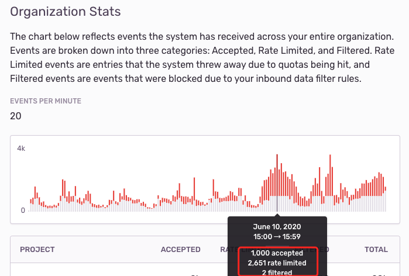
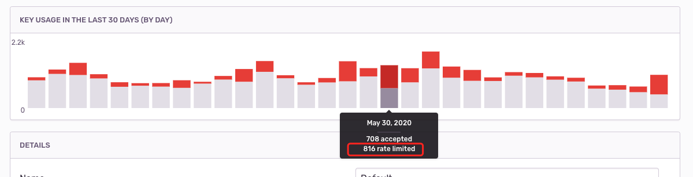

# Sentry 异常上报失败与 429 问题

这是一个在优化前端异常上报时出现的问题

> 山月人肉盯着异常报了半个小时，但是在 Sentry 中仍然没有收到一条报错，郁闷不已，反复踌躇徘徊。喝一杯水后顿悟，然后发现了那条 http 状态码为 429 的异常上报请求。

## 捉虫

刚开始碰到 Sentry 中未收到报错 (Event) 时，一直在尝试去找 Sentry 服务器端的 `Inbound Filter` 设置以及 Sentry 客户端的 `beforeSend` 设置，这两个均与 `Event` 的过滤有关。以致于耽搁了半个小时。

**日志是排查问题时最重要的线索！！！**

后来回过神来，在控制台网络中找到了 http 429 的这条请求，而 429 的描述语为 `Too Many Requests`。出现了 429，往往代表着 API 被限流了。

## 原因

在 Sentry 上对于异常上报设置了 `Rate Limit`，每小时最多只能上报 1000 个Event，导致许多异常被丢弃。

**图中红色的部分是丢弃的 Event，可以看出丢弃的比捕捉到的更要多！**

## 解决

基于以往上报及丢弃的 Event 数量，往大调整 `Rate Limit`

## 总结

1. 还好这次问题暴露在前端的 Sentry 上报，可以很方便地通过 `devtools -> network` 来查询日志，如果本次是后端上报异常的话，就会较难调试，可能得用上一天时间
1. **对 Sentry 此类异常上报系统，作为业务层重要的基础设施，还是要多一分熟悉，平时才能更好地定位 Bug**

## 反思

关于异常监控系统，很多开发同学往往只注重如何去上报，但这远远不够！因为只注重如何去上报只是异常上报链路中的一个生产侧，不谋全局者不足谋一域。此时开发更应该在更高的角度去思考：

1. 每个异常有没有都上报上去，会不会被限流或其他原因(如磁盘满了)被丢弃掉
1. 每个异常上报上去后，如何去设计 Alert 规则：邮箱还是钉钉？警告要触发吗？

## 拓展

这里拓展一些关于异常上报的注意点，关于 Sentry 异常上报信息有三大关键字段及两大核心概念

三大关键字段指：

1. `Tags`，也可以认为是 `Index`，作为索引，方便查询。如 userId，errorCode 前端还会涉及到浏览器及一些业务相关要素。
1. `Stack`，异常堆栈，方便在异常系统直接定位代码
1. `Context`，相关上下文信息，如发请求的 `url` 及 `body`，执行数据库查询的 `sql` 等

两大核心概念：

1. `Event`，报一次错就是一个 `Event`
1. `Issue`，如一个 Bug 导致了 N 次 Event，则会聚合为一个 `Issue`，关于聚合算法，会根据 `fingerprint` 来辨别

如果以上这些做好了，无论采用 `ElaticSearch` 还是 `Sentry` 做异常上报都是无关紧要的。

> 好吧，其实还是有很大不一样的，比如 Sentry 作为专一的异常上报系统，则会有更好的 Alert，而 ES 做 Alert 就很难了。且 Sentry 对 User Feedback，Event Group，Bug workflow 及与 jira，gitlab 的集成更好。

关于 `Node` 服务端的异常上报可以参考我以前的文章：

1. [Node 异常结构化与上报](https://shanyue.tech/node/error.html)
