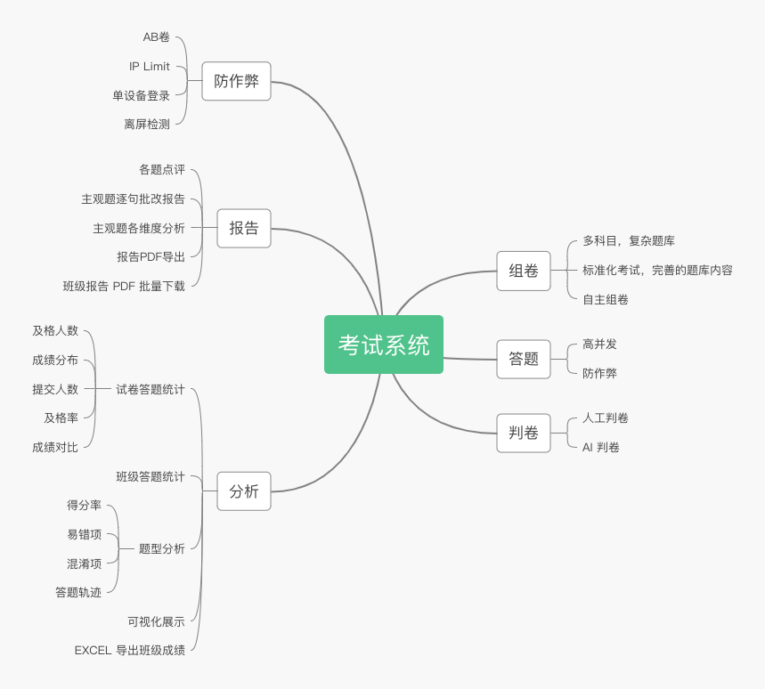
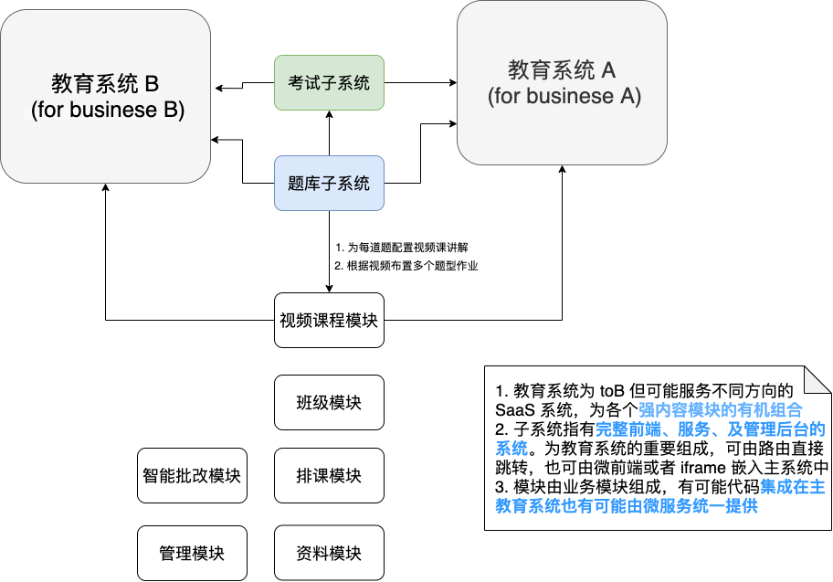
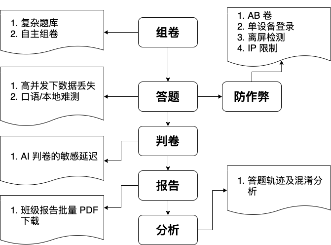
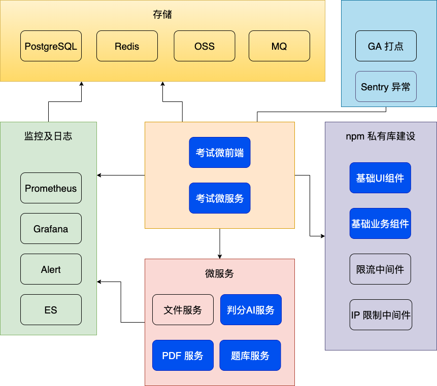
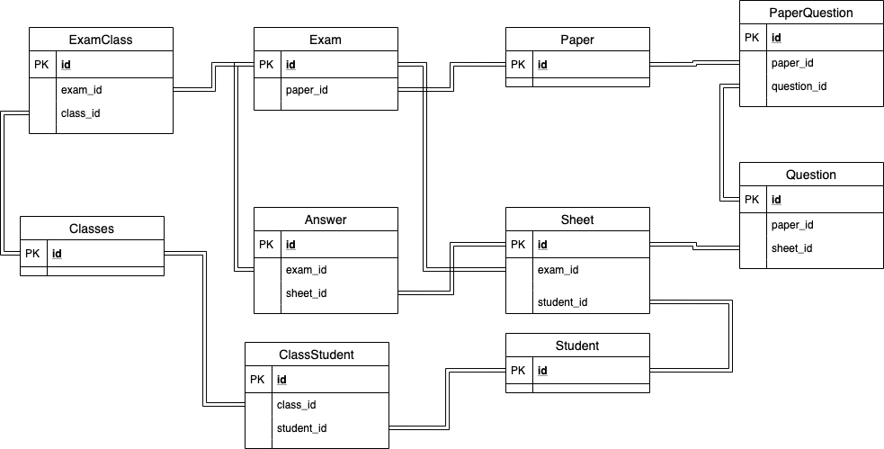
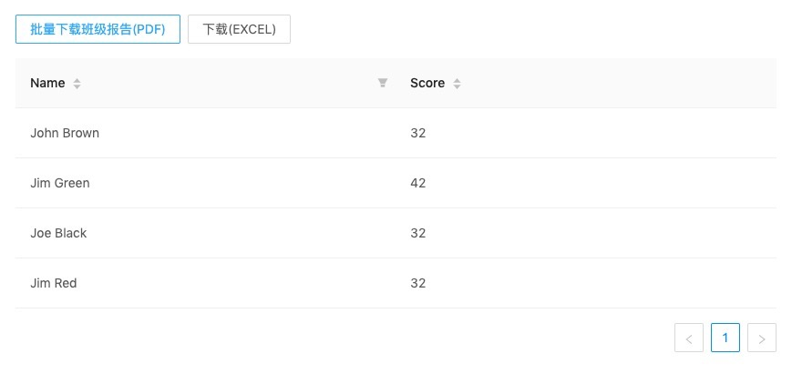
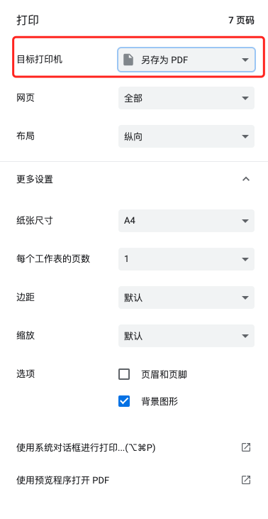

date: 2020-06-21 19:32

---

# 在线教育中技术与业务疑难问题之考试系统

[ toc ]

我在一家在线教育公司有一两年的时间，精力都投入到了考试系统的设计上。

对于考试系统这个产品，无论从各方面来讲，都有一些小小的收获。于是抽时间回顾并写了下来，希望对后来人有所裨益。由于我司偏英语教育，因此试举例时也偏向英语教育

> 东坡云："事如春梦了无痕"，苟不记之笔墨，未免有辜彼苍之厚。

## 概述

### 导图



### 考试系统在主系统中的位置



### 业务技术难点梳理



### 技术架构



## 总结

### 业务

1. 线上考试系统致力于高校/中小学信息化建设，可以为教学减负
1. 线上考试系统是 toB 教育系统的一个子模块，需要抽离出来，做成微前端为服务，赋能与集团内各个教育系统 (嵌入页面，或直接跳入考试系统)
1. 教育系统除了线上考试子系统的模块，还可以有课程、作业、题库、知识库等内容模块。各个子模块按照权重自由组合可构成不同的教育系统
1. 教育系统可以按照账号数(并发数)或模块数收费
1. 考试业务次数少、并发大、时间集中并有固定场地
1. 考试组卷基于题库系统，需要自主组卷
1. ...答题过程见脑图
1. 考试系统可以与智能硬件结合
1. 考试系统可以直接从 word/图片 作为试卷，全部视为主观题
1. 考试系统需要注意内容与教研积累，避免文档类工具侵入
1. 考试系统部分功能可移到小程序，如加入班级，扫码考试

### 技术

1. 答题时高并发需要注意缓存、异步、消息队列、服务降级及熔断
1. 答题时高并发写需要注意测试数据库是否抗的住，如果可以，则跳过，如果不可以，则升级或者扔消息队列
1. 云数据库注意最高连接数多少，避免考试答题时写库拒绝
1. 防作弊发现作弊时禁止页面中做题，而非强制提交，方便老师确认作弊或解冻
1. 答题时并发数控制基于 `redis zset` 中的 `zrangebyscore`，每次答题写入用户的 `userId` 或者 `fingerprint`
1. 答题时只用户单设备登录，此时使用浏览器 `fingerprint` 辨认，在每次答题时服务端确认
1. 用户的浏览器指纹基于 `fingerprintjs2` 生成，考试换机器时会失效，此时需要老师解冻
1. 防作弊离屏检测基于离屏次数与离屏时间，可以通过 `blur/focus` 事件监听，并与 `FullScreen API` 结合
1. 防作弊离屏检测需要统一机房，防止流氓软件弹框被视为作弊
1. 机房统一考试环境可以通过 `IP whitelist` 方式防作弊
1. 防作弊 AB 卷采用打乱题号的方式防止作弊
1. 考试完成后要注意主观题判卷服务的高并发，注意缓存、异步、消息队列及熔断
1. 判卷完成后要注意pdf服务生成报告的高并发，注意缓存、异步、消息队列及熔断
1. 判卷服务与pdf服务注意弹性扩容，比如 `k8s` 中的 `HPA`
1. 答题分析时注意混淆项和答题轨迹的业务逻辑
1. excel 导出时使用前端导出(前端表格与导出格式一致)，使用库  [sheetjs](https://github.com/SheetJS/sheetjs)
1. 报告与分析完成后需要向老师学生发送邮件，邮件需要扔到消息队列
1. 丰富样式的邮件没法使用外部 `css`，此时需要使用 `juice` 来完成这一操作

## 线上考试的业务价值及中学高校信息化建设

我中学时代班级教室里刚进了一台电脑，投影仪及大屏幕，黑板教学转化为更丰富的多媒体的 PPT 教学。

考试系统的业务价值在与对教育的升级及补充，如同我十年前的班级中的电脑与投影仪。线上考试大大降低了线下考试的繁琐及复杂，并减轻了老师的负担。

而在国家政策中，《教育信息化“十三五”规划》再次强调，“要加强信息化专业队伍建设，确保各级各类学校信息化管理与服务工作得到落实”，因此一些高些也能因此受到国家拨款。

信息化建设主要体现在管理，教学上。在管理上有很多网络厂商及硬件厂商入驻，而在教学上，软件公司可以分一杯羹，在线考试属于教学的一部分，这也是服从于国家政策，服从于高校及中学的信息化建设。

## 目标用户：toB (or toC)

考试系统这一产品形态便注定它的场景大部分在 toB (business) 场景。

从上一部分的业务价值分析到它的场景大都在于学校，服务于学校的信息化建设。

那是不是也可以作用于更多的，非院校，弱组织重个人的考试，如成人自考，考研(可卖给培训机构)，四六级，计算机二级考试等。

换一句话说，是否可以把考试添加一种新的类型称之为模考，可从严格的定时定点并推广给广大的 C 端用户？但随之而来的新的挑战是：

1. 技术。更多的考试类型在技术上需要适配更通用的题库
1. 教研。更多的考试类型，可能需要额外的科目教研老师。但一般来讲，在线教育公司是重科目划分的 (或者重年龄单划分)
1. 运营及转化。C 端往往需要有运营来拉新留存转化，那转化的目标在哪里？在线教育公司转化一般指拉人培训，而非收会员。
1. 客单价。C 端的客单价实在是不值钱...

## 考试

考试，几乎所有人都经过中考高考的洗礼，所有人对它都非常熟悉，甚至痛恨与恐惧。

这一点很好，这是所有人都熟悉的业务，每个人都曾是该业务的用户，每个人都能对业务此添上一嘴，并很有可能提出****的建设性意见。

先来说一说考试的特点

1. 次数少。每年两次考试，因此我们作为开发来讲，一般大忙都在期末
1. 科目多。中学有语数外理化生政史地九门，大学有高数英语及各种专业课考试，题型及科目的多样性注定了它的题库复杂。科目多则体型杂，体型杂则数据结构化复杂，填空、单选、多选等客观题需要给出，数学推断，英语作文，英语口语及翻译。雅思多选与托佛多选的判分不一致
1. 标准化考试。标准化考试，就有标准题型，一致的判分准则。**标准化考试也需要相应的题库内容，比如历史四六级，历届高考**
1. 高并发。高并发没有绝对之分，只有相对而言。**当期末多个学校、院系统一考试几千人甚至几万人同时答题**，并且学生试卷答案实时提交，主观题几乎是有所改动就要提交一次，会对服务器造成过大的压力
1. 固定场地。线上会在机房进行统一考试，并且有监考老师巡场
1. 机房考试。可以使用最新的 Chrome，减少兼容性问题

关于这点，将在以下对他们的技术及业务层面展开讨论

## 考试系统，题库系统及大教学系统

考试系统及题库系统作为主教育系统的重要内容模块角色呈现，**教育系统是重内容及重服务的一个系统，而题库及考试系统更是构成它的重要组成部分**。

1. 教育系统为 toB 但可能服务不同方向的 SaaS 系统，为各个强内容模块的有机组合
2. 子系统指有完整前端、服务、及管理后台的系统。为教育系统的重要组成，可由路由直接跳转，也可由微前端或者 iframe 嵌入主系统中
3. 模块由业务模块组成，有可能代码集成在主教育系统也有可能由微服务统一提供

以下是各模块的联系：


## 考试的业务分析

关于考试的整场流程，可以分为以下五个大步骤

+ 组卷: 从题库组卷。设置题目，分数，答案，试题分析等
+ 考试: 根据试卷可以发布多次考试，考试可布置为多个院系班级。设置开考时间，考试时长，交卷时长限制，学生查成绩时间，迟到禁答时间，防作弊设置等
+ 防作弊: 防作弊的手段，一般包括 IP 限制，账号单设备限制，离屏检测，AB 卷四个方面，并支持防作弊检测失误的补偿方案
+ 判卷及报告: 客观题自动判卷，主观题 AI 判卷或人工判卷，判卷后可生成报告，可对班级报告进行 Excel 及 PDF 批量下载。
+ 分析: 对班级及试卷进行分析，如及格率，分数正态分布，题目错误率，试卷易错题，题目易错项，题目混淆项，答题轨迹等，并生成 Dashboard 进行可视化展示，并支持 PDF 及 EXCEL 下载

## 关于考试系统的表与关系

核心表及关系如下

+ `Paper`: 试卷
+ `Exam`: 考试，一份试卷可以生成多次考试
+ `Classes`: 班级，一份考试可布置在多个班级当中，一个班级可以有多份考试
+ `Student`: 学生，一个班级有多个学生，一个学生也可在多个班级，一个学生对一份考试会生成一份答卷
+ `Sheet`: 答卷，某学生关于某考试的答题卡
+ `Question`: 问题，某一个试卷由多道题目组成，可能有多层嵌套。
+ `Answer`: 答题，答题卡上关于某问题的答案

以上就是关于考试系统的所有表及关系，这有助于梳理业务及对以下在真实场景中遇到的问题进行讲解，ER 图如下



## 科目分裂、题库及通用考试系统

正因为有多个科目，基于结构化的题库系统，**做一套通用的考试系统的本质是做一套通用的题库系统**

如对于数学而言

当然，更复杂的情形可参考我关于题库系统的文章

> 关于考试背后的题库系统，对于教育公司是相当重要的基础支撑服务，可参考我以前的文章分析

## 考试及其用户并发数限制的技术实现

**一些 toB 的产品一般拿机构用户数及用户并发数作为卖点**，机构用户数用一条 SQL 即可实现

而并发数限制可以用 `redis` 中 `zset` 实现，**不过个人感觉并发数限制是个 ROI 低并且费力不讨好的伪需求**

> 此时略有瑕疵，使用 userId 作为标志，可以考虑使用用户端传过来的 `fingerprint`

``` js
// 当一个用户访问接口时
await redis.zadd(`Organization:${organizationId}:concurrent`, Date.now(), `User:${fingerprint}`)

// 查询当前机构的并发数
// 通过查询一分钟内的活跃用户来确认并发数
const count = await redis.zrangebyscore(`Organization:${organizationId}:concurrent`, Date.now() - 1000 * 60, Date.now())
```

## 防作弊，技术、业务与用户(学生)的折中

从中学到大学，每次考试总会听说有几个考试作弊的，对于考试作弊的手段也屡见不鲜。

但是线上的作弊手段比线下更繁杂，更新颖以及更容易。以下是我在做考试系统时经常能够看到的场景

1. 学生百度答案
1. 场外学生替考
1. 学生互传答案

**但是增加技术或业务的复杂性的同时，也会带来更多的问题** ，考试系统的防作弊有时会带来一些副作用

### 避免百度：离屏检测

对于离屏检测的设置可以总结为两个方面，次数及时间

+ 离屏五次
+ 并且累计离屏时间超过三分钟

满足以上条件则判为作弊

### 离屏检测前端技术实现

在伟大的开放的浏览器环境下，可以通过浏览器事件以下几类事件监听离屏

+ `visibilitychange`: 刷新时会触发
+ `blur/focus`: 打开 devtools 时会触发

对于离屏检测也有基本的需求

1. 切标签页及切换屏幕视为离屏
1. 刷新页面不视为离屏
1. 打开 devtools 视为离屏

``` js
window.addEventListener('focus', () => console.log('FOCUS'));
window.addEventListener('blur', () => console.log('BLUR'));

document.addEventListener('visibilitychange', () => {
  console.log('VISIBILITY', document.visibilityState)
});
```

**因此关于离屏检测的事件选择 `blur/focus`**

但是它有一个致命的问题！**当你开两个浏览器，一边一半。一边做题，一边百度，这是无法被检测到的，那怎么办？**

**全屏**

### 离屏检测扩展：全屏事件及进一步问题

关于全屏也有一个浏览器的 API 及事件: `FullScreen API`，虽然 API 兼容性不太好，但是对于机房环境也是足够了的。

如此之来便没有问题了吗？如果你电脑上有各种流氓软件，时时会弹出一些推送，点过去也会视为离屏，因此需要做到以下两点：

1. 统一的考试环境
1. 卸掉不必要的插件

总结下离屏检测的技术实现

1. `FullScreen API` 全屏答卷
1. `blur/focus` 离屏检测
1. 强统一的考试环境，避免各种插件的悬浮框

### 避免替考：IP 限制

如果对某场考试屏蔽了考场外 IP 地址，则场外替考变成了不可能

此时只需要写一个关于白名单的中间件就可以解决问题，伪代码如下

``` js
app.get('/exams/:id', IPWhiteListMiddle({ rule: ['XXX.XXX.XXX.XXX'] }))
```

这其中涉及到两个问题

### 如何获取客户端 IP

在 `koa` 及 `express` 中均有 api 可直接获取 IP，这里仅稍微介绍下原理

如果有 x-forwarded-for 的请求头，则取其中的第一个 IP，否则取建立连接 socket 的 remoteAddr。

而 x-forwarded-for 基本已成为了基于 proxy 的标准HTTP头，格式如下，可见第一个 IP 代表其真实的 IP

``` bash
X-Forwarded-For: 203.0.113.195, 70.41.3.18, 150.172.238.178
X-Forwarded-For: <client>, <proxy1>, <proxy2>
```

[在服务端应用中如何获得客户端 IP](https://github.com/shfshanyue/Daily-Question/issues/288)

### 支持 IP CIDR

[ip](https://www.npmjs.com/package/ip) 这个库支持 IP 的多种格式，周下载量几百万，并且无任何依赖，可放心使用

``` js
ip.cidrSubnet('192.168.1.134/26').contains('192.168.1.190') // true
```

### 避免替考：单设备

为了避免学生考试替考，当考生在场外有人替答时，在考场本人的电脑上显示整屏并且醒目的提示语，使得老师巡考时就能够发现该学生作弊。

1. 创建学生答题卡时，在 redis 中存入该答题卡对应的用户 token (答题卡是某学生针对某次考试的唯一记录)
1. 每次学生答题时，对比 token 是否一致

**当然 `token` 是可以共享的，严格意义上来说也有可能导致并非真正的单设备登录，此时可以替换为 `fingerprint`**

``` js
// 获取浏览器的指纹信息与用户的 token，共同组成 fingerprint
const fp = ctx.fingerprint + ctx.token

// 当创建学生答题卡时，存入该学生的 fingerprint
await redis.set(`Sheet:1285`, fp)

// 每次提交答案时，对比此时的 fingerprint 与数据库中是否对应
const lastFp = await redis.get(`Sheet:1285`)
if (fp !== lastFp) {

}
```

#### fingerprint

> 如何在浏览器获取唯一标识 `fingerprint` 呢？

越常见的需求就有越成熟的解决方案，在 github 中可以使用 [fingerprintjs2](https://github.com/fingerprintjs/fingerprintjs2) 来获取浏览器指纹信息，原理根据如下条件判断

1. UserAgent
1. WebGL
1. Canvas
1. 关于新型API的支持程度

### 避免传答案：AB卷

AB 卷并非指两套不同的卷子，而是指以下两方面的混淆，用以保证每个学生收到的考试卷子都是不一样的

1. 小题顺序混淆
1. 选择题选项顺序混淆

至于技术上的实现就相当简单了，在 `lodash` 中只需要一行代码

``` js
_.shuffle([1, 2, 3, 4]);
```

### 反作弊：补偿措施

**当机器发现学生作弊时，弹出不可作答的界面，而非强制交卷**，如果监考老师发现可以继续作答时

可在教师端进行操作解除限制

1. 清空离屏次数
1. 清空离屏时间
1. 清空单设备 Fingerprint/Token

## 答题优化：拍照答题

题目分为客观题及主观题，对于主观题来说，特别是数学类主观题来说线上答题特别复杂，如果能在纸上写再传到答题卡中就很方便

1. 数学等不好线上答题题型
1. 人工判卷给分

## 补考: 考试故障的兜底方案

如果考试过程中，某学生因设备问题或技术问题导致答案未提交到服务器怎么办？

让他与未及格学生一起去补考！

看，真正有效的办法总是这么简单并且充满着暴力美学。

## 自动改卷及人工改卷

### 自动改卷：AI，自研或第三方服务?

在线考试利在教师减压，一般而言客观题判分几乎不需要由老师参与，而主观题也可以通过 AI 来解放教师的生产力。在英语这门科目上，以下两种类型是需要并且能够做到人工判卷

+ 英语作文
+ 英语口语

自从几年前，SaaS 系统如雨后春笋成长起来，对于一些实力不够雄厚的小企业而言，直接购买服务相比自研是非常节省财力的一种方法。

而 AI 判卷自研，需要的成本也很高

1. 人力成本高，招人不好找
1. 机器成本高

如果非大企业，一般建议直接购买三方服务，而购买三方服务的优势也很明显

1. 成本低，相比养人与养机器而言，成本要低很多
1. 按需付费，按接口调用次数收费
1. 无需运维，所能提供的并发量也比自研大很多 (不过还是要往消息队列里扔一下)

## 考试分析: 班级分析与试卷分析

+ 易错项
+ 混淆项
+ 答题轨迹

## 考试报告分析与邮件通知

发送邮件，邮件服务即可。难点在于邮件的样式中

此时可以通过 `juice` 来注入样式

## 试卷及班级报告 EXCEL/PDF 批量生成

关于某一试卷及某一班级成绩的 EXCEL 信息生成及 PDF 批量下载。产品原型大致如下，一个关于班级成绩的大表哥以及两个关于下载的按钮



### EXCEL 生成

这是一个简单但是繁琐的需求，如果非要在技术上说一些可说的，那就是**在前端生成 excel 还是后端生成**

我是偏向于前端生成的，前后端分离，后端负责数据，前端负责 UI，而 excel 明显是属于 UI 一类的。而且在生产环境不止一次出现过 Excel 数据与页面列表数据不一致的问题，这就是 Excel 在后端生成的果。

关于 Excel 生成的 package，可以使用坐拥两万多颗星的 [sheetjs](https://github.com/SheetJS/sheetjs)

> 关于在生产环境的更多问题，可以参考山月总结的 [虫子集]()

### PDF 批量生成并打包下载的需求

在教师端的考试分析页面，一个班级，所有学生成绩，一张列表，一目了然，每个学生成绩都可以查看他们的本次考试报告

院方的教师看在眼里，想在心里：**如果可以把所有学生的报告都打包下载出来就好了**

### PDF 下载及样式

先不说 PDF 的批量下载，单说单个学生考试报告的下载

单个学生的下载可以直接通过 API 来完成，如下

``` js
window.print()
```

由于PDF下载与网页端有着分页的诸多不同，好在有媒体查询可以调整样式

``` css
@media print {

}
```

而分页也可以通过三个属性来控制，详细内容可以参考本篇文章 [page-break](https://css-tricks.com/almanac/properties/p/page-break/)

``` css
page-break-after  : auto | always | avoid | left | right
page-break-before : auto | always | avoid | left | right
page-break-inside : auto | avoid
```



对于这种方式利弊很明显，利在简单，弊在

1. 操作繁琐，需提供操作指南
1. 只能下载单个 PDF

### PDF 批量打包下载方案

那如何打包多个 PDF 批量下载呢，现在答案就很简单了，通过 `puppeteer`。来做一个 `urltopdf` 的服务。

当初，我在做这个服务的时候遇到了很多坑，包括

1. 容器中 chrome 依赖
1. 容器中 font 依赖

但是时代变了，随着 `serverless` 的发展，针对于无头浏览器已发展出了 `browserless`，对于 `urltopdf` 这类服务更是天然集成。

推荐以下技术方案，重运维，轻应用。很容易部署在 docker 及 k8s 集群中，另外你可以选择他们的 `SaaS` 方案，免于部署

[browserless](https://github.com/browserless/chrome)

当可以获取到所有 PDF 后，在通过 zip 压缩打包并下载，涉及到以下两个库

1. [jszip](https://github.com/Stuk/jszip): 负责打包所有的 pdf
1. [FileSaver.js](https://github.com/eligrey/FileSaver.js): 负责下载

### PDF批量下载时间：消息，限流及异步

我们要意识到的一点是 `urltopdf` 服务是一个高延迟低并发的服务，毕竟它跑在浏览器中，甚至几十个并发都有可能压垮服务器。

**限流。** 好在 `browserless/chrome` 天然支持配置限流，而免于在网关层配置。关于限流可参考我以前的文章 [限流及漏桶算法](https://shanyue.tech/post/rate-limit/)

设置20个并发限制

``` bash
docker run -e "MAX_QUEUE_LENGTH=10 MAX_CONCURRENT_SESSIONS=10" -p 3000:3000 --restart always -d --name browserless browserless/chrome
```

**消息队列及异步。** 在服务上游(生产侧)做好限流后，往往在服务发起端需要做好消息队列，用以控制访问上游服务的频率。方案如下

1. 班级成绩列表中批量下载 PDF 按钮置灰
1. 学生交卷并判卷成功后，扔到消息队列中
1. 生成 pdf 成功后入库
1. 该班级所有学生的 pdf 生成成功后，置灰取消 (可由 ws 通知)

关于消息队列的可选方案有以下几种

1. rocketmq
1. redis
1. kafka

好在 pdf 生成并入库满足幂等性，不会有太大的问题

## 多人考试中的并发

当学生在考场进行答题时，为了避免机房发生故障，因此学生试卷都需要实时提交答题卡，特别当在作文时，并发量会变得更大。这时，处理并发问题就会变得很重要

> 那如何看一个系统的 QPS 呢？

### 提前扩容及服务器升级、数据库升级

一般需要在接到大型考试之前通知运维同学，运维会临时购买阿里云服务器进行扩容 k8s 的 node，并扩展考试服务的 POD 数量

### 压测

``` bash
$ ab -c 100 -n 10000 https://exam-service/api/answers/submit
```

当然 `ab` 只能利用单核新能，如果要进行更复杂的压测，可以在阿里云使用压测服务

可以使用简单的命令进行压测，或者与运维共同压测，使用考试时1.5倍流量压测，用以找到一个更好的服务器 POD 扩容数量级限流大小

### 降级

关掉其它的不重要的接口，如

1. 降低考试时长心跳的发送频率
1. 关闭掉关于业务模块打点的请求

### 缓存

对于题库数据，可以缓存到 redis 甚至 CDN 中

### 异步及消息队列

1. 保存答案考虑落到消息队列并慢慢同步到数据库中。(复杂性提升，必要性不强，可往后考虑)
1. PDF 服务异步限流加消息队列
1. 自动判卷服务异步限流加消息队列

### 限流

对于以下两种高延迟的服务添加限流，并在调用方添加消息队列

1. PDF 服务异步限流加消息队列
1. 自动判卷服务异步限流加消息队列

### 熔断

## 与微信小程序的互补

考试系统中考试是以班级划分的，那如何更方便地加入班级呢？

可以在老师讲课之后放入班级二维码并通过扫码直接加入班级。另外小程序可以更好地与大教学系统结合

## 钉钉及文档类工具的冲击: Word 试卷及内容

**过度的结构化，细节化也意味着不自由。**

目前得知某些院系老师可以直接在钉钉上使用石墨文档布置试卷然后手工改卷。对于专业的考试系统也是一种积压，而且越专业越复杂越不好用。

**因此专业的考试系统除了工具属性外还应该有内容属性，如内置的海量高考题库、四六级题库并支持模拟考试。**

## 软件与智能硬件结合

与硬件（平板）捆绑销售，然后再打着...

## 总结

### 业务技术难点梳理


### 技术架构


