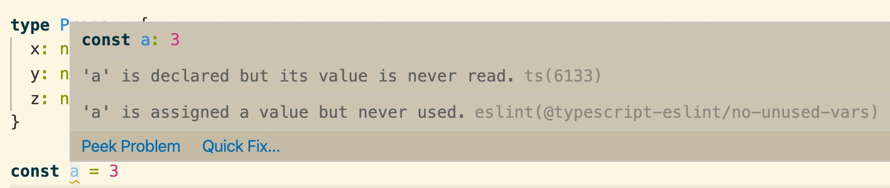
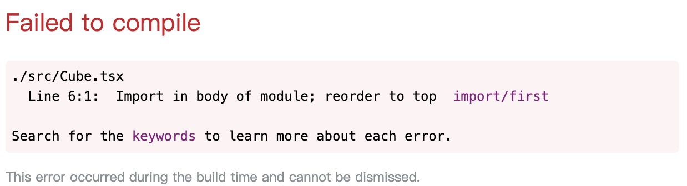

# 团队编码规范约束最佳实践

一千个读者，就有一千个哈姆雷特。

一千个程序员，就有一千种代码风格。

那什么是代码风格呢？从小的来说，有的开发喜欢带分号，有的不喜欢带分号。有的喜欢使用空格，有的喜欢使用 Tab。有的喜欢空两个空格，有的喜欢四个空格。除了这些，还有一些关于代码的优化，如避免声明未使用，避免冗余的代码逻辑等。如果你是新参加工作的人员，又恰好遇到一个代码风格混乱，密密麻麻赋值前后都不带空格的项目，只能有苦难言了。

因此团队合作中需要统一规范。

## ESLint 与约束

统一编码规范不仅可以大幅提高代码可读性，甚至会提高代码质量。当我们设计了一套关于编码规范的规则集时，需要工具去辅助检测，这就是 `ESLint`。

``` bash
$ npm install eslint --save-dev
```

规则集需要统一集中配置，ESLint 会默认读取配置文件 `.eslintrc` 来解析，而规则集在 `rules` 中进行配置：

``` json
{
  "rules": {
    "semi": ["error", "always"],
    "quotes": ["error", "double"]
  }
}
```

而我们需要做的是设定我们的代码规范，即 `rules` 项，关于它的文档及最佳实践参考下文：

+ [ESLint Rules and Best Practices](https://eslint.org/docs/rules/)

## 不要重复造轮子

我们需要推到重来，设计属于自己团队的一套编码规范吗？

完全没有必要推倒重来，既耗费人力，又难以做到规则的全部覆盖。

很多优秀的团队，都根据最佳实践设定了特别优秀的编码规范，比如 `airbnb` 设定了一套约束特别强的规范。另外也有一些特别简单但却十分实用的规范，如 `eslint:recommended`。

+ [airbnb javascript style](https://github.com/airbnb/javascript)

我们仅仅需要使用 `extend` 配置项去继承一些优秀的开源的代码规范，并使用 `rules` 做一些自己团队的规则补充。

``` json
{
  "extend": ["airbnb-base"],
  "rules": {
    "semi": ["error", "never"]
  }
}
```

## 开发环境，生产环境与警告

开发环境对于开发而言重要的是什么？

是开发体验。

一个良好的编码规范会带来解放强迫症的舒适感，但过于严格的代码风格有时也会使人烦躁。试举两个小例子，有可能是在你写代码时出现过的场景：

1. 禁止掉 `console.log`，避免在生产环境输出多余的东西。但偏偏在测试环境经常需要调试，但是如果仅仅设为警告的话，警告又会被忽视，失去意义。
1. 特别是当设置了规则 `no-unused-vars` 时。如果仅仅是为了在开发时调试，却因为无法通过 ESlint 规则校验无法方便调试。

这是一个约束与自由的权衡，ESLint 在提供强有力约束时自然会牺牲一些开发上的便利性。中庸，儒家思想讲究中庸，此时可以在权衡下选择一个中庸的方案：

把 ESLint 的所有影响调试的规则校验都设置为 `Warn`，那你又问了警告往往不是会被忽略吗？是这样子的，所以需要在 CI 中设置环境变量 `CI=true`，如此在 CI 中即使有警告也无法交付。CI 指持续集成，在本篇文章后边也会接着提到，另外，在本系列文章中也会重点讲解 CI，欢迎持续关注。

如在 `create-react-app` 中的大部分规则都是设置为 `Warn`


但是，如果你使用了 `webpack`，并且结合 `eslint-loader`，那解决方案就更加简单了：使用 `emitWarning: true`，在测试环境把所有 `Error` 都当做 `Warn`，这样避免了修改 ESLint 规则，`webpack` 的配置如下

``` js
{
  test: /\.(js|mjs|jsx|ts|tsx)$/,
  enforce: 'pre',
  use: [
    {
      options: {
        cache: true,
        emitWarning: true,
      },
      loader: require.resolve('eslint-loader'),
    },
  ]
}
```

所以有两种权衡开发体验与编程规范的方式：

1. 把 ESLint 的 rule 设置为 `Warn`，并在持续集成中配置环境变量 `CI=true`。
1. 结合 webpack 与 `eslint-loader`，根据当前环境的环境变量配置 `emitWarning`。

## 第一层约束: IDE

当不符合代码规范的第一时间，我们就要感知到它，及时反馈，快速纠正，比直到最后积攒了一大堆错误要高效很多。

这里以 `VS Code` 作为示例，它只需要安装一个插件：`eslint`，便可以做到智能提示，来看看效果吧：



另外，配合 `eslint-loader`，使用浏览器也可以做到实时提示：



## 第二层约束: Git Hooks

团队合作中的编码规范有一点是，虽然自己有可能不舒服，但是不能让别人因为自己的代码而不舒服。

git 自身包含许多 hooks，在 `commit`，`push` 等 git 事件前后触发执行。与 `pre-commit hook` 结合可以帮助校验 Lint，如果非通过代码规范则不允许提交。

[husky](https://github.com/typicode/husky) 是一个使 `git hooks` 变得更简单的工具，只需要配置几行 `package.json` 就可以愉快的开始工作。

> husky 的原理是什么？

``` json
// package.json
{
  "scripts": {
    "lint": "eslint . --cache"
  },
  "husky": {
    "hooks": {
      "pre-commit": "npm lint",
    }
  }
}
```

或者结合 [lint-staged](https://github.com/okonet/lint-staged) 调用校验规则

``` json
{
  "husky": {
    "hooks": {
      "pre-commit": "lint-staged"
    }
  },
  "lint-staged": {
    "*.js|{lib,setup,bin,hot,tooling,schemas}/**/*.js|test/*.js|{test,examples}/**/webpack.config.js}": [
      "eslint --cache"
    ],
    "*.{ts,json,yml,yaml,md}|examples/*.md": [
      "prettier --check"
    ],
    "*.md|{.github,benchmark,bin,examples,hot,lib,schemas,setup,tooling}/**/*.{md,yml,yaml,js,json}": [
      "cspell"
    ]
  }
}
```

不过做前端的都明白，客户端校验是不可信的，通过一条命令即可绕过 `git hooks`。

``` bash
$ git commit -n
```


## 第三层约束: CI

`git hooks` 可以绕过，但 CI(持续集成) 是绝对绕不过的，因为它在服务端校验。使用 `gitlab CI` 做持续集成，配置文件 `.gitlab-ci.yaml` 如下所示

``` yaml
lint:
  stage: lint
  only:
    - /^feature\/.*$/
  script:
    - npm lint
```

## 小结

1. 团队中代码规范统一是极有必要的
1. 使用成熟的 eslint config，并做细节修改
1. 设置部分 eslint rule 为警告，保障开发体验，并且在 `pre-commit` 与 `CI` 中把警告视为不通过，保证严格的代码规范
1. 可以在 `IDE (vscode)`，`git hooks`，`CI` 中添加三层规范校验拦截
1. 可以使用 `husky` 与 `lint-staged` 很方便地做关于 lint 的 `git hooks`
1. `git hooks` 的规范校验可以通过 `git commit -n` 跳过，需要在 CI 层继续加强校验
