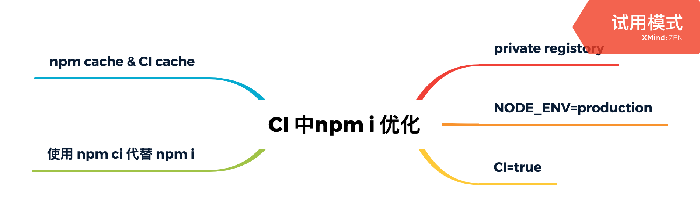

# 在生产环境中使你的 npm i 速度提升 50%


对于一个前端应用，或者说是一个 Node 应用，在 CICD pipeline 中，无论是构建，测试，部署，其中必不可少的环节就是依赖安装: `npm i`。

`npm i` 不仅是必不可少的环节，而且很可能也是耗时最长的一个环节。

打蛇打七寸，优化应该从瓶颈处开始，如果能从依赖安装下手，将能极大地缩短部署时间，提高产品交付效率，改善 DevOps 流程，从而促进敏捷开发。

CI 环境中的优化不同于本地开发环境，其中最大的不同在于: 在本地环境中安装依赖是有状态的，如 `node_modules`，`~/.npmrc`，`~/.npm` 一系列硬盘目录及文件，无不构成状态。而在生产环境中，往往结合 `CICD` 工具，每次分配的 `Runner` 不一定是一台服务器(容器)，往往被视为无状态，因而无法有效利用缓存而导致 CI 中部署用时过长。

但也正因为 CICD Runner 的无状态化，这意味着你只要参考构建脚本，如 `.gitlab-ci.yaml`，`.travis.yaml` 或者 `.github/workflows/deploy.yaml`，就可以从零把项目跑起来，而避免过多在熟悉新项目时求助他人。

不同的部署方式，不同的持续集成工具有不同的实践方法，但优化的原理大同小异。

<!--more-->



> 如果嫌文章太长，直接直接拉到最下方看总结

## 只安装有必要的库

`npm install` 的速度显然与它依赖的包的多少是正相关的，那减少包的数量就可以减少装包所花费的时间。这个道题如同每天都少吃一顿饭就会变瘦一样简单。

使用 `--production` 可以只安装 `package.json` 中 `dependencies` 中的依赖项，只把要安装在 CI 中需要使用到的依赖。在生产环境部署时可以指定 `--production`。

``` bash
npm install --production
```

另外，通过设置环境变量 `NODE_ENV=production` 相当于指定 `--production`，测试如下:

``` bash
$ NODE_ENV=production npm config get production
true
```

**这最大的不足就是需要你谨小慎微战战兢兢，如临深渊如履薄冰地把 `packages` 分拣到 `devDependencies` 与 `dependencies` 中。**

## 使用私有镜像仓库

从 `npm` 的官方仓库可以发布与拉取 `package`，比如 `react`，`vue` 和 `express` 都发布在官方仓库中。官方 `registory` 地址是 `https://registry.npmjs.org/`，这对国内的前端应用来说，由于远在国外，远程仓库的服务器时延过大，此时的瓶颈在于网络。

国内的公有镜像库是一个不错的选择，如淘宝镜像，它每隔十分钟与官方镜像仓库同步一次，而它位于国内，网络不至于太慢。

**对于企业级项目的生产环境来说，在集群内部搭建私有仓库是一个更好的选择，也更能缩短时延。** 流量能在局域网完成的，就不需要去互联网中溜圈了。

使用 `npm config` 来设置 npm 仓库，它将把仓库信息写入 `~/.npmrc` 中，这足以适用于 `CICD` 中。

``` bash
npm config set registry https://registry-npm.shanyue.tech/
```

## 缓存：人不能两次踏进同一条河流

人不能踏进同一条河流两次，一个接口不能连续慢两次，npm install 同样不能慢两次。

正如 http cache 一样，`npm install` 也可以充分利用缓存，npm 的缓存在 linux 系统中存在于以下路径:

+ `~/.npm`

命令 `npm cache verify` 可以校验缓存，如下所示:

``` bash
$ npm cache verify
Cache verified and compressed (~/.npm/_cacache):
Content verified: 4415 (156612117 bytes)
Index entries: 6239
Finished in 14.017s
```

结合 `npm install --prefer-offline` 缓存优先策略充分利用缓存

但是有一个悖论，在 CI 中是无状态的: 你本次装的 `node_modules` 和生成的 `~/.npm` 将会在下次装包时丢失。

这时候就需要利用 CI 的缓存功能，如以下是 `travis ci` 的配置

``` yaml
install:
- npm ci
# keep the npm cache around to speed up installs
cache:
  directories:
  - "$HOME/.npm"
```

## progress: 屏蔽非必要打印信息

当设置 `progress` 为 true 时，`npm install` 时将会显示进度条，把它设置为 false 可小幅提高 `npm install` 的速度。

修改设置:

``` bash
npm set progress=false
```

在 [官方文档](https://docs.npmjs.com/using-npm/config#progress) 中对 `progress` 有以下介绍：

> Default: true, unless TRAVIS or CI env vars set.
> Type: Boolean

因此，只需要在构建服务器中简单设置一个 `CI=true` 的环境变量即可以很轻便地解决问题

## 使用 npm ci 替代 npm i

单看名字，里边有个 `CI`，它就像适用在 CI 中，事实也如此。它在 CI 环境中做了一系列优化，如去除掉一些面向用户的特性来加强速度。除了性能，它也有一些在 CI 上基于完整性与安全性的检查，如 `package.json` 与 `package-lock.json` 版本不一致的问题。

为了更好地提高速度，`npm ci` 基于一个独立的库 [libcipm](https://github.com/npm/libcipm) 安装依赖，而它拥有和 `npm install` 兼容的 API。并且当它安装依赖时，默认是缓存优先的，它会充分利用缓存，从而加速装包。

经实验，`npm ci` 可以减少将近一半的的依赖安装时间。

``` bash
$ npm install
added 1154 packages in 60s

$ npm ci
added 1154 packages in 35s
```

## 总结

最后总结一下如何减少 npm install 的时间，都是很简单的设置，一分钟搞定

1. 选择时延低的 `registry`，需要企业技术基础建设支持
1. `NODE_ENV=production`，只安装生产环境必要的包(如果 dep 与 devDep 没有仔细分割开来，工作量很大，可以放弃)
1. `CI=true`，npm 会在此环境变量下自动优化
1. 结合 CI 的缓存功能，充分利用 `npm cache`
1. 使用 `npm ci` 代替 `npm i`，既提升速度又保障应用安全性
