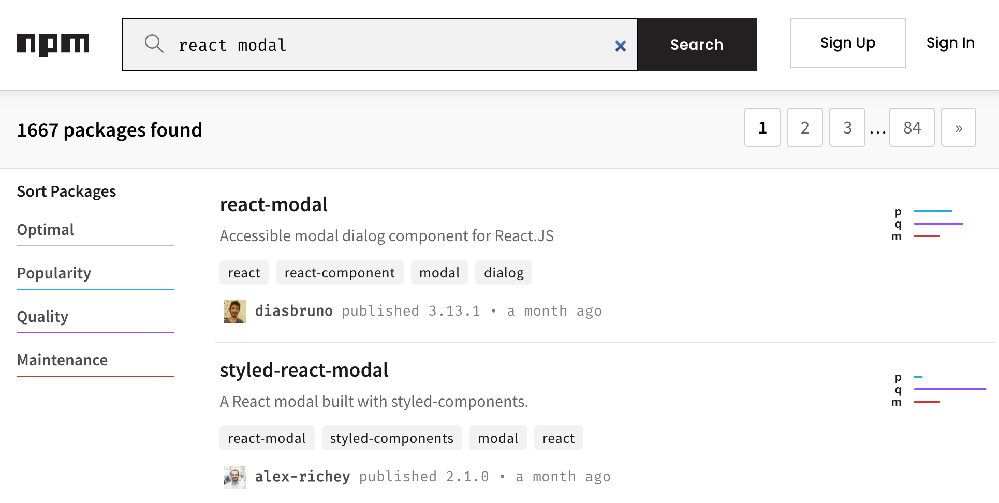
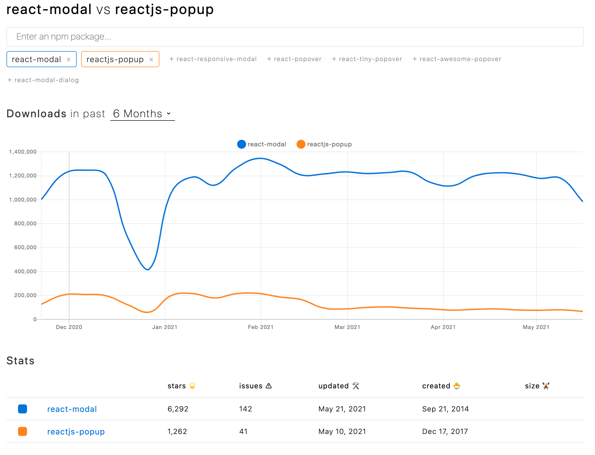

# 如何快速找到一个合适的 npm 库

假设我需要一个 React 的弹框组件，我应该如何快速选择一个合适的 npm 库？

## 一、搜索

在正确的网址进行搜索:

+ [npm 官网](https://npmjs.com): 官方网站，权威网站
+ [yarn 官网](https://yarnpkg.com/): 基于 
+ [Github](https://github.com)

使用正确的关键词进行搜索: `react modal`

如果不出所料，这里可以选出一个或多个比较合适的第三方库。那对于一个选择困难症，如何从中挑选一个更好的库呢？



## 二、选型

你有没有参与过业务技术选型，你们是如何考虑技术选型的呢？这是工作了三五年的前端出去面试时经常会碰到的问题。

答：使用最流行的技术方案。最流行的技术方案往往拥有更丰富的生态与更多的从业人员，既方便找轮子，又好招人。

而最流行的技术方案指的是 **挑选下载量最高的库，而非 Star 最高的库**。当然这句话有些太绝对，但适用于大部分场景。

那还有一些小场景呢？再考虑几个关键要素: `PQM`

1. `P`: 考察其流行度，周下载量多少，Github Stars 多少，是否无人问津
1. `Q`: 考察其质量性，是否含有测试、Type等
1. `M`: 考察其维护性，如最后一次更新时间，是否长时间未更新，如 Issues 的个数，是否有好多问题悬而未决

这里推荐一个选型必备网站: [npm trends](https://www.npmtrends.com/)，它可以很直白地把这些指标放在一起进行对比，并且能够推荐**与该 Package 所有相似的包**



## 三、文档

要多看文档！

我向我女朋友强调了这点，她问我，那应该如何去找到它的文档呢？

1. `npmjs.com` 某个库详情页面的右侧，有 Homepage 字段指向官方文档
1. `github.com` 某个 repo 详情页面的右上角，有官网链接
1. 如果以上两者都没有，那 Readme.md 就是文档

其次，某个 package 的官网、Github 信息都会在 `package.json` 中声明

``` js
{
  "homepage": "https://lodash.com/",
  "repository": {
    "type": "git",
    "url": "git+https://github.com/lodash/lodash.git"
  }
}
```

接下来再送几个小技巧

``` bash
# 快速找到并打开 react 的文档
$ npm docs react

# 快速找到并打开 react 的仓库
$ npm repo react
```

## 四、示例

文档看完就进入了实操阶段，可按照以下步骤学会使用该库

+ 文档中的示例: 如 [lodash](https://lodash.com/)及一众较小体积的库
+ 仓库中的示例: 如 [redux](https://github.com/reduxjs/redux)、[nextjs](https://github.com/vercel/next.js) 与 [koa](https://github.com/koajs/examples)
+ 仓库中的测试: 适用于一些边界的示例

为了某一个待调研的库，在本地新建一次性文件进行学习是一件不推荐的事情，以下三个工具帮你搞定所有的试验性调研

+ [npm devtool](https://npm.devtool.tech/ms): 在浏览器控制台用以调试较小提交的库，如 lodash/ms/joi 之类
+ [codesandbox](https://codesandbox.io/): 用以调试 Vue/React 等周边库
+ [stackblitz](https://stackblitz.com/): 用以调试 NodeJs 相关库

## 五、源码

``` bash
# 快速找到并打开 react 的仓库
$ npm repo react
```

把代码下载到本地，去跑通、去运行、去测试、去调试。
