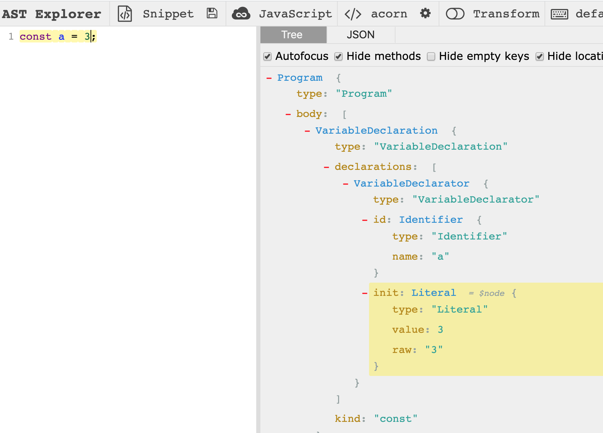
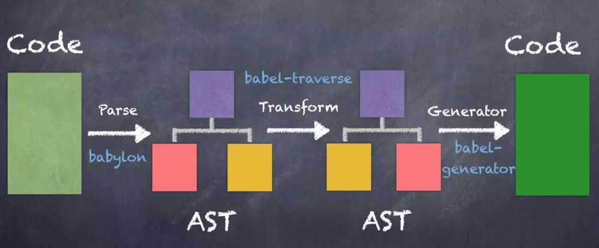

# javascript 代码是如何被压缩的

在 `jquery` 时代，当我们引用它的 CDN 地址时，在线上需要引用的是 `jquery.min.js`。

在现代前端时代，当我们对资源进行打包后，同样需要对代码进行压缩。在生产环境的 JS 仅有一行代码，变量也被压缩为单字符，体积大大减小。


我们是如何对 JS 代码进行压缩的呢？

<!-- 已不识庐山真面目 -->

<!-- 随着前端的发展，特别是 `React`，`Vue` 等构造单页应用的兴起，前端的能力得以很大提升，随之而来的是项目的复杂度越来越大。此时的前端的静态资源也越来越庞大，而毫无疑问 `javascript` 资源已是前端的主体资源，对于压缩它的体积至为重要。 -->

<!-- 为什么说更小的体积很重要呢：更小的体积对于用户体验来说意味着更快的加载速度以及更好的用户体验，这也能早就企业更大的利润。另外，更小的体积对于服务器来说也意味更小的带宽以及更少的服务器费用。 -->

<!-- 前端构建编译代码时，可以使用 `webpack` 中的 `optimization.minimizer` 来对代码进行压缩优化。但是我们也需要了解如何它是压缩代码的，这样当在生产环境的控制台调试代码时对它也有更深刻的理解。 -->

<!-- ## 如何查看资源的体积

对于我们所编写的代码，它在操作系统中是一个文件，根据文件系统中的 `stat` 信息我们可以查看该文件的大小。

`stat` 命令用来打印文件系统的信息：

``` bash
$ stat config.js
  File: ‘config.js’
  Size: 3663            Blocks: 8          IO Block: 4096   regular file
Device: fd01h/64769d    Inode: 806060      Links: 1
Access: (0644/-rw-r--r--)  Uid: (    0/    root)   Gid: (    0/    root)
Access: 2020-02-13 13:43:54.851381702 +0800
Modify: 2020-02-13 13:43:52.668417641 +0800
Change: 2020-02-13 13:43:52.691417262 +0800
 Birth: -

```

`stat` 打印的信息过大，如果只用来衡量体积，可以使用 `wc -c`

``` bash
$ wc -c config.js
3663 config.js
``` -->

## 如何压缩代码体积？

这里介绍几种关于压缩代码体积的几种思路

### 去除多余字符: 空格，换行及注释

``` javascript
// 对两个数求和
function sum (a, b) {
  return a + b;
}
```

此时文件大小是 `62 Byte`， **一般来说中文会占用更大的空间。**

多余的空白字符会占用大量的体积，如空格，换行符，另外注释也会占用文件体积。当我们把所有的空白符合注释都去掉之后，代码体积会得到减少。

**去掉多余字符之后，文件大小已经变为 `30 Byte`。** 压缩后代码如下:

``` javascript
function sum(a,b){return a+b}
```

替换掉多余字符后会有什么问题产生呢？

**有，比如多行代码压缩到一行时要注意行尾分号。** 这就需要通过以下介绍的 AST 来解决。

### 压缩变量名：变量名，函数名及属性名

``` javascript
function sum (first, second) {
  return first + second;  
}
```

如以上 `first` 与 `second` 在函数的作用域中，在作用域外不会引用它，此时可以让它们的变量名称更短。但是如果这是一个 `module` 中，`sum` 这个函数也不会被导出呢？那可以把这个函数名也缩短。

``` javascript
// 压缩: 缩短变量名
function sum (x, y) {
  return x + y;  
}

// 再压缩: 去除空余字符
function s(x,y){return x+y}
```

在这个示例中，当完成代码压缩 (`compress`) 时，代码的混淆 (`mangle`) 也捎带完成。 **但此时缩短变量的命名也需要 AST 支持，不至于在作用域中造成命名冲突。**

### 解析程序逻辑：合并声明以及布尔值简化

通过分析代码逻辑，可对代码改写为更精简的形式。

合并声明的示例如下：

``` javascript
// 压缩前
const a = 3;
const b = 4;

// 压缩后
const a = 3, b = 4;
```

布尔值简化的示例如下：

``` javascript
// 压缩前
!b && !c && !d && !e

// 压缩后
!(b||c||d||e)
```

### 解析程序逻辑: 编译预计算

在编译期进行计算，减少运行时的计算量，如下示例:

``` javascript
// 压缩前
const ONE_YEAR = 365 * 24 * 60 * 60

// 压缩后
const ONE_YAAR = 31536000
```

以及一个更复杂的例子，简直是杀手锏级别的优化。

``` javascript
// 压缩前
function hello () {
  console.log('hello, world')
}

hello()

// 压缩后
console.log('hello, world')
```

## AST

`AST`，抽象语法树，js 代码解析后的最小词法单元，而这个过程就是通过 Parser 来完成的。

那么 AST 可以做什么呢？

+ eslint: 校验你的代码风格
+ babel: 编译代码到 ES 低版本
+ taro/mpvue: 各种可以多端运行的小程序框架
+ GraphQL: 解析客户端查询

我们在日常工作中经常会不经意间与它打交道，如 `eslint` 与 `babel`，都会涉及到 `js` 与代码中游走。不同的解析器会生成不同的 AST，司空见惯的是 babel 使用的解析器 `babylon`，而 `uglify` 在代码压缩中使用到的解析器是 `UglifyJS`。

你可以在 [AST Explorer](https://astexplorer.net/) 中直观感受到，如下图：



那压缩代码的过程：code -> AST -> (transform)一颗更小的AST -> code，这与 `babel` 和 `eslint` 的流程一模一样。



## uglify、terser 与 swc

一个久负盛名的关于代码压缩的库: [uglify](https://github.com/mishoo/UglifyJS)，一个用以代码压缩混淆的库。但它有一个致命弱点，不支持 `ES6`。

一个更加适应现代化前端用以代码压缩的库 [terser](https://github.com/terser/terser) 诞生了，它来自于 uglify，与它保持一致的 API，但是它对 `ES6` 有更好的支持，同时也是 webpack 内置进行代码压缩的库。

那它是如何完成一些压缩功能的，答案是 AST。

`webpack` 中内置的代码压缩插件就是使用了 `terser`，看一段它工作的代码:

``` javascript
const { minify } = require('terser')
const code = 'function add(first, second) { return first + second; }'
const result = await minify(code, { sourceMap: true })
console.log(result.code)
console.log(result.map)
```

而当你真正使用它来压缩代码时，你只需要面向配置编程即可，文档参考 [uglify 官方文档](https://github.com/mishoo/UglifyJS2#parse-options)

``` js
{
  {
    ecma: 8,
  },
  compress: {
    ecma: 5,
    warnings: false,
    comparisons: false,
    inline: 2,
  },
  output: {
    ecma: 5,
    comments: false,
    ascii_only: true,
  }
}
```

## 在 webpack 中压缩代码

在知道代码压缩是怎么完成的之后，我们终于可以把它搬到生产环境中去压缩代码。终于到了实践的时候了，虽然它只是简单的调用 API 并且调调参数。

一切与性能优化相关的都可以在 `optimization` 中找到，`TerserPlugin` 是一个底层基于 `uglifyjs` 的用来压缩 JS 的插件。

``` javascript
optimization: {
  minimize: isEnvProduction,
  minimizer: [
    new TerserPlugin({
      terserOptions: {
        parse: {
          ecma: 8,
        },
        compress: {
          ecma: 5,
          warnings: false,
          comparisons: false,
          inline: 2,
        },
        output: {
          ecma: 5,
          comments: false,
          ascii_only: true,
        },
      },
      sourceMap: true
    })
  ]
}
```
