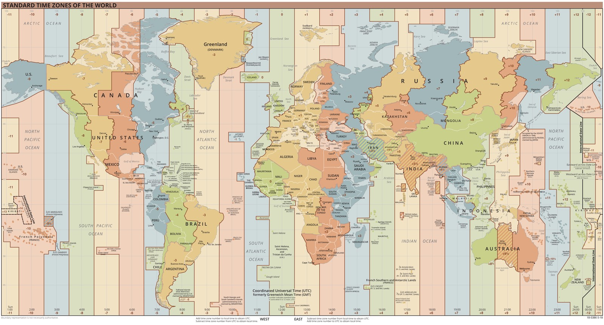

# 经纬度与大地坐标系

> 最近在成都正在做一个省市县的地图钻透，涉及到一些地理知识，简单做做科普

如何准确标识地球上某一位置？

从初中地理学到的东西可以知道：经纬度

## 经度

经度，用以指示一个地点的东西向地理位置。地球上某一地点离本初子午线以东或以西的度数。本初子午线的经度是0°，**东经为正数，西经为负数**。

当你正准备睡觉时，大洋某岸的国家有可能正在起床，正是因为经度，所以有了时差，才有了产品面向国际化时的各种时区问题。

英国伦敦格林尼治皇家天文台的本初子午线为 0°，因此它被作为时差的参考原点，称为格林尼治时间 (Greenwich Mean Time)，简写 GMT。

经度每隔十五度会差一个小时，在中国，使用 `new Date` 构造时间会显示为 `GMT+08`，采用中国几何中心的东经120°作为北京时间。

``` js
> new Date()
< Mon Nov 02 2020 12:34:57 GMT+0800 (中国标准时间)
```

世界经度与时区图:



## 纬度

纬度，用以指示一个地点的南北向地理位置，其范围从赤道的0°到南北极的90°，**北纬为正数，南纬为负数**。

纬度与季节相关，当中国大部分地区正在穿短袖的时候，澳大利亚在穿着羽绒服。如果有澳大利亚的朋友，咱俩可以拼一件羽绒服，冬天我穿，夏天你穿。

## 经纬度及地理编码

经纬度的表示方法如同时钟一样: 角分秒与小数点。在计算机中一般选择小数点的方式进行编码

+ 角分秒: 111d30m00s, 40°30′00″
+ 小数点: 116.452562, 40.046077，东经为正，北纬为正

通过专业的坐标拾取工具，可以获取到某一点的具体坐标，从某一地址到经纬度坐标的转化也叫做**地理编码**

+ [百度拾取坐标系统](http://api.map.baidu.com/lbsapi/getpoint/index.html)

从经纬度到具体地址的转化成为**逆地理编码**，但由于存在不同的坐标系对经纬度加密，此时需要执行编码坐标系

+ WGS84 (World Geodetic System)，世界大地测量系统。采用地图如谷歌
+ GCJ02 (GuoJia Cehui Ju)， 火星坐标系，WGS84 坐标系加密后的坐标系，由中国国家测绘地理信息局制定，在国内需要使用基于 GCJ02 的坐标系。采用地图如Google国内地图、高德、腾讯地图
+ BD09，百度坐标系，GCJ02坐标系加密后的坐标系

+ [批量工具网](https://www.piliang.tech/geocoding)
+ [高德地理编码、逆编码](https://lbs.amap.com/api/webservice/guide/api/georegeo)
