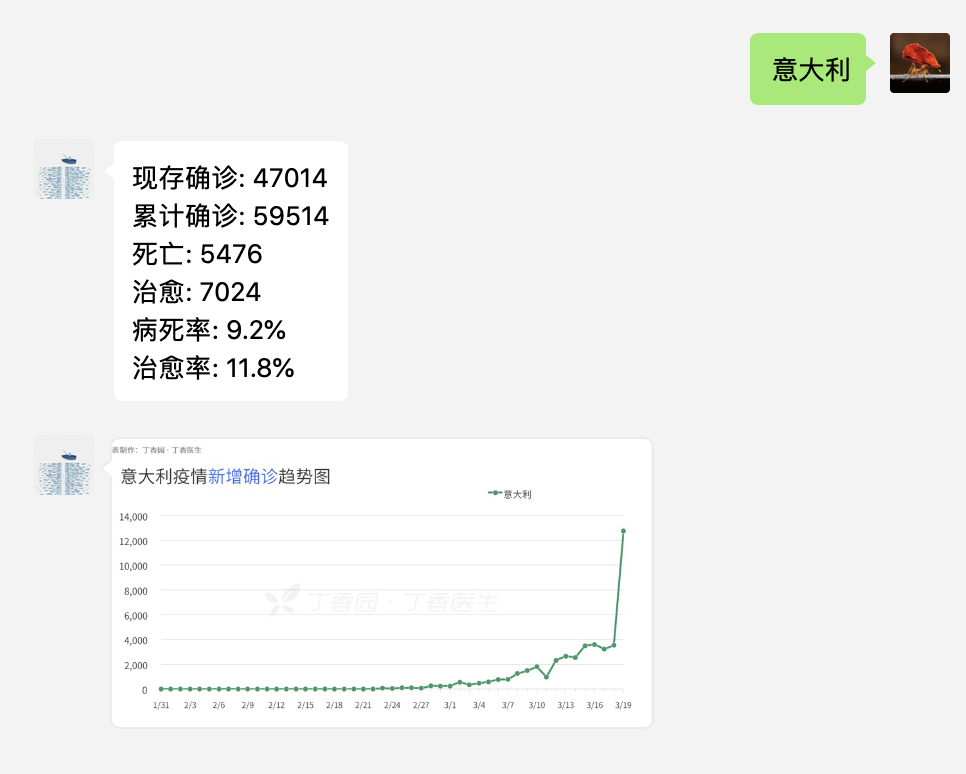

# 使用 wechaty 开发一个疫情机器人

## 代码

+ [wechat-ncov](https://github.com/shfshanyue/wechat-ncov)，欢迎 Star

## 技术栈

+ [wechaty](https://github.com/wechaty/wechaty)
+ [wechaty-puppet-padplus](https://github.com/wechaty/wechaty-puppet-padplus)

> Wechaty is a Bot SDK for Wechat Individual Account which can help you create a bot in 6 lines of javascript, with cross-platform support including Linux, Windows, MacOS, and Docker.

> 如果你需要获取 Token，请参考[这里](https://github.com/juzibot/Welcome/wiki/Support-Developers)

## 效果



## 测试

请添加机器人【shayue-bot】，备注【疫情】，通过好友。


+ 回复【疫情】，将自动回复疫情最为严重国家的疫情信息。
+ 回复【意大利】或者其它国家，将自动回复该国家的疫情信息。

### 接收用户消息

接收到的用户信息为 `Message` 类，根据接收到的消息机器人进行回复，

``` js
const { Message } = require('wechaty')
const covid = require('../message/covid')

// 关键字对应处理函数
const routes = [
  { keyword: '疫情', handle: covid.ncov },
  { keyword: '',     handle: covid.keyword }
]

async function reply (msg, data) {
  for (const text of data) {
    await msg.say(text)
  }
}

async function handleMessage (msg) {
  // 如果接收到的是文字
  if (msg.type() == Message.Type.Text) {
    // 如果不是在群里
    if (!msg.room()) {
      console.log(msg)
      // 找到该关键字对应的处理函数
      const route = routes.find(route => msg.text().includes(route.keyword))
      // 处理函数返回对应的消息回复
      const data = route.handle(msg.text())
      // 根据消息回复(n条)回复消息
      await reply(msg, data)
    }
  }
}

exports.handleMessage = handleMessage
```

## 下一步计划

+ 自动通过好友
+ 自动加群
+ 每日群播报 (业务信息、打点数据、监控警报、股票信息、基金信息)
