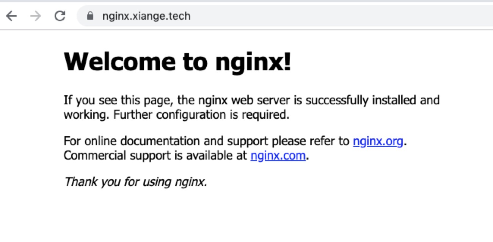

# 在 kubernetes 中自动为域名配置 https

随着 web 的发展，`https` 对于现代网站来说是必不可少的。如果你想得到一个免费的证书，那么 [Let's Encrypt](https://letsencrypt.org/) 是一个不错的选择，它的主要目的是推进网站 `https` 的进程。

> 感谢 Let's Encrypt 的免费证书

借助 `helm`，在 `k8s cluster` 中为域名配置 `https` 将会变得非常简单，部署资源成功后在 `k8s` 中为 `Ingress` 配置证书将会变得非常容易: 只需要在 Ingress 中多添加两行代码

**本篇文章将介绍如何只需要三步为你的域名配置上 https**

**在本篇文章之前，假设此时你已经能够配置 `Ingress` 并成功访问到你的域名**，如果没有，你可以参考本系列文章的以上几篇

+ [部署你的第一个应用: Pod，Application 与 Service](https://shanyue.tech/k8s/pod)
+ [通过外部域名访问你的应用: Ingress](https://shanyue.tech/k8s/ingress)

<!--more-->

## 01 使用 helm 部署 cert-manager

我们选择这个 `helm chart` [jetstack/cert-manager](https://hub.helm.sh/charts/jetstack/cert-manager) 部署 `https`。目前，在 github 上，该仓库 [jetstack/cert-manager](https://github.com/jetstack/cert-manager) 已拥有 4.4K Star。

如果想使用 `let's encrypt` 自动为 `Ingress` 配置 `https`。在部署时需要为 helm chart 指定以下参数。

``` bash
ingressShim.defaultIssuerName=letsencrypt-prod
ingressShim.defaultIssuerKind=Issuer
```


这里有关于 [Issuers的文档](https://docs.cert-manager.io/en/latest/reference/issuers.html)

部署过程如下，这里使用了 `helm v3` 进行部署

``` bash
# 部署前需要一些 crd
$ kubectl apply -f https://raw.githubusercontent.com/jetstack/cert-manager/release-0.11/deploy/manifests/00-crds.yaml

# 为 helm 添加 repo
$ helm repo add jetstack https://charts.jetstack.io

# 使用 helm v3 部署，指定参数
$ helm install cert-manager jetstack/cert-manager --set "ingressShim.defaultIssuerName=letsencrypt-prod,ingressShim.defaultIssuerKind=Issuer"
NAME: cert-manager
LAST DEPLOYED: 2019-10-26 21:27:56.488948248 +0800 CST m=+2.081581159
NAMESPACE: default
STATUS: deployed
NOTES:
cert-manager has been deployed successfully!

In order to begin issuing certificates, you will need to set up a ClusterIssuer
or Issuer resource (for example, by creating a 'letsencrypt-staging' issuer).

More information on the different types of issuers and how to configure them
can be found in our documentation:

https://docs.cert-manager.io/en/latest/reference/issuers.html

For information on how to configure cert-manager to automatically provision
Certificates for Ingress resources, take a look at the `ingress-shim`
documentation:

https://docs.cert-manager.io/en/latest/reference/ingress-shim.html
```

校验状态，查看刚才部署 `crd` 与 `pod` 的状态，校验是否成功

``` bash
$ kubectl get crd
NAME                                  CREATED AT
certificaterequests.cert-manager.io   2019-10-26T01:16:21Z
certificates.cert-manager.io          2019-10-26T01:16:21Z
challenges.acme.cert-manager.io       2019-10-26T01:16:21Z
clusterissuers.cert-manager.io        2019-10-26T01:16:24Z
issuers.cert-manager.io               2019-10-26T01:16:24Z
orders.acme.cert-manager.io           2019-10-26T01:16:21Z

$ kubectl get pods
NAME                                             READY   STATUS    RESTARTS   AGE
cert-manager-5d8fd69d88-s7dtg                    1/1     Running   0          57s
cert-manager-cainjector-755bbf9c6b-ctkdb         1/1     Running   0          57s
cert-manager-webhook-76954fcbcd-h4hrx            1/1     Running   0          57s
```

## 02 配置 ACME Issuers

指定 kind 为 `Issuer`，并修改以下邮箱为自己的邮箱，Issuer 资源配置如下

``` yaml
apiVersion: cert-manager.io/v1alpha2
kind: Issuer
metadata:
  name: letsencrypt-prod
spec:
  acme:
    # The ACME server URL
    server: https://acme-v02.api.letsencrypt.org/directory
    # Email address used for ACME registration
    email: example@shanyue.tech
    # Name of a secret used to store the ACME account private key
    privateKeySecretRef:
      name: letsencrypt-prod
    # Enable the HTTP-01 challenge provider
    solvers:
    - http01:
        ingress:
          class: nginx
```

使用 `kubectl apply -f` 部署生效

``` shell
$ kubectl apply -f letsencrypt-issue.yaml
```

## 03 为 Ingress 添加 annotation

在部署 Ingress 时指定 `annotations` 就可以很方便地配置证书

``` yaml
annotations:
  kubernetes.io/ingress.class: "nginx"
  cert-manager.io/issuer: "letsencrypt-prod"
```

或者

``` yaml
annotations:
  kubernetes.io/ingress.class: "nginx"
  kubernetes.io/tls-acme: 'true'
```


关于 `Ingress` 的完整配置如下，你也可以在我的github上查看 `Deployment`，`Service` 到 `Ingress` 完整的配置: [shfshanyue/learn-k8s:/conf/nginx.yaml](https://github.com/shfshanyue/learn-k8s/blob/master/conf/nginx.yaml)

``` yaml{6,7}
apiVersion: networking.k8s.io/v1beta1
kind: Ingress
metadata:
  name: nginx-service-ingress
  annotations:
    kubernetes.io/ingress.class: "nginx"
    cert-manager.io/issuer: "letsencrypt-prod"
spec:
  tls:
  - hosts:
    - nginx.xiange.tech
    secretName: nginx-tls
  rules:
  - host: nginx.xiange.tech
    http:
      paths:
      - backend:
          serviceName: nginx-service
          servicePort: 80
        path: /
```

校验 `certificate` 状态，`Ready` 为 True

> 由于镜像在 quay.io 中，pull image 的时间过慢，有可能需要十分钟

``` bash
$ kubectl get certificate
NAME        READY   SECRET      AGE
nginx-tls   True    nginx-tls   44h

$ kubectl describe certificate nginx-tls
Name:         nginx-tls
Namespace:    default
Labels:       <none>
Annotations:  <none>
API Version:  cert-manager.io/v1alpha2
Kind:         Certificate
Metadata:
  Creation Timestamp:  2019-10-26T13:30:06Z
  Generation:          1
  Owner References:
    API Version:           extensions/v1beta1
    Block Owner Deletion:  true
    Controller:            true
    Kind:                  Ingress
    Name:                  nginx-service-ingress
    UID:                   c9abc7b7-45da-431b-b732-e535a809dfdd
  Resource Version:        2822740
  Self Link:               /apis/cert-manager.io/v1alpha2/namespaces/default/certificates/nginx-tls
  UID:                     ccb3aa54-e967-4813-acbe-41d9801f29a6
Spec:
  Dns Names:
    nginx.xiange.tech
  Issuer Ref:
    Group:      cert-manager.io
    Kind:       Issuer
    Name:       letsencrypt-prod
  Secret Name:  nginx-tls
Status:
  Conditions:
    Last Transition Time:  2019-10-26T13:43:02Z
    Message:               Certificate is up to date and has not expired
    Reason:                Ready
    Status:                True
    Type:                  Ready
  Not After:               2020-01-24T12:43:01Z
Events:                    <none>
```

访问 `Ingress` 中配置的域名，Chrome 浏览器中左上角的小锁提示 `https` 配置成功



## 参考

+ [Automatically creating Certificates for Ingress resources](https://docs.cert-manager.io/en/latest/tasks/issuing-certificates/ingress-shim.html)
+ [Setting up ACME Issuers](https://docs.cert-manager.io/en/latest/tasks/issuers/setup-acme/index.html)
+ [Get Automatic HTTPS with Let's Encrypt and Kubernetes Ingress](https://akomljen.com/get-automatic-https-with-lets-encrypt-and-kubernetes-ingress/)
