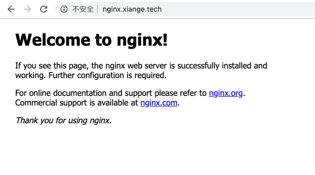

# 使用 Ingress 进行域名访问

在上篇文章中我们已经使用 k8s 部署了第一个应用，此时我们可以使用 `Ingress` 使它可以在互联网上可以被访问到 (当然你要有自己的域名并且指向正确)

+ [部署你的第一个应用: Pod，Application 与 Service](https://shanyue.tech/k8s/pod)

以下是官网搬用的关于 `Ingress` 的一幅图，用以描述 Ingress 的作用。如果你对它一无所知，你可以把它理解为传统的 nginx，用以配置自己网站的域名使之能够通过外网访问。

``` txt
internet
    |
[ Ingress ]
--|-----|--
[ Services ]
```

其中，`Ingress` 包含两个组件

+ `Ingress`: 配置转发规则，类似于 nginx 的配置文件
+ `Ingress Controller`: 转发，类似于 nginx，它会读取 `Ingress` 的规则并转化为 `nginx` 的配置文件

而 `Ingress Controller` 除了 `nginx` 外还有 `haproxy`，`ingress` 等等，我们选用 `nginx` 作为 Ingress Controller

## 使用 helm 部署 nginx Ingress Controller

我们使用 helm 选择官方的 [stable/nginx-ingress](https://github.com/helm/charts/tree/master/stable/nginx-ingress) chart 进行部署。

`nginx-ingress` 会配置一个 type 为 `LoadBalancer` 的 service， **因此需要配置 `EXTERNAL-IP` 为k8s集群节点的 IP。** 在这里 external-ip 会设置为 `[172.17.68.39, 172.17.68.40]`

我们可以通过 `kubectl get nodes` 来获取 IP 地址

``` bash
# 获取node的 INTERNAL-IP，作为 LoadBalancer 的 EXTERNAL-IP
$ kubectl get nodes -o wide
NAME       STATUS   ROLES    AGE   VERSION   INTERNAL-IP    EXTERNAL-IP   OS-IMAGE                KERNEL-VERSION               CONTAINER-RUNTIME
shanyue    Ready    master   13d   v1.16.0   172.17.68.39   <none>        CentOS Linux 7 (Core)   3.10.0-957.21.3.el7.x86_64   docker://18.6.2
shuifeng   Ready    <none>   13d   v1.16.0   172.17.68.40   <none>        CentOS Linux 7 (Core)   3.10.0-957.21.3.el7.x86_64   docker://18.6.2
```

在这里 external-ip 会设置为 `[172.17.68.39, 172.17.68.40]`

``` bash
controller.service.externalIPs[0]=172.17.68.39
controller.service.externalIPs[1]=172.17.68.40
```

``` bash
# 使用 helm v3 部署，如果使用 helm v2 部署的话，把 release-name 使用 --name 指定
$ helm install nginx-ingress stable/nginx-ingress --set "controller.service.externalIPs[0]=172.17.68.39,controller.service.externalIPs[1]=172.17.68.40"
NAME: nginx-ingress
LAST DEPLOYED: 2019-10-18 21:21:44.115902395 +0800 CST m=+1.904554085
NAMESPACE: default
STATUS: deployed
NOTES:
The nginx-ingress controller has been installed.
It may take a few minutes for the LoadBalancer IP to be available.
You can watch the status by running 'kubectl --namespace default get services -o wide -w nginx-ingress-controller'

An example Ingress that makes use of the controller:

  apiVersion: extensions/v1beta1
  kind: Ingress
  metadata:
    annotations:
      kubernetes.io/ingress.class: nginx
    name: example
    namespace: foo
  spec:
    rules:
      - host: www.example.com
        http:
          paths:
            - backend:
                serviceName: exampleService
                servicePort: 80
              path: /
    # This section is only required if TLS is to be enabled for the Ingress
    tls:
        - hosts:
            - www.example.com
          secretName: example-tls

If TLS is enabled for the Ingress, a Secret containing the certificate and key must also be provided:

  apiVersion: v1
  kind: Secret
  metadata:
    name: example-tls
    namespace: foo
  data:
    tls.crt: <base64 encoded cert>
    tls.key: <base64 encoded key>
  type: kubernetes.io/tls
```

校验 nginx-ingress 的部署情况

``` bash
$ helm ls
NAME            NAMESPACE       REVISION        UPDATED                                 STATUS          CHART
nginx-ingress   default         1               2019-10-18 11:21:44.115902395 +0800 CST deployed        nginx-ingress-1.24.0

# 查看 nginx-ingress 所有的 service
$ kubectl get svc -l app=nginx-ingress
NAME                            TYPE           CLUSTER-IP     EXTERNAL-IP                 PORT(S)                      AGE
nginx-ingress-controller        LoadBalancer   10.101.64.64   172.17.68.39,172.17.68.40   80:30285/TCP,443:31094/TCP   7m19s
nginx-ingress-default-backend   ClusterIP      10.110.76.15   <none>                      80/TCP                       7m19s
```

## 配置 Ingress 映射域名

与已知知识关联有助于我们更好地学习新知识，以下是关于 nginx 与 ingress 部署一个博客应用的简单配置文件

1. 外网通过域名 nginx.xiange.tech 来访问应用
1. 代理服务 nginx 来做负载均衡
1. nginx 暴露出 80 端口

``` conf
server {
  listen 80
  server_name nginx.xiange.tech

  location / {
    proxy_pass: http://nginx:80
  }
}
```

使用 `Ingress` 配置路由规则如下

``` yaml
apiVersion: networking.k8s.io/v1beta1
kind: Ingress
metadata:
  name: nginx-service-ingress
spec:
  rules:
  - host: nginx.xiange.tech
    http:
      paths:
      - backend:
          serviceName: nginx-service
          servicePort: 80
        path: /
```

我们使用 `Ingress` 把它配置到了 `nginx.xiange.tech` 该域名下，在公网环境下的浏览器中打开域名 `nginx.xiange.tech`，可以看到熟悉的 nginx 配置页面



## 小结

部署一个应用从 `Deployment`，`Service` 再到 `Ingress` 的完整配置文件如下

``` yaml
apiVersion: apps/v1
kind: Deployment
metadata:
  name: nginx-deployment
spec:
  selector:
    matchLabels:
      app: nginx
  replicas: 3
  template:
    metadata:
      labels:
        app: nginx
    spec:
      containers:
      - name: nginx
        image: nginx:alpine
        ports:
        - containerPort: 80

---

apiVersion: v1
kind: Service
metadata:
  name: nginx-service
spec:
  selector:
    app: nginx
  ports:
  - protocol: TCP
    port: 80
    targetPort: 80

---

apiVersion: networking.k8s.io/v1beta1
kind: Ingress
metadata:
  name: nginx-service-ingress
spec:
  rules:
  - host: nginx.xiange.tech
    http:
      paths:
      - backend:
          serviceName: nginx-service
          servicePort: 80
        path: /
```

