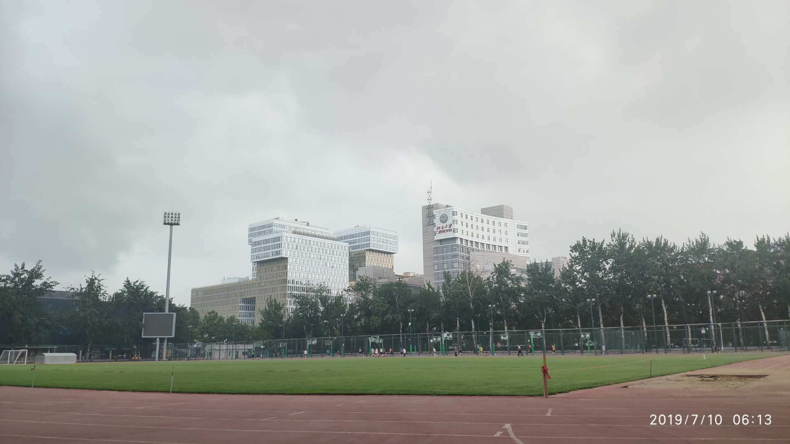
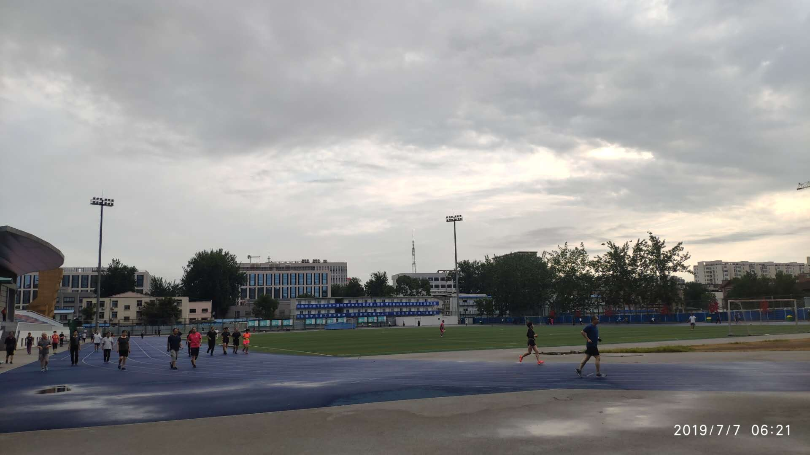
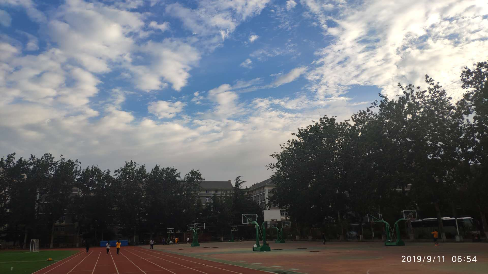
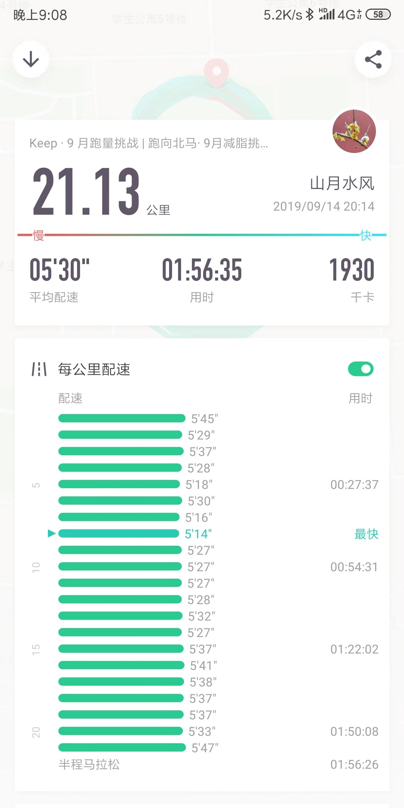
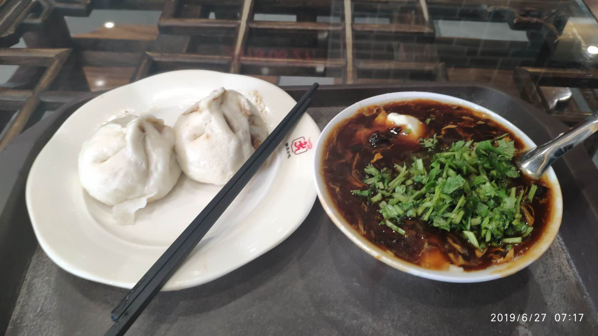
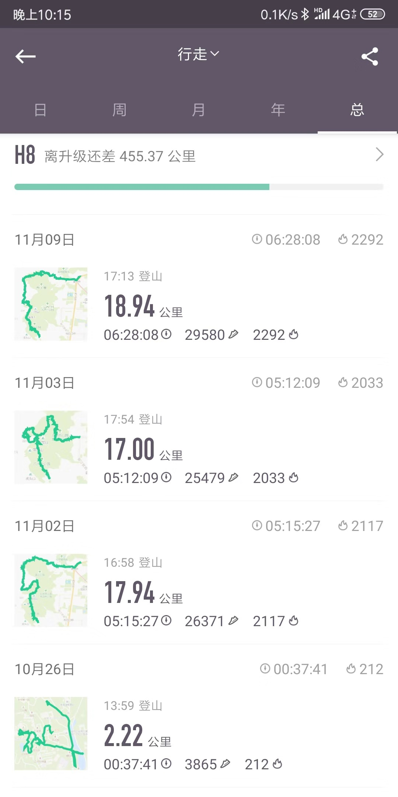
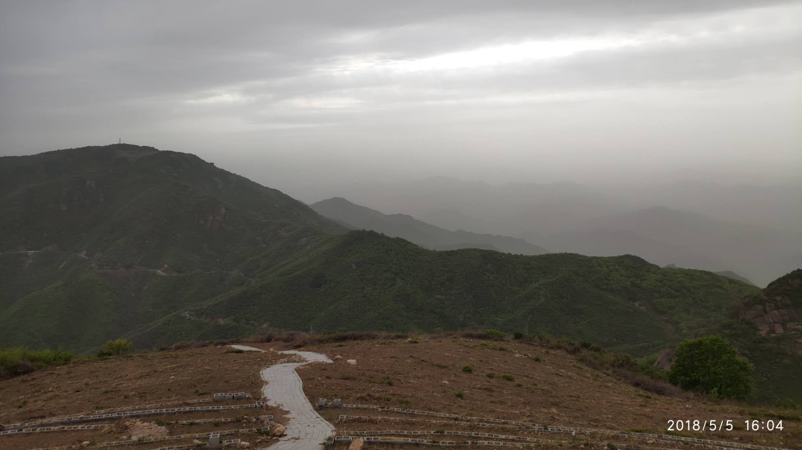
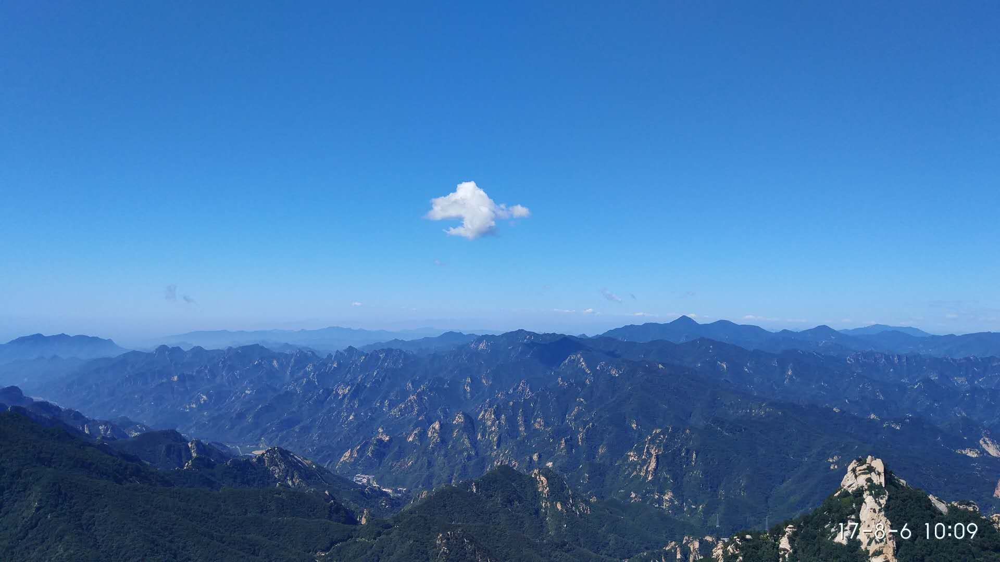
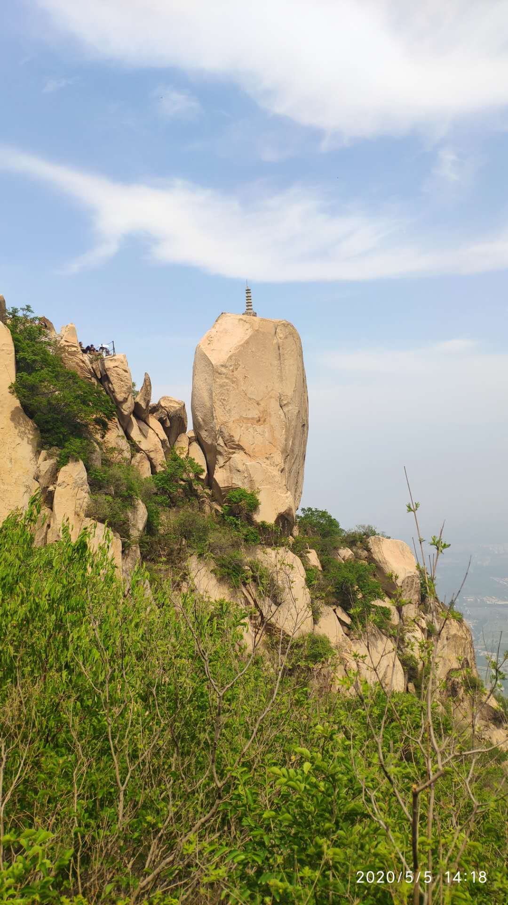

# 我的一天

最近有很多人问及山月的一天如何安排，于是写此篇文章记录我的一天。

这是疫情前的情况，现在稍有不同，因疫情学校未开门最近很少跑步，爬山时体力也有下降，念此也感慨过多，读完后对以前的我肃然起敬

> 你如何度过一天，就如何度过一生

## 工作日

> 6:00 起床，简单洗漱

当然冬天会晚一些，大致六点半以前，夏天会更早一些，六点之前就能够起床。

> 6:20 骑自行车去周围大学操场，跑步

跑步喜欢放在早上，此时外力干预比较少(比如不会突然开会、聚餐、改BUG之类)，且换衣服鞋方便，跑步完更是可以直接回家洗澡。北京的夏天酷暑难当，早上是唯一稍微凉快跑步比较舒服的时候。每当跑完步看表不到八点时，总感觉比他人多拥有了半天的幸福时光。

跑步一般 8公里/10公里/15公里，跑步的时候会打开微信读书上的唐诗三百首与宋词三百首，来减轻跑步时的枯燥。背诗与跑步互相成就，背诗没这么无聊，跑步也没有这么无聊，一个断了跑跑了断，一个背了忘忘了背，如同西西弗斯的石头。

租住地方附近有诸多大学，如中央民族大学，北京交通大学，北京邮电大学，中央财经大学，北京外国语大学，这极大增加了我的幸福感并让跑步更容易坚持下去，我常在交大跑步，偶尔也会去其他学校。

目前半马最快是 `1小时56分钟`，配速五分半，在北外的三百米小操场上跑下来，那天人很挤，背的滕王阁序。

> 8:00 早饭

跑完步后就近在学校吃，偶尔会自己做豆浆，蒸俩鸡蛋。吃完饭回家，刷牙洗澡刷会手机准备去上班。

> 9:50 出门去上班

骑自行车五分钟到公司。

> 10:15 早会，站会

> 16:00 需求会，回顾会，分享会，各种会议

> 19:00 下班

一般会在下班后再在公司待一会，回家后有时会看电影，有时会敲代码，也会写写博客。曾经有一两个月每天都在看电影，不过一般以敲代码居多。

## 周末

> 6:00 起床，简单洗漱

> 7:00 吃早饭，刷手机

> 9:00 出门爬山

对于自己这样非常业余且没有追求的户外爱好者，一般仅选择交通方便的几座，因此常爬的就香八拉及鹫峰，阳台山，凤凰岭三峰，大都在西郊线及十六号线的终点站。如果你有充足的体力，可以由阳台山爬到妙峰山，一来回将近四十公里，而香八拉一般可以控制在二十公里左右。

另外香山因红叶知名，而往往红叶不在香山，西山背后的南马场水库与红叶大峡谷中红叶更胜一筹，且没有秋后香山摩肩接踵般的挤。

> 19:00 吃饭，回家，敲代码

