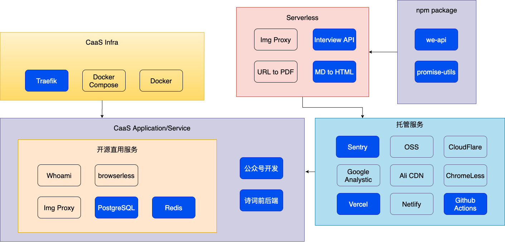
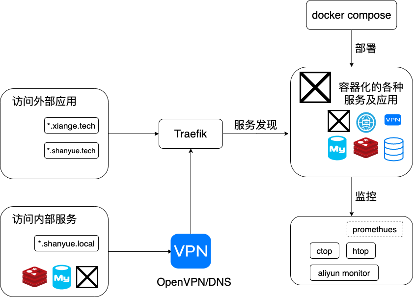

date: 2020-07-28 20:00

---

# 二零二零上半年总结

## 薅羊毛

今年上半年由于疫情影响，北京高校都未开学，校门都不让外人进入，因此坚持了很久的跑步由此中断。好在北京市级精品公园很多，为免疫情提前预约的烦恼办了年卡，跑步就转战到了公园中。

然而做一些事总是事与愿违，早就把初心扔到了九霄云外，本想着跑步的我拿着年卡开始了薅·北京公园·羊毛之旅。于是离我较近的北京动物园及玉渊潭已经被我薅了不下十次，早就值回了票价，心满意足。只是体重又涨了很多...

## 个人项目

上半年做了很多个个人项目，为了好玩，也为了实践一些新技术作为技术储备。

根据强弱状态以及是否需要依赖服务器，技术选型分为以下几类：

1. **强状态 API 服务**: `GraphQL` + `Traefik` + `Docker` + `PostgreSQL` + `Redis`。使用自建的服务器搭建数据存储，并通过 `traefik` 与 `docer` 暴露及部署服务。如我的诗词站: <https://shici.xiange.tech>
1. **无状态 API 服务**: `GraphQL` + `Serverless`。使用 `GraphQL` 提供接口，通过 `serverless` 进行服务编排及部署。如 [md-to-html-api](https://github.com/shfshanyue/md-to-html-api) 与 [interview-api](https://github.com/shfshanyue/interview-api)
1. **SSR 应用**: `Next.js` + `Vercel`。使用 `Next.js` 写页面，并部署在 `Vercel`，可惜 `vercel` 没有国内节点，网络很慢。如 [极客时间返利平台](https://geek.shanyue.tech)，对 SEO 有着较高的要求
1. **CSR 应用**: `create-react-app` + `OSS` + `Github Actions`。对于纯静态的应用直接通过部署在 OSS 上，如我在年初写的 [疫情实时地图](https://github.com/shfshanyue/2019-ncov)

简单罗列下个人项目，都是些极小的项目。这里也建议大家都可以试着找一找可满足自己小需求的项目，并用一两天的时间完成它。

+ [shfshanyue/markdown-to-html-api](https://github.com/shfshanyue/md-to-html-api): 根据 mardown 生成美化 html 的 GraphQL API
+ [shfshanyue/interview-api](https://github.com/shfshanyue/interview-api): 程序员面试每日一题
+ [shfshanyue/geek](https://geek.shanyue.tech): 极客时间返利平台: <https://geek.shanyue.tech>
+ [shfshanyue/2019-ncov](https://github.com/shfshanyue/2019-ncov): 全国新型冠状病毒，肺炎疫情实时省市地图，单日 PV 最高48万
+ [shfshanyue/shici](https://github.com/shfshanyue/shici): 诗词小站，服务器容器运维、爬虫及前后端开发可参考我的博客，单日 PV 500 <https://shici.xiange.tech/>
+ [shfshanyue/wechat](https://github.com/shfshanyue/wechat): 个人公众号的微信开发，如看文需扫码关注功能
+ [shfshanyue/wechat-bot](https://github.com/shfshanyue/wechat-bot): 个人微信机器人开发，社群运营、智能对话与提醒。自动通过好友，加群后欢迎语以及基金、疫情信息监控
+ [shfshanyue/wechat-cron](https://github.com/shfshanyue/wechat): 个人公众号的自动上传素材脚本，使用 [we-api](https://github.com/shfshanyue/we-api) 作为 SDK

## 关于个人项目的基础设施

为了更好地支撑个人项目，因此做了一些基础设施相关的事情

### `CaaS`

`Container as a Service`，容器即服务，快速部署个人项目到服务器上。也可以在上边做一些大软件的部署实践，如 `mysql`、`prometheus`、`ES` 和 `kibana` 等。

### `Package`

+ [@shanyue/promise-utils (npm)](https://github.com/shfshanyue/promise-utils): 一些有用的 promise 工具函数，如 map, filter, retry 与 sleep
+ [cls-session (npm)](https://github.com/shfshanyue/cls-session): Node 类似 CLS 的实现，并避免了 Promise 在 async_hooks 中内存泄漏问题
+ [we-api (npm)](https://github.com/shfshanyue/we-api): 关于微信公众号 API 封装的 SDK，支持 TS与更好用的 SDK

### `Template`

+ [apollo-server-starter](https://github.com/shfshanyue/apollo-server-starter): 使用 apollo-server 帮助你快速开发 GraphQL，接入 `redis`、`postgres` 和 `sentry`，并支持 `docker` 部署
+ [next-app](https://github.com/shfshanyue/next-app): 使用 `next.js` 开发前端应用，支持良好的 SEO、GA 与 `sentry`，并支持 `vercel`、`serverless` 及 `docker` 部署

### `Service`

一些基础服务，大部分都是从 `github` 拉取来的，如 `Image Proxy` 服务

## 技术积累

学习如逆水行舟，不进则退。特别对于技术，特别对于应用层技术，一时半会不接触，一年半载生疏地如同从未见过。关于新技术的学习，细想起来，好像未曾有，仅仅是把旧有技术又重温了一遍。

为了一丝朦胧的记忆抑或是为了系统的总结归纳，如同百年孤独中对抗失忆症的小纸条，我写了一些系列文章的总结。

想着，如果十年后某一天我去送了外卖，也可以指着博客给他们说: "看，我以前是敲代码的"。

### 前端高级进阶系列

1. [前端高级进阶：javascript 代码是如何被压缩](https://github.com/shfshanyue/blog/tree/master/frontend-engineering/uglify.md)
1. [前端高级进阶：如何更好地优化打包资源](https://github.com/shfshanyue/blog/tree/master/frontend-engineering/bundle.md)
1. [前端高级进阶：网站的缓存控制策略最佳实践及注意事项](https://github.com/shfshanyue/blog/tree/master/frontend-engineering/http-cache.md)
1. [前端高级进阶：团队代码规范约束最佳实践](https://shanyue.tech/frontend-engineering/eslint.html)
1. [前端高级进阶：在生产环境中使你的 npm i 速度提升 50%](https://github.com/shfshanyue/blog/tree/master/frontend-engineering/npm-install.md)
1. [前端高级进阶：使用 docker 高效部署你的前端应用](https://github.com/shfshanyue/blog/tree/master/frontend-engineering/docker.md)
1. [前端高级进阶：CICD 下的前端多特性分支环境的部署](https://github.com/shfshanyue/blog/tree/master/frontend-engineering/feature-deploy.md)
1. [前端高级进阶：前端部署的发展历程](https://github.com/shfshanyue/blog/tree/master/frontend-engineering/deploy.md)
1. [前端高级进阶：本地环境 https 证书配置](https://github.com/shfshanyue/blog/tree/master/frontend-engineering/https-local.md)

### Node 进阶

+ [Node实践语言篇: 如何引入模块及其细节](https://github.com/shfshanyue/blog/tree/master/node/require.md)
+ [Node实践源码篇: 40 行代码实现精简版 koa](https://github.com/shfshanyue/blog/tree/master/node/koa.md)
+ [Node实践代码篇: 为你的应用添加单元测试](https://github.com/shfshanyue/blog/tree/master/node/test.md)
+ [Node实践日志篇: 如何正确且高效地打印日志](https://github.com/shfshanyue/blog/tree/master/node/log.md)
+ [Node实践日志篇: async_hooks，CLS 与异步资源生命周期监听](https://github.com/shfshanyue/blog/tree/master/node/cls.md)
+ [Node实践日志篇: Node 中全链路式日志实践](https://github.com/shfshanyue/blog/tree/master/node/log-request-id.md)
+ [Node实践监控篇: 如何监控 Node 服务的内存](https://github.com/shfshanyue/blog/tree/master/node/mem.md)

### 个人服务器运维

关于以前写的一些系列文章，也有补充，如个人服务器运维和 k8s 系列

#### 序

1. [序·当我有一台服务器时我做了什么](https://shanyue.tech/op/when-server.html)
1. [序·当我有一台服务器时我做了什么(2019)](https://shanyue.tech/op/when-server-2019.html)

#### 配置篇

1. [高效简单的服务器登录配置](https://shanyue.tech/op/init.html)
1. [服务器上 git 安装及基本配置](https://shanyue.tech/op/git.html)
1. [服务器上 ssh key 管理及 github 配置](https://shanyue.tech/op/ssh-setting.html)
1. [云服务器基本指标信息查看及命令](https://shanyue.tech/op/system-info.html)
1. [vim 基本操作及配置](https://shanyue.tech/op/vim-setting.html)
1. [tmux 与多窗口管理](https://shanyue.tech/op/tmux-vim-setting.html)
1. [ansible 简易入门](https://shanyue.tech/op/ansible-guide.html)

#### 容器篇

1. [docker 简易入门](https://shanyue.tech/op/docker.html)
1. [Dockerfile 最佳实践](https://shanyue.tech/op/dockerfile-practice.html)
1. [案例: 使用 docker 高效部署前端应用](https://shanyue.tech/op/deploy-fe-with-docker.html)
1. [docker compose 编排架构简介](https://shanyue.tech/op/docker-compose-arch.html)
1. [docker compose 简易入门](https://shanyue.tech/op/docker-compose.html)
1. [使用 traefik 做反向代理](https://shanyue.tech/op/traefik.html)
1. [使用 traefik 自动生成 https 的证书](https://shanyue.tech/op/traefik-https.html)
1. [使用 dnsmasq 搭建本地 DNS 服务](https://shanyue.tech/op/dnsmasq.html)
1. [使用 openvpn 访问内部集群私有服务](https://shanyue.tech/op/openvpn.html)
1. [使用 postgres 做数据存储](https://shanyue.tech/op/deploy-postgres.html)
1. [使用 redis 做缓存服务](https://shanyue.tech/op/deploy-redis.html)
1. [使用 sentry 做异常监控](https://shanyue.tech/op/deploy-sentry.html)
1. [案例：黑客增长 - 从博客向公众号引流](https://shanyue.tech/op/blog-to-wechat.html)
1. [案例：黑客增长 - 使用公众号开发模拟面试](https://shanyue.tech/op/wechat-interview.html)

#### 监控篇

1. [linux 各项监控指标](https://shanyue.tech/op/linux-monitor.html)
1. [使用 htop 监控进程指标](https://shanyue.tech/op/htop.html)
1. [使用 ctop 监控容器指标](https://shanyue.tech/op/ctop.html)

#### 命令篇

1. [sed 命令详解及示例](https://shanyue.tech/op/linux-sed.html)
1. [awk 命令详解及示例](https://shanyue.tech/op/linux-awk.html)
1. [jq 命令详解及示例](https://shanyue.tech/op/jq.html)
1. [tcpdump 命令详解及示例](https://shanyue.tech/op/linux-tcpdump.html)
1. [案例: 使用jq与sed制作掘金面试文章榜单](https://shanyue.tech/op/jq-sed-case.html)

## 业务

关于公司内部业务思考，也花了些时间总计了下

1. [在线教育技术与业务分析之考试系统](https://shanyue.tech/business/exam.html)
1. [考试系统的高并发解决方案](https://shanyue.tech/business/exam.html): 好吧，这篇还没写。除了增加机器外，就是尽量减少无用请求及写库操作，利用好 `batch` 及 `cache`。后端往 redis 里扔数据，减少与数据库的交互。前端使用 indexdb/websql/localstorage 持久化全局状态，减少与后端的交互。

回顾这几年在公司所做的业务，总是觉得业务深度与广度接触不多，思考不足，领悟不够，总是追求技术上的成长，现在想来还是业务重要。

不谋全局者不足谋一域，以前刻意追求技术上的广度，却忽略了业务的领域性。殊不知很多业务在整个行业都是通用的，如小到系统如 CRM、ERP、MIS、 DSP、智能搭建系统和 WebIDE 等 (都可以包装成 SaaS，在 toB 方向上卖钱)，大到行业如电商、金融、教育、多媒体、云计算。

虽然技术的行业属性不是很强，但也不能够选择性忽视。现在我的业务敏感性虽然越来越强，却望山跑死马，深知不足也越来越多。

## 辞职

如果还有什么要写的话，那就是裸辞了。裸辞的感觉真是贼爽，不过目前还在走流程中。

在一家公司工作了四年多，是时候休息一段时间了，计划休息一两个月，并在这段时间内沉淀下一些业务思考及技术落地。哪位看官有不错的机会，也可以联系我微信 `shanyue94`
