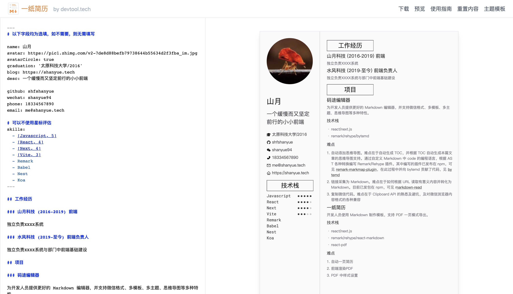
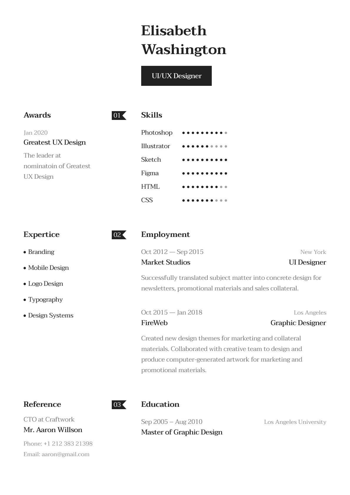
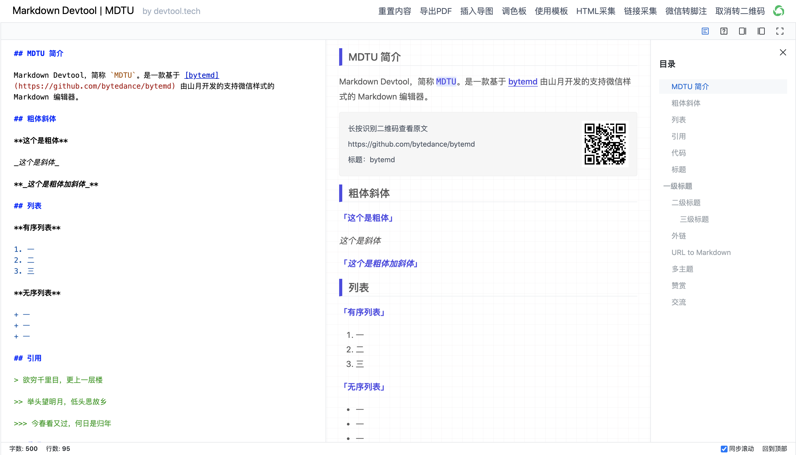
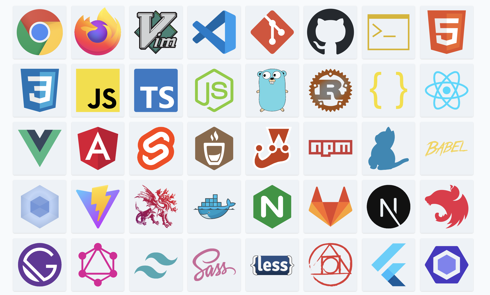
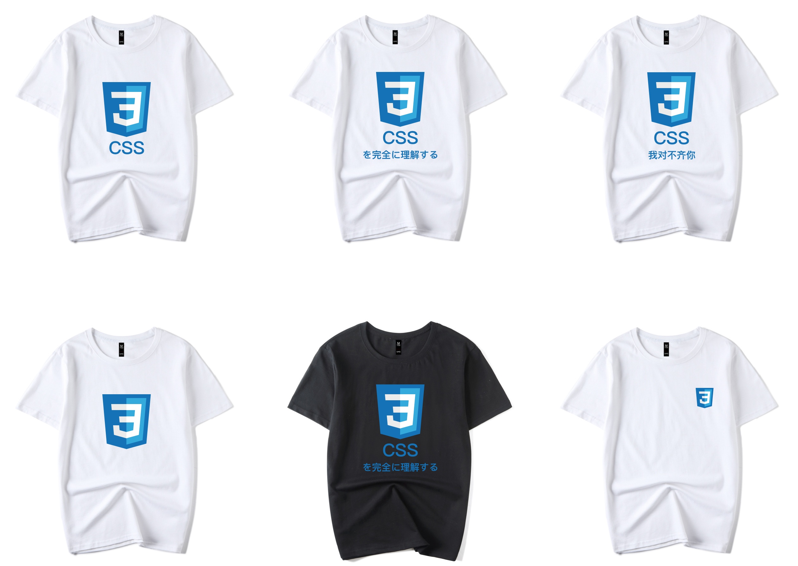

# 我的五一回顾：两个项目与一个店铺

今年五一全国国内旅游出游 2.3 亿人次，已达历史最高，你的五一去了哪里？

五一在外旅游的人比较多，我一个没有工作的人怎么好意思去和他们抢景点。于是我决定回家，避开高峰再出去旅游。

我在家呆了五天，趁闲做了以下三件事:

## 01 [一纸简历](https://cv.devtool.tech/app)上线

这几天从无到有上线了一个新的应用：[一纸简历](https://cv.devtool.tech/app)，它使用 Markdown 编写简历，用以两个月后我重新找工作时的简历制作与投递。

正如这个应用的名字而言，简历只需一页，本应用会根据简历内容多寡来自动压缩为一页简历。

目前是个初版，你也可以看出来，它的样式较为简陋，并且自动一页排版的功能还没有完成。

它最大的优势为实时渲染 PDF，你在网页上所见到的样式便是 PDF 中真实的样式，缺点在于 PDF 中的样式与实在难调，而以下是我的目标样式

## 02 [MDTU](https://markdown.devtool.tech/app)重构

MDTU，域名迁移到 `markdown.devtool.tech`，因此该应用也命名为 `Markdown Devtool`，简称 `MDTU`，谐音取中文字 **码途编辑器**，也有人戏称为 **码秃编辑器**。

MDTU 用来书写 Markdown，可管理模板、从URL中读取Markdown、导出PDF等。并对微信支持友好，支持微信外链转二维码及脚注、复制到微信等。

MDTU 也经历了一次重构，由以前的项目 [开发者工具箱](https://devtool.tech) 抽离出来，并对首页体积进行了优化: 500KB -> 126KB。

## 03 程序员的小书桌店铺

这是我心血来潮开的一个淘宝店铺，专注于程序员周边，因此店铺名就叫做**程序员的小书桌**。目前仅仅有新上架的一件 CSS 图案的短袖与40张一套的贴纸，有兴趣的你可以关注一下。

有朋友吐槽我：程序员这群人死抠死抠的，小东西客单价低不赚钱，大东西像电子设备看准牌子买，一点羊毛都薅不出来。

我想想也对，权当玩票。最近几天也出了几单，折腾下来心想，开店铺的核心技能还是 PS 啊。

还有一个好处，以后在公众号中可以来送短袖与贴纸了。**那就从本篇文章开始吧，你希望短袖上的图案是哪一个技术的 Logo，点赞最多的五位同学可以获取你们喜欢图案的短袖。**
