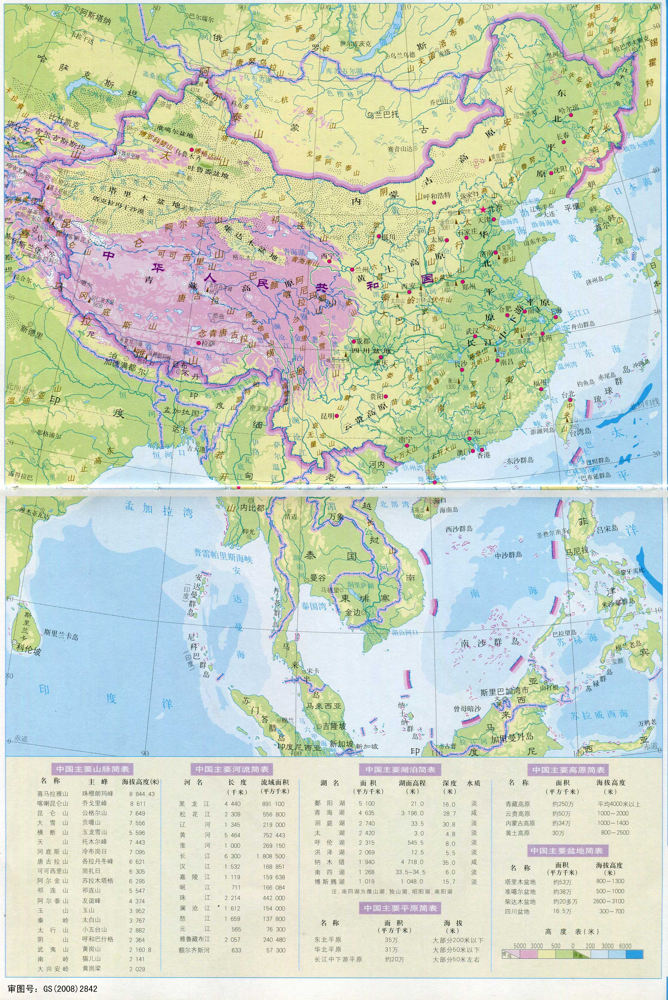

date: 2020-04-10 15:00
loc: 乌鲁木齐

---

# 裸辞旅游的开始：如何获取一份正确而完整的高铁线路图

我裸辞大概已过去了五十多天，这中间历程，乘坐火车从西安经河西走廊辗转到了新疆，目前在乌鲁木齐。不来新疆不知中国之大，不来新疆不知张骞通西域之艰辛。

张骞受两次俘虏之灾、费十三年之力、历千万艰辛方通西域，开拓丝绸之路，封博望侯，取其渊博望达的意思。正是由于张骞这个人形 GPS，霍去病得以驱逐匈奴，封狼居胥，拿下河西走廊，始置河西四郡：

可见，一份地图是多么地重要！

而我所在这近两个月的短短旅途，尽管每天都在拿起百度地图谷歌地图不停地划来划去，盯着发呆一个小时。依旧因为地图的缺失，改变了多次旅游走向。更准确地说，是因为铁路客运路线图的缺失，而在百度地图上无法清晰地看到火车路线图。当我经西安走到宝鸡时，才发现高铁无从翻越南侧的秦岭到达汉中及至四川，只能通过兰州转车或者再次返回西安，我的西北之行循着丝绸之路就此开始。

那我应该从哪里去搞到全国的铁路路线路呢？！

在信息化建设如此全面的今天，我甚至很难在官方途径找到线路图，殚精竭力地终于在全网找到由个人制作的高铁线路图。

## 如何自己绘制

以上仅仅是高铁路线路，那客运专车路线图呢？

求人不如求己，还是自己来吧！

如果我们知道了所有的火车站点信息，是否就能自己在地图中绘制出来？而通过 12306 又可以爬取到所有的车站站点数据。此时通过前端技术绘制路线图就容易很多，目前我正在完成这部分工作

## 更多的一些地图及链接

+ [县市边界行政图: https://datav.aliyun.com/tools/atlas](https://datav.aliyun.com/tools/atlas/#&lat=31.769817845138945&lng=104.29901249999999&zoom=4)

## 高清图

由于微信公众号对于上传图片的尺寸限制，以上图片的清晰度有可能受损。如需原图，可添加我微信 `shanyue94` 获取