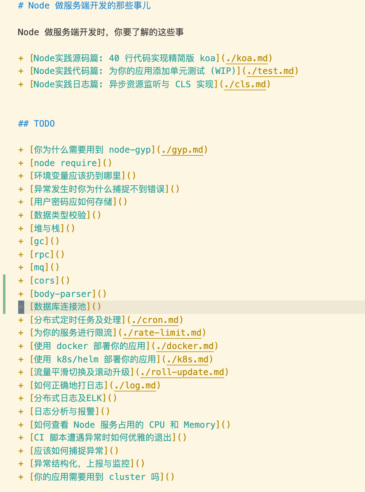
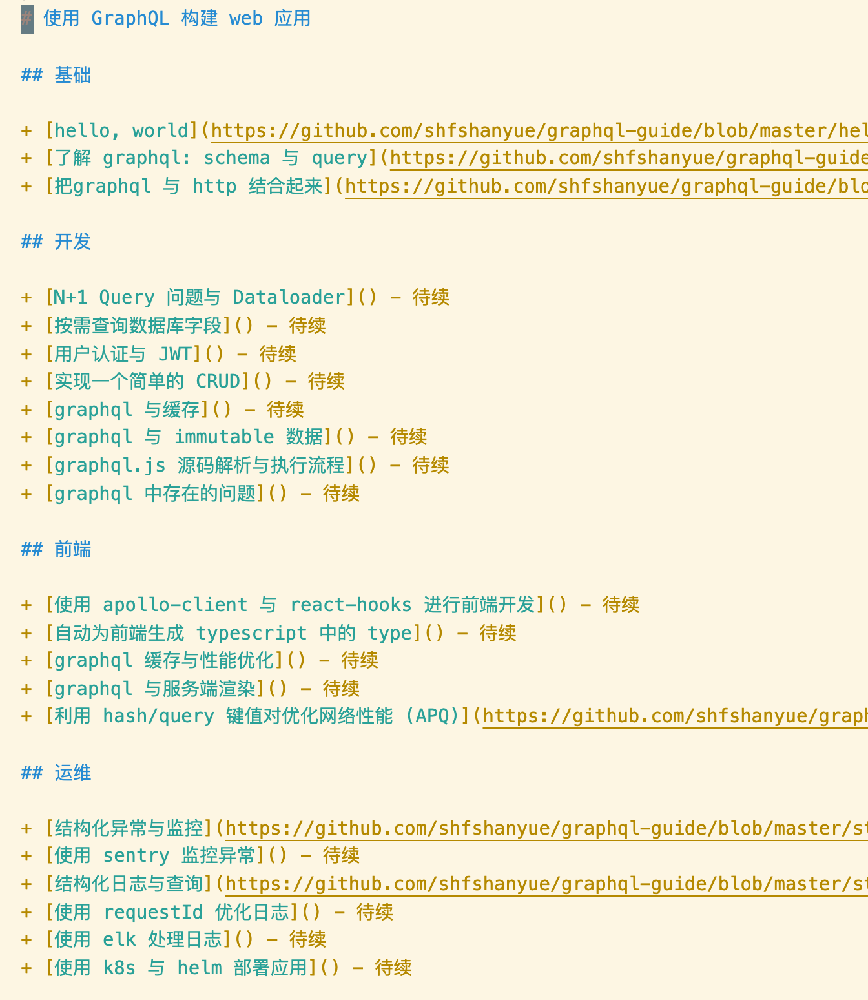

date: 2020-07-01 20:00

---

# 山月的六七月创作（暨不发广告）计划

今天七月一日建党节，2020 悄无声息已经走过了一半。先来装逼一句：

> 少年自负凌云笔。到而今、春华落尽，满怀萧瑟。

回想最近公众号上原创更新频率降低，阅读量更是惨不忍睹。

这有可能与最近微信公众号更换了曝光算法有关：你可能发现你的订阅号列表中的文章推送时间已经乱序了。**而对于自己经常不打开的公众号甚至会从推送列表中消失！**

而对于一个公众号的点赞、阅读、再看、星标，则可以提高它在公众号列表中的权重。

既然已经看到这里了，，那就顺手给个星标吧，感激不尽(抱拳

当然对于提升公众号权重最重要的是提高文章质量！于是我做了以下两个重大决定

1. **七八月份不恰饭不发广告了！！！**
1. **七八月坚持一周四篇原创文更新**

于是你们在我的公众号上再也不用担心打开是不是广告了！ **以后会在每天晚上 10: 24 推送文章，首条原创，次条转载优质文章**

## 系列文章

我以前写过两个系列的文章，一个是关于服务器运维的，一个是关于前端进阶的，目录如下

1. [前端高级进阶：javascript 代码是如何被压缩](https://mp.weixin.qq.com/s?__biz=MjM5NTk4MDA1MA==&mid=2458073285&idx=2&sn=063efcd44a700acc5958aab4736a5966&chksm=b187aeb886f027aed5ccaaecd511e8986c4f161581ef8044c3968aaf17f1c97238a42d841916&token=1220258650&lang=zh_CN#rd)
1. [前端高级进阶：如何更好地优化打包资源](https://mp.weixin.qq.com/s?__biz=MjM5NTk4MDA1MA==&mid=2458073257&idx=1&sn=c2cf508cf95f92031c16f91111b38ad8&chksm=b187aed486f027c25c95dc58a26ef3ca6502ac5b28051c4bb6440a705795c3c938b74d800c7c&token=1220258650&lang=zh_CN#rd)
1. [前端高级进阶：网站的缓存控制策略最佳实践及注意事项](https://mp.weixin.qq.com/s?__biz=MjM5NTk4MDA1MA==&mid=2458073285&idx=1&sn=da3acbb864c10cfeacffda7a72891c4c&chksm=b187aeb886f027ae7bfee589b2e4f7a632738d3abac4cd5980136bd12fec4852f487b808601e&token=1220258650&lang=zh_CN#rd)
1. [前端高级进阶：在生产环境中使你的 npm i 速度提升 50%](https://mp.weixin.qq.com/s?__biz=MjM5NTk4MDA1MA==&mid=2458073303&idx=1&sn=1bf274e857d21316396e9bd7fe6449fc&chksm=b187aeaa86f027bc9328c602063368d14628ab5b099e41210b7691f093ed08036d6352c1ba1f&token=352443757&lang=zh_CN#rd)
1. [前端高级进阶：前端部署的发展历程](https://mp.weixin.qq.com/s?__biz=MjM5NTk4MDA1MA==&mid=2458073311&idx=1&sn=c132105ab64bc13f8a6245de513231db&chksm=b187aea286f027b4f6e2772d6a183c85911b87c0b61149ac56760acd930babcdfdce0e4d9a54&token=2089781434&lang=zh_CN#rd)
1. [前端高级进阶：团队代码规范约束最佳实践](https://shanyue.tech/frontend-engineering/eslint.html)
1. [前端高级进阶：使用 docker 高效部署你的前端应用](https://github.com/shfshanyue/blog/tree/master/frontend-engineering/docker.md)
1. [前端高级进阶：CICD 下的前端多特性分支环境的部署](https://github.com/shfshanyue/blog/tree/master/frontend-engineering/feature-deploy.md)

接下来，准备持续更新两个系列文章 (虽然感觉受众少)

1. Node 进阶系列。我司 Node 用作服务端开发语言，并且山月已经写了三年 Node，所以来总结一波
1. GraphQL 指南。关于 graphql 也写了很久，所以也总结一下

关于目录，都拟了两份...

**另外，你们想看什么文章欢迎留言啊！**

## 大厂内推及每日面试题

除此之外，山月还致力于另一个公众号的运营：【互联网大厂招聘】

**每周都会与大厂的技术招聘负责人深入聊天，深入了解他们的业务及技术栈偏好，方便候选人掌握最全面的信息去面试**

关于以前的大厂内推推送可以看这两篇文章:

+ [【字节-视频架构组-前端】头条架构组招人了内含自测题](https://mp.weixin.qq.com/s?__biz=MzA3MzU0MjIzMA==&mid=2247483800&idx=1&sn=1d9f8c4137e9426d21c0813321afd016&chksm=9f0c3ea1a87bb7b75cd227a019609f3e8386f88e3123e641cf07f8c009a5c3c1150def254f3d&token=467808697&lang=zh_CN#rd)
+ [【阿里-供应链平台事业部】社招、校招 (附面试题)](https://mp.weixin.qq.com/s?__biz=MzA3MzU0MjIzMA==&mid=2247483727&idx=1&sn=0bd43a7fbe89533a6c0abf8be9d7eb8d&chksm=9f0c3e76a87bb7603a5d769760a18b893c32f841f1b0810bff0a685d8bae0a646eba21b40c49&token=467808697&lang=zh_CN#rd)

除每周一两次的大厂招聘内推信息外，本号还每日推送大厂面试并争取在三百字内把答案讲清楚，每天五分钟，半年进入大厂中。

好了，终于又水了一篇文章...明天见

# 关注我

扫码添加我的微信，备注进群，加入高级前端进阶群

