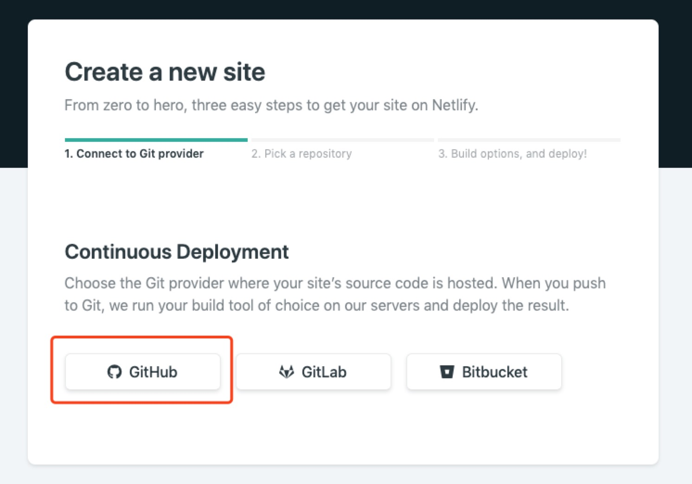
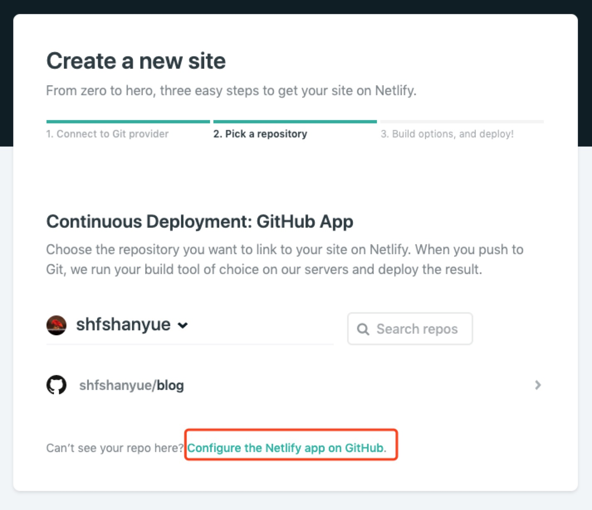
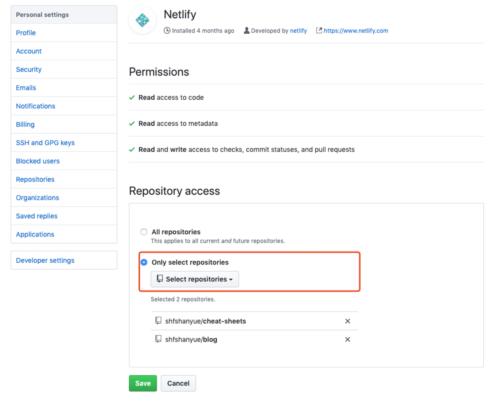
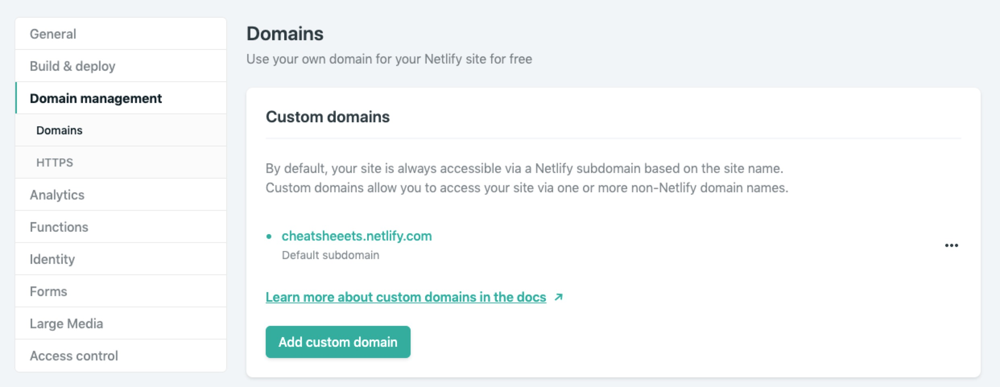

# 使用 netlify 托管你的前端应用

我前几天的一篇文章 [如果你想搭建一个博客](https://shanyue.tech/op/if-you-want-a-blog)，其中提到了使用 `netlify` 做博客托管服务。

[netlify](https://www.netlify.com/) 可以为你的静态资源做托管，就是说它可以托管你的前端应用，就像 `github page` 那样。不过，它不又只像 `github page` 那么功能单一，它可以做更多的事情

1. `CI/CD`: 当你 push 代码到仓库的特定分支会自动部署
1. `http headers`: 你可以定制资源的 `http header`，从而可以做**缓存优化**等
1. `http redirect/rewrite`: 如果一个 `nginx`，这样可以配置 `/api`，解决跨域问题
1. `二级域名`: 你如果没有自己的域名，可以使用它的任意二级域名-只要没有被占用，这比 `github page` 多仓库只能用 `/path` 要好很多
1. `CDN`: 把你的静态资源推到 CDN，虽然是国外的
1. `https`: 为你准备证书，当然使用的是 `lets encrypt`
1. `Prerender`: 结合 `SPA`，做预渲染

**它做的是整个前端部署工作流的事情，而且很多事情都是自动完成的。**

年初(2019/03) 我写过一篇文章: [如何使用 docker 高效部署前端应用](https://shanyue.tech/op/deploy-fe-with-docker)。其中讲了如何使用一个 `nginx` 镜像优化构建前端静态资源的过程，而这只是前端部署工作流的一小部分，这种方案更加适合小型公司。

而在大型公司，基础设施更加健全，对于前端部署很有可能有一个部署平台，如同 `netlify` 一样：**你根本不需要构建镜像，你只需要写一个极其简单的配置文件。**

本篇文章讲解如何结合 `netlify` 去部署你 `github` 上的前端应用。将以我的个人仓库 [cheat-sheets](https://github.com/shfshanyue/cheat-sheets) 部署到 <https://cheatsheeets.netlify.com/git> 作为示例进行演示。

> 当然 `gitlab` 也可以结合 `netlify` 使用

+ 本文地址: [使用 netlify 部署你的前端应用](https://shanue.tech/op/deploy-fe-with-netlify)
+ 系列文章: [个人服务器运维指南](https://shanyue.tech/op)

## 新建站点

### 新建站点

使用 `github` 授权登录 [netlify](https://www.netlify.com/)。在主页点击 `New site from git` 按钮，新建站点


### 选择一个仓库







### 构建选项

+ `build command`: 如何生成静态文件，一般会是 `npm run build`
+ `publish directory`: 静态文件目录，一般会是 `public/dist` 等

另外也可以作为配置文件，参考下一节


### 部署成功


### 配置二级域名



此时通过 <https://cheatsheeets.netlify.com/git> 访问页面，成功部署

## 配置文件

配置文件可以配置你的 http 的 `header`，`rewrite`，`redirect` 等，可以参考 [官方文档](https://docs.netlify.com/configure-builds/file-based-configuration/#headers)

以下我是的博客 [shfshanyue/blog](https://github.com/shfshanyue/blog) 的配置文件

``` toml
[build]
  base = ""
  publish = ".vuepress/dist"
  command = "npm run build"

[[headers]]
  for = "/*"

  [headers.values]
    cache-control = "max-age=7200"

[[headers]]
  for = "/assets/*"

  [headers.values]
    cache-control = "max-age=31536000"
```

+ `build.publish`: 静态文件目录
+ `build.command`: 如何生成文件的命令

另外，我把 `/assets/*` 做了永久缓存，因为里边都是带了 hash 值的静态文件

## 配置 api 解决跨域问题

另外，如果你的前端应用需要配置代理服务器，比如 `/api` 与 `/graphql`，可以设置 `redirects`。算是替代了一部分 `nginx` 的功能

``` toml
[[redirects]]
  from = "/graphql/"
  to = "https://graphql.shanyue.tech"
  status = 200
  force = true
  headers = {X-From = "Netlify"}
```

## 小结

如果你有个人博客，个人作品或者应用，那么你可以试一下 `netlify`。由于服务器在国外，他可能有些慢，不过你可以试试国内厂商的 CDN

## 相关文章

+ [如何使用 docker 高效部署前端应用](https://shanyue.tech/op/deploy-fe-with-docker)
+ [如果你只想搭建一个博客](https://shanyue.tech/op/if-you-want-a-blog)
