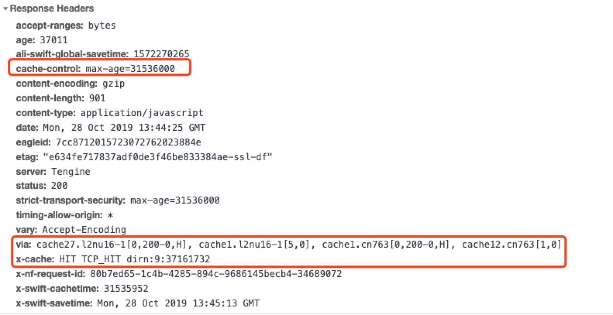

# 如果你想搭建一个博客

如果你只想搭建一个博客，那么你不需要一个服务器就能完成搭建工作，而且会更容易些

相对而言使用一个*静态网站网站托管服务*，复杂度与工作量就会少了很多，毕竟它部署时只需要维护若干静态文件。也更适合刚接触博客搭建或者没有服务器的同学

<!--more-->

## 00 架构

根据你的域名有没有备案以及对网络时延的要求，可以选择以下两种方案

1. `SSG` + `github` + `netlify/vercel`，适合域名没有进行备案且主要服务于国外的同学
1. `SSG` + `github` + `github actions` + `alioss` + `alicdn(可选)`，适合域名在国内进行备案的同学

其中 `netlify` 与 `vercel` 都是国外优秀的网站托管平台，全球各地均有 CDN 节点，并支持与 github 协作进行自动部署，特别是 `vercel` 好用到爆。以下是他们的官网，对于个人项目来说*完全免费*

+ [Vercel: Develop. Preview. Ship. For the best frontend teams](https://vercel.com/)
+ [Netlify: All-in-one platform for automating modern web projects](https://www.netlify.com/)


## 01 选择一款静态网站生成器

动态博客带有数据库等存储，状态重，复杂性高，不便于部署与迁移。无状态的静态博客是一个不错的选择。

`SSG`，全称 `Static Site Generator`，静态网站生成器。如果你不想折腾数据库，那你可以选择一个静态网站生成器: **你只需要喂给它一大堆 markdown，它就会生成一大堆 html 文件。**

至于生成器，这是我曾经使用过的，感觉都很不错，你可以任选一款，如何构建参考官方文档。

+ [hugo](https://github.com/gohugoio/hugo): github star 39k。使用 go 开发，是我用过的构建最快的生成器，它的简介也只有一句话: `The world’s fastest framework for building websites.`，不过我自我感觉它的主题样式略少。如果你想定制，那你需要对 `go` 语言的 `template` 有些了解。
+ [hexo](https://github.com/hexojs/hexo): github star 28.4k。使用 node 开发，主题样式多，我还是较为喜欢这一点。
+ [vuepress](https://github.com/vuejs/vuepress): github star 14.5k。使用 vue 开发，一般用作文档较多。从我的博客风格就可以看出来，它使用 `vuepress` 构建。
+ [gatsby](https://github.com/gatsbyjs/gatsby): github star 41 k。使用 React 开发，可定制性强。`React` 的官网就是使用 `gatsby` 开发

我自己的博客 [山月行](https://shanyue.tech) 目前使用 `vuepress` 进行构建。

## 02 如何使他人评论博客文章

有些小伙伴希望自己的博客引入评论系统，这样子可以更方便地与其他人交流。但是，引入评论势必引入*数据存储*，引入数据存储势必引入*后端 API*的编写，甚至需要买一个服务器来支持 API 及数据存储，此时问题就变得复杂化了。

而博客评论可视为特定的通用业务领域模型，就会有该领域模型中通用的解决方案，而我认为一种比较好的方案是：

**使用 Github Issues 作为数据存储，使用 Github API 作为后端 API，使用 npm package 作为 SDK**

以下是借用 `github issues` 的反响不错的两个 npm package，推荐使用

+ [gitment](https://github.com/imsun/gitment)
+ [gittalk](https://github.com/gitalk/gitalk)

> 我的博客刚开始使用了 gitment 作为评论系统，后来没人评论就关了...所以，有时候需不需要开博客评论，也要看看自己博客的流量
## 03 如何部署

当使用 SSG 在本地搭建好一个博客后，需要部署在互联网提供服务，*可以使用诸多免费的托管平台*。

+ [github pages](https://pages.github.com/): 部署后可以使用二级域名 `xxx.github.io`
+ [netlify](https://docs.netlify.com/): 部署后可以使用二级域名 `xxx.netlify.com`
+ [vercel](https://vercel.com): 部署后可以使用二级域名 `xxx.vercel.app`

此处及剩余篇章使用 `netlify` 进行演示，它可以结合 `github` 做 CI/CD: 当你把代码 push 到 github 的指定分支时，它就会在 netlify 自动部署。另外它也有 `Cache`、`Redirect`、`Rewrite` 等诸多配置

我的[个人博客](https://shanyue.tech)*曾经*使用了 `netlify`，关于构建的配置文件如下，需保存在根目录的 `netlify.toml` 文件中。由于我的博客使用了 `vuepress` 作为 SSG，因此配置文件如下

``` toml
[build]
  base = ""
  publish = ".vuepress/dist"
  command = "npm run build"

[[headers]]
  for = "/assets/*"

  [headers.values]
    cache-control = "max-age=31536000"
```

关于部署的详细流程，可参考以下两篇文章:

+ [使用 netlify 部署你的前端应用](https://shanyue.tech/no-vps/deploy-fe-with-netlify.html)
+ [使用 alioss 部署你的前端应用](https://shanyue.tech/no-vps/deploy-fe-with-alioss.html)

## 04 如果你想使用自己的域名

你可以在域名提供商 [godaddy](https://sg.godaddy.com/zh) 或者[阿里云](https://wanwang.aliyun.com/domain/searchresult/#/?keyword=shanyue&suffix=tech) 直接注册一个。

并且在域名提供商处配置 CNAME: `yourdomain.com` -> `xxx.netlify.com`

**当使用了自己的域名后，你需要去 `netlify` 为你的域名配置 `https`，netlify 会根据你提供的域名通过 `Lets Encrypt` 为你自动生成证书**

## 05 使用 CDN

由于网站托管服务的服务器大都在国外，网络速度上可能惨不忍睹，配置 CDN 就能派上了用场。如果域名*已备案*，建议使用阿里云的CDN服务，*按量收费*。

**当然这时候 `https` 需要重新配置 (阿里云的 https 流量也会收费)**

> Note: 使用 CDN 时要配置好正确的 nameserver

## 06 配置永久缓存

对于 vue/react 此类现代前端技术而言，结合 webpack 工程化越来越出色。如 `vuepress` 中 `SPA` 与 `SEO` 的结合， **但最重要的是生成带有 hash 的静态资源文件**

**为带有 hash 的静态资源文件在源站(即netlify)配置永久缓存，也能在阿里云上为 CDN 与 https 省不少流量费**

``` toml
[[headers]]
  for = "/assets/*"

  [headers.values]
    cache-control = "max-age=31536000"
```

以下是缓存在CDN命中的截图

1. `cache-control: ma-age=31536000` 设置永久缓存
1. `via` 通过的代理节点
1. `x-cache: HIT` 在CDN上命中缓存



## 相关文章

+ [使用 netlify 部署你的前端应用](https://shanyue.tech/no-vps/deploy-fe-with-netlify.html)
+ [使用 alioss 部署你的前端应用](https://shanyue.tech/no-vps/deploy-fe-with-alioss.html)
+ [如何使用 docker 高效部署前端应用](https://shanyue.tech/frontend-engineering/docker.html)
