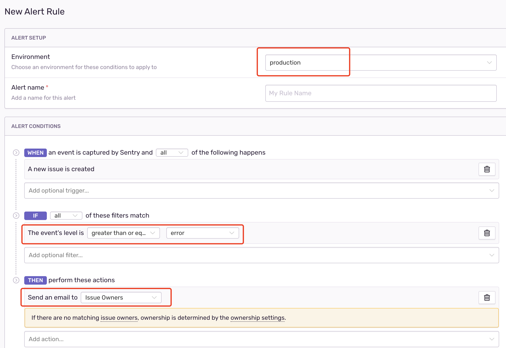
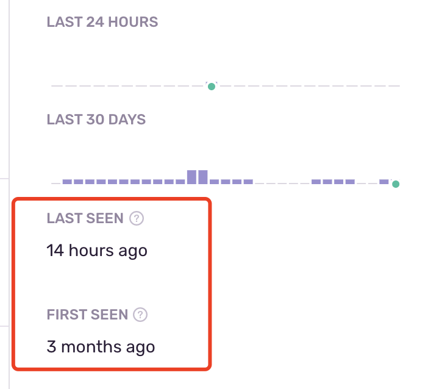
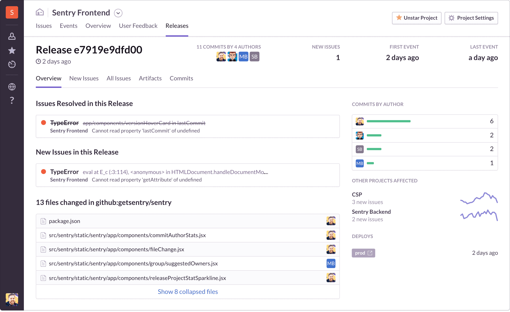

# Sentry: 免费的异常上报服务

在以前的章节中，我们可以使用免费的云服务来完成一个弱存储的前端应用

1. 使用 Vercel (或 Netlify) 部署前端应用
1. 使用 Vercel Serverless Function (或其它 Serverless 方案) 部署简单的后端 API

此时，尚缺一个异常报警系统，可以用 `Sentry` 搞定。`Sentry`，官网 <sentry.io>，帮助开发者解决 Bug 和优化性能的一个 APM (application monitoring platform) 系统。对于个人开发者，你可以免费使用它帮助自己监控多个项目，**只不过功能有限，在看文档时要格外注意**。

**至于登录 Sentry，直接使用 Github 登录即可。** 以下对 Sentry 的使用做一个简单的介绍。

## 术语

基本属于为以下两个

+ Event: 应用端每次触发异常，就是一次 Event，会上报到 Sentry 中
+ Issue: Sentry 把同一位置触发的异常聚合在一起就是 Issue，**在 Sentry 中以 Issue 为主要单位分析问题**

> 多想一步：Sentry 如何把 Event 聚合成 Issue，即如何确认多个 Event 都是在同一位置触发的？

## 上报

作为一个专业的异常上报服务，Sentry 支持各式各样的语言，如下所示:

+ Javascript
+ Go
+ Python
+ Ruby
+ Java

基本上适用于 Serverless 运行时的语言都可以接入 `Sentry`，这是一个振奋人心的好消息。

关于各大语言及框架可如何接入，直接参考官方文档 [Sentry Supported Platforms](https://docs.sentry.io/platforms/)，最简答最基本的方式就是直接捕捉异常并上报。


``` js
try {
  aFunctionThatMightFail();
} catch (err) {
  Sentry.captureException(err);
}
```

## 报警 (Alert)

### 报警规则 (Alert Rule)

如以下是常见却容易被忽略的报警规则

1. 当只有生产环境下的 Issue 才会触发报警
1. 当只有异常级别大于 Error 才会触发报警

当然，你也可以个性化定义一些 Alert Rule



### 报警方式

当出现问题时如何受到通知？

这当然不能够一直忙等待空轮询，否则过于耗费精力。当然要使用发送邮件这类通知类型的方式了，除了邮件外还有其他的不过需要集成到 Sentry 中。

+ 发送邮件
+ 钉钉消息 (需集成)
+ 手机短信 (需集成)
+ 手机电话 (需集成)

## 分析

### 1. 第一次/最后一次报错

+ `First Seen`: 第一次报错时间有助于捕捉到该异常发生的版本号
+ `Last Seen`: 最后一次报错时间决定这个异常是否已解决，或者是否还需要解决



### 2. 获取到 Release

`Release` 就是版本号，这个需要在代码中*手动配置*。通过 Release 可以

1. 快速推断出出现问题的 Commit，并指定给对应的提交者
1. 对该 Release 出现的问题进行聚类


