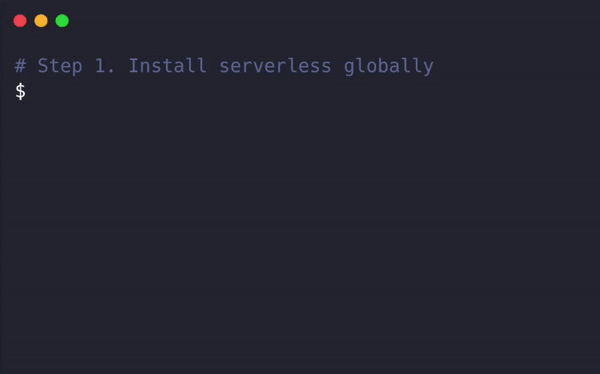

# serverless framework 初识

::: warning
本篇文章有可能已过时，可使用最新的 Serverless Component
:::

`serverless` 是各大云服务商提供出来的一种无服务的计算资源。为什么叫无服务呢，因为如果你使用 `serverless`，你只需要关注应用层，而无需关心底层基础设施，无需运维。简而言之，`serverless` 并不是真的无服务，而是关于有服务的不归你管，云服务商帮你搞定，比如 `google`，`aws` 或者 `aliyun`。

关注点分离，好呀好，有了 `serverless` 以后只需要也只能关心业务了，这也不知是喜是忧。但你也无需过于担心，这是对已有并且成熟的开发模式的挑战，解决痛点有限，因此很多团队对于替换为 `serverless` 也动力不足。

但是我仍然建议你学习 `serverless`，毕竟各大云厂商对于 `serverless` 有很多免费额度可以让你薅羊毛，对于个人开发者利好。

## serverless framework

`serverless` 是基于各大云服务商的产品，每一个云厂商对于 `serverless` 都有一套自己的 API。为了能够兼容这些 API，为了让你的代码 `Write Once, Run Everywhere`，于是 `serverless framework` 诞生了。

> 通常认为 serverless = faas + baas，然而 serverless framework 只兼容到了 faas，对于 baas，如各家提供的数据存储服务，要做到兼容还是很难。

## 快速开始



`serverless framework` 与腾讯云的函数计算来开始一个 `hello, world` 吧

``` bash
$ npm install -g serverless
```

``` bash
$ mkdir hello

$ cd hello

$ serverless create --template tencent-nodejs --name hello

Serverless: Generating boilerplate...
_______                             __
|   _   .-----.----.--.--.-----.----|  .-----.-----.-----.
|   |___|  -__|   _|  |  |  -__|   _|  |  -__|__ --|__ --|
|____   |_____|__|  \___/|_____|__| |__|_____|_____|_____|
|   |   |             The Serverless Application Framework
|       |                           serverless.com, v1.67.0
-------'

Serverless: Successfully generated boilerplate for template: "tencent-nodejs"
```

此时在 `hello` 目录自动生成了关于 `serverless` 在腾讯云的 `hello, world` 版。由于缺少关于腾讯云的 `plugin` 需要首先装包

``` bash
$ npm i
```

## 简述

## serverless.yaml

`serverless.yaml` 是 `serverless framework` 的核心，是一个 `sls` 服务的资源配置文件。如果把 `sls` 等同于 `faas + baas`，那么 `faas` 与 `baas` 的配置都在这里。

``` yaml
service: hello

# 云厂商的信息，如 aws/google/aliyun/tencent
provider:
  name: tencent
  runtime: Nodejs8.9    # Nodejs 版本号
  credentials: ~/credentials

plugins:
  - serverless-tencent-scf  # 腾讯云对 sls 的适配

functions:
  hello_world:          # 函数名
    handler: index.main_handler # 该函数所调用的函数
```

### index.js

``` javascript
exports.main_handler = (event, context, callback) => {
  callback(null, 'Hello World');
};
```

`index.js` 中是 `faas` 中的核心，`function`。在 `callback` 中来回调你所需的数据。


## 部署

使用 `sls deploy` 打包资源并部署到腾讯云，此时需要你在腾讯云的凭证信息。**你可以通过与腾讯云绑定的微信扫码授权**，相比其他厂商需要手动维护凭证信息，还是很方便的。

``` bash
# 其中 sls 是 serverless 的简写
$ sls deploy
Serverless: Packaging service...
Serverless: Excluding development dependencies...
Serverless: Uploading service package to cos[sls-cloudfunction-ap-guangzhou]. hello-dev-KamjFZ-2020-04-15-21-47-11.zip
Serverless: Uploaded package successful /Users/xiange/Documents/hello/.serverless/hello.zip
Serverless: Creating function hello-dev-hello_world
Serverless: Updating code...
Serverless: Updating configure...
Serverless: Created function hello-dev-hello_world
Serverless: Setting tags for function hello-dev-hello_world
Serverless: Creating trigger for function hello-dev-hello_world
Serverless: Deployed function hello-dev-hello_world successful
Serverless: Service Information

service: hello
stage: dev
region: ap-guangzhou
stack: hello-dev
resources: 1
functions:   hello_world: hello-dev-hello_world

# 如果需要部署到生产环境
$ sls deploy --stage  production
```

稍等一分钟，就可以看到部署成功的信息。

## 函数调用

本地函数可以很简单地通过调用函数名来执行，`serverless` 也可以通过 `sls invoke` 来调用函数。

``` bash
$ sls invoke --function hello_world

Serverless:

"Hello World"

----------
Log:
START RequestId: 69ffc57f-0afb-471b-865d-c7289e16f2ac
Event RequestId: 69ffc57f-0afb-471b-865d-c7289e16f2ac

END RequestId: 69ffc57f-0afb-471b-865d-c7289e16f2ac
Report RequestId: 69ffc57f-0afb-471b-865d-c7289e16f2ac Duration:64ms Memory:128MB MemUsage:21.8125MB
```

## 日志与监控

`serverless` 号称 `noops`，很大程度上是由于少了 `log` 及 `metrics` 的基础设施搭建。使用 `sls logs` 与 `sls metrics` 可以获取相关信息，但是丰富度及可定制化就完全不如 `kubernetes` 运维了。

``` bash
$ sls logs
Serverless: {
  "FunctionName": "hello-dev-hello_world",
  "RetMsg": "\"Hello World\"",
  "RequestId": "fc72271f-eede-4dbb-8315-f24045597db7",
  "StartTime": "2020-04-15 21:48:55",
  "RetCode": 0,
  "InvokeFinished": 1,
  "Duration": 1,
  "BillDuration": 1,
  "MemUsage": 74870780,
  "Log": "START RequestId: fc72271f-eede-4dbb-8315-f24045597db7\nEvent RequestId: fc72271f-eede-4dbb-8315-f24045597db7\n2020-04-15T13:48:55.344Z\tfc72271f-eede-4dbb-8315-f24045597db7\t{}\n \nEND RequestId: fc72271f-eede-4dbb-8315-f24045597db7\nReport RequestId: fc72271f-eede-4dbb-8315-f24045597db7 Duration:1ms Memory:128MB MemUsage:71.402344MB",
  "Level": "",
  "Source": ""
}
Serverless: {
  "FunctionName": "hello-dev-hello_world",
  "RetMsg": "\"Hello World\"",
  "RequestId": "62b5760e-5545-4316-bef6-423d4b568396",
  "StartTime": "2020-04-15 21:48:45",
  "RetCode": 0,
  "InvokeFinished": 1,
  "Duration": 2,
  "BillDuration": 2,
  "MemUsage": 74870780,
  "Log": "START RequestId: 62b5760e-5545-4316-bef6-423d4b568396\nEvent RequestId: 62b5760e-5545-4316-bef6-423d4b568396\n2020-04-15T13:48:47.995Z\t62b5760e-5545-4316-bef6-423d4b568396\t{}\n \nEND RequestId: 62b5760e-5545-4316-bef6-423d4b568396\nReport RequestId: 62b5760e-5545-4316-bef6-423d4b568396 Duration:2ms Memory:128MB MemUsage:71.402344MB",
  "Level": "",
  "Source": ""
}

$ sls metrics
Serverless: Service wide metrics
2020-04-14 22:09:45 - 2020-04-15 22:09:45

Service:
  Invocations: 5
  Outflows: 0
  Errors: 0
  Duration(avg.): 7.3 ms

Functions:
  hello-dev-hello_world:
    Invocations: 5
    Outflows: 0
    Errors: 0
    Duration(avg.): 7.3 ms
```

## 下一步

从本篇文章，可以大概知道如何在腾讯云初建一个 `serverless` 函数，并且知道了如何执行并且调用它，但好像仅仅如此。在日常的技术讨论中，它往往与业务开发结合在一起，在接下来的篇章中，我将介绍

1. 如何使用 `serverless` 部署 API Server，如 `koa`，`python`，`go`
1. 如何使用 `serverless` 部署纯前端应用，如 `react`/`vue`
1. 如何使用 `serverless` 部署 SSR 应用，如 `next`/`nuxt`
1. 如何使用 `serverless` 跑定时任务及爬虫
