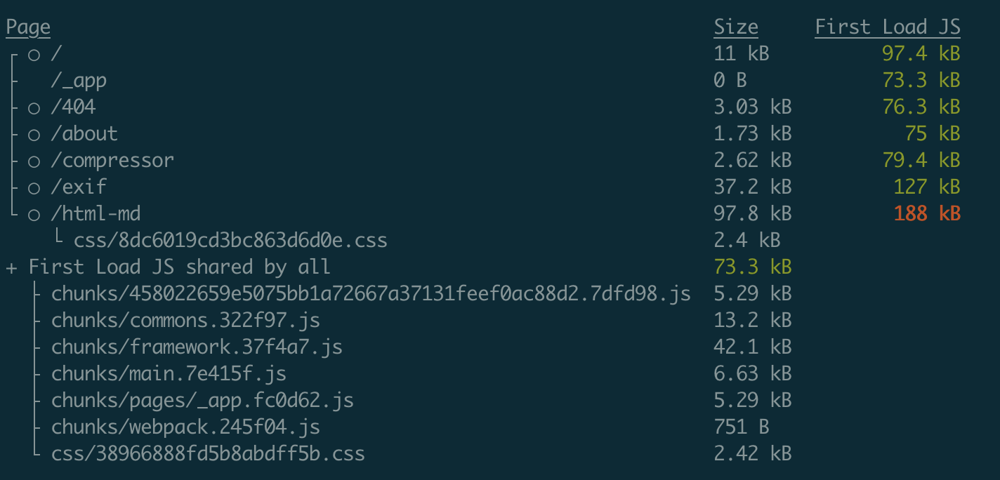
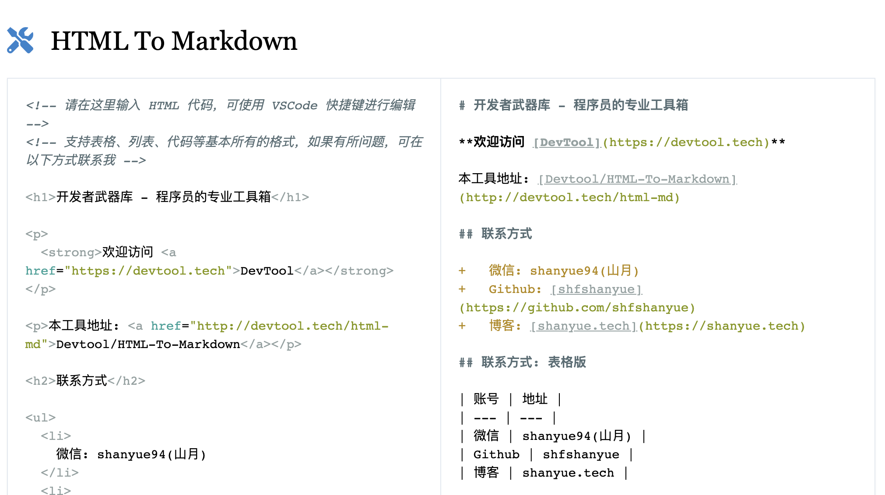

# 使用 Node 开发一个命令行工具

使用 Node 开发一个命令行工具在工作中也较为常见，也很有意思，较为其它语言而言也更加简单，今天写一篇文章总结一下如何写一个友好健壮的 cli 工具

在阅读完本篇文章之后，可以阅读 Github 上的一篇文章: [Node CLI 工具最佳实践](https://github.com/lirantal/nodejs-cli-apps-best-practices)

## 命令行工具

什么是命令行工具？

最初印象大致是 `ls`，`pwd` 这些能够**在终端执行的系统命令**，这样的命令有很多，数不胜数，被称为系统内置命令。如果使用 `which` 查看他们的来历，则能够发现他们的庐山真面目:

``` bash
$ which pwd
pwd: shell built-in command
```

随着对 Linux/Unix 系统理解及使用的逐渐加深，发现了诸多的非内置命令:

+ top
+ ps
+ netstat
+ dig
+ man

使用 `which` 侦查情况，发现他们实际执行的路径在某一个 bin 目录

``` bash
$ which top
/usr/bin/top

$ which ps
/bin/ps
```

而这些 bin 目录在环境变量 PATH 中，豁然开朗。简而言之: **在 PATH 中路径的命令可在其它任意地方执行**。

``` bash
export PATH=$HOME/bin:/usr/local/bin:$PATH
```

你好像想起点什么？在大学配置 Java 时被环境变量支配的各种恐惧？是了，所有语言的可执行命令都要放在 `PATH` 下，只不过其它语言自动给你做了，而 Java 让你自己做这件事。

+ java
+ python
+ pip
+ node
+ npm

开发命令行的原理也是如此，而本篇文章的目标就是:

**使用 Javascript 这门前端开发者熟悉的语言，借助 Node 环境，开发一个命令行工具。**

## 原理

先看两个命令行工具: `serve` 一个流行的静态文件服务器，`markdown` 一个我自己写的解析 URL 到 markdow 的命令行。通过命令解析出他们指向的符号链接

``` bash
$ ls -lah $(which serve)
lrwxr-xr-x  1 xiange  admin    65B  7 12  2020 /usr/local/bin/serve -> ../../../Users/shanyue/.config/yarn/global/node_modules/.bin/serve

$ ls -lah $(which markdown)
lrwxr-xr-x  1 xiange  admin    48B  1 28 20:06 /usr/local/bin/markdown -> ../lib/node_modules/markdown-read/md-read-cli.js
```

从中可以看出他们关于命令行的解析:

1. npm 全局下载 Package 到 /usr/local/lib/node_modules 下 (yarn 同理)
1. 根据 package.json 中 bin 选项的指示，对应的二进制脚本挂载到 PATH 路径
1. 对应的二进制脚本添加 x 权限 (可执行文件权限)

简而言之，Node 环境下的命令行工具，借助的原理无非是环境变量 Path 与一个符号链接

## 从 package.json 说起

在 **package.json 中的 bin 选项**，用以指定最终的命令行工具的名字

``` json
{
  "bin": {
    "markdown": "./md-read-cli"
  }
}
```

如上所示，`markdown` 是最终在终端执行的命令，而 `./md-read-cli` 是该命令实际执行的文件。

对于最终可执行的命令行工具，Node 项目一般倾向置文件于 `bin` 目录下，如以下 Typescript 的配置:

``` json
{
  "bin": {
    "tsc": "./bin/tsc",
    "tsserver": "./bin/tsserver"
  },
}
```

## 一个执行环境

对于可直接执行的文件，需要指明执行环境，首行添加一行说明: 

``` js
#!/usr/bin/env node

// code 往下写
```

这一句话是啥子意思了？

1. `#!` 后接解释器，标明该文件使用 `/usr/bin/env node` 来执行
1. `/usr/bin/env` 为 env 的绝对路径，用以在 PATH 路径中执行命令 (在各种不同的系统中，node 命令行的位置不同，因此使用 `env node` 找到路径并执行)
1. `env node` 在人为层面可理解为执行 `node` 命令

所以这句话的意思是: **使用 node 执行这个脚本**

``` bash
// 不写 #!/usr/bin/env node
$ node serve .

// 写上 #!/usr/bin/env node
$ serve .
```

## 解析命令输入

``` bash
$ node cmd.js 1 2 3
```

``` js
// Output: [
//   '/usr/local/bin/node',
//   '/Users/shanyue/cmd.js',
//   '1',
//   '2',
//   '3',
// ]
process.argv
```

根据解析 `process.argv` 来获取各式各样的参数作为命令行的输入，当然解析参数也要参照基本规律: 格式、可选、必选、简写、说明、帮助等等。[命令行工具命名协议](https://pubs.opengroup.org/onlinepubs/9699919799/basedefs/V1_chap12.html) 文章中已说的足够详细。

``` bash
// 一个较为规整的命令行帮助
$ node --help
Usage: node [options] [ script.js ] [arguments]
       node inspect [options] [ script.js | host:port ] [arguments]

Options:
  -                                         script read from stdin (default if no file name is provided,
                                            interactive mode if a tty)
  --                                        indicate the end of node options
  --abort-on-uncaught-exception             aborting instead of exiting causes a core file to be generated for
                                            analysis
  -c, --check                               syntax check script without executing
  --completion-bash                         print source-able bash completion script
  --cpu-prof                                Start the V8 CPU profiler on start up, and write the CPU profile to
                                            disk before exit. If --cpu-prof-dir is not specified, write the profile
                                            to the current working directory.
```

以此衍生出了关于解析命令参数的多个库，在实际工作中就直接用吧！

+ [yargs](https://github.com/yargs/yargs): Star 8.5K，周下载量 4900K
+ [commander](https://github.com/tj/commander.js): Star 19.7K，周下载量 5300K，tj 大神的作品

使用 `commander` 解析不同的输入指令

``` js
const { program } = require('commander')

// 解析不同的指令输入
program
  .option('-d, --debug', 'output extra debugging')
  .option('-s, --small', 'small pizza size')
  .option('-p, --pizza-type <type>', 'flavour of pizza')

program.parse(process.argv)

const options = program.opts()
console.log(options)
```

## 丰富的色彩体验



目前大部分终端已支持彩色输出，丰富的高亮色彩如同代码高亮一样使用户可以快速抓住重点。把异常、警告、成功的信息用不同的颜色标出，命令行工具的输出一目了然。在现代构建工具，如 Webpack 下，也大都支持彩色输出。

以下是在命令行工具中常用的两个色彩库，支持多种多样色彩的输出。

+ [chalk](https://www.npmjs.com/package/chalk)
+ [colors](https://www.npmjs.com/package/colors)

以下是 `chalk` 示例，`Error` 与 `Warning` 信息用不同的颜色表示

``` js
const chalk = require('chalk')
 
const error = chalk.bold.red
const warning = chalk.keyword('orange')
 
console.log(error('Error!'))
console.log(warning('Warning!'))
```

## 发布与安装

在辛苦努力写完一个 cli 工具后，就是检验成果的时候。发布到 npm 仓库，可使所有人使用你的命令行工具，这也是最重要的一步

``` bash
# 发布之前需要 npm login，登录到 npm registory
$ npm publish
```

发版成功后全局下载命令行工具，开始使用，示例用它抓取下我的博客首页

``` bash
$ npm i -g markdown-read
/usr/local/bin/markdown -> /usr/local/lib/node_modules/markdown-read/md-read-cli.js
+ markdown-read@1.1.0
added 102 packages from 72 contributors and updated 10 packages in 33.15s

$ markdown https://shanyue.tech
## [#](#山月的琐碎博客记录) 山月的琐碎博客记录

本博客关于平常工作中在前端，后端以及运维中遇到问题的一些文章总结。以后也会做系列文章进行输出，如前端高级进阶系列，个人服务器指南系列。个人微信 shanyue94，欢迎添加交流

## [#](#名字由来) 名字由来
```

## 总结

本篇文章由浅至深讲解了以下几方面的内容:

1. 一个全局可执行的命令行工具的原理是什么
1. 在 Node 中开发一个命令行工具所需要的配置
1. 开发命令行工具时如何解析参数

并根据实践，开发了一个从 URL 中读取 Markdown 的小工具: [markdown-read](https://github.com/shfshanyue/markdown-read)，欢迎 Star、下载及使用。

另外，我基于此命令行做了一个 Web 版，欢迎来体验: <https://devtool.tech/html-md>



