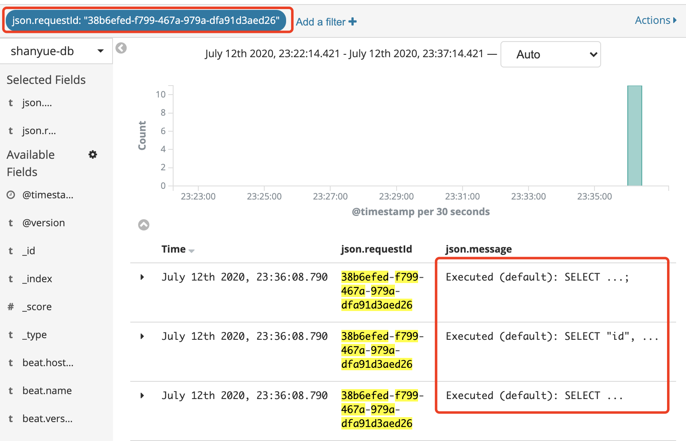

date: 2019-06-30 19:00

---

# Node 中的全链路式日志标记及处理

本篇文章开始之前先抛出两个问题:

1. 当在客户端捕捉到一条异常请求时，如何有效地排查问题？
1. 当在生产环境中发现某条 API 高延迟，又如何定位问题？

从挂下来的蜘蛛丝可以找到蜘蛛的所在，从灶马爬过留下的痕迹可以查出灶马的去向。

而要更有效解决此类问题，我们需要依赖全链路式的日志作为蛛丝马迹。如当发现测试环境某条 API 延迟过高时，通过该 API 在日志系统中找到所涉及到的所有关键逻辑及数据库查询，查找是否 SQL 查询过多或其中有慢查询所致，或者是否被上游服务拖累。

在微服务架构中，标记全链路日志有助于更好的解决 bug 和分析接口性能，本篇文章介绍在 `Node` 中如何标记全链路式日志

## 当一个请求到来时，服务器端会产生哪些日志

+ `AccessLog`: 这是最常见的日志类型，一般在 `nginx` 等方向代理中也有日志记录，但在业务系统中有时需要更详细的日志记录，如 API 耗时，详细的 request body 与 response body
+ `SQLLog`: 关于数据库查询的日志，记录 SQL、涉及到的 table、以及执行时间，**从此可以筛选出执行过慢的SQL，也可以筛选出某条API对应的SQL条数**
+ `RequestLog`: 请求第三方服务产生的日志
+ `Exception`: 异常
+ `RedisLog`: 缓存，也有一些非缓存的操作如 `zset` 及分布式锁等
+ `Message Queue Log`: 记录生产消息及消费消息的日志
+ `CronLog`: 记录定时任务执行的时间以及是否成功
+ 关键业务逻辑

## 如何标记全链路上所有日志

**使用 `requestId` 唯一标识每个请求，有时它又被称为 `sessionId` 或者 `transactionId`，在更多情况下它被称作 `traceId`**

操作步骤如下

1. 使用一个中间件获取 `requestId`，并存储到 `Context` 中。中间件通过读取请求头 `X-Request-Id` 来获取，如果请求方未设置，则自动生成
1. 使 `requestId` 在整个链路进行手动传递，如读取 `context.requestId`，手动注入到 `ORM` 进行SQL查询的日志中

``` typescript
// 关于处理 requestId 的 koa middleware
async function context (ctx: KoaContext, next: any) {
  // 从前端获取到 requestId，如果前端没有，则自己生成随机Id
  const requestId = ctx.header['x-request-id'] || uuid()
  // 设置 requestId 的响应头
  ctx.res.setHeader('X-Request-Id', requestId)
  // 存储到 Context 中
  ctx.requestId = requestId
  await next()
}

app.use('/todos/:id', (ctx) => {
  const user = await User.findByPk(ctx.body.id, {
    logging (sql) {
      loger.log(sql, {
        // 从 Context 中获取信息手动传递 requestId
        requestId: ctx.requestId
      })
    }
  })
})
```

**显而易见，这样手动层层传递很繁琐，特别是在崇尚分层的服务器架构中，这样可能需要传递五六层** 此时需要以更小侵入性的方式来标记 requestId

## 降低侵入性

如上，在每次数据库查询时手动对 `requestId` 进行标记过于繁琐，何况除了与数据库交互，还要有诸多微服务进行交互。

此时可以统一设计 `logger` 函数进行标记，并且使用 `CLS (Continues Local Storage)` 来管理异步资源中的 `requestId`。

关于 `CLS` 的实现，实例中用到了 `cls-hooked`，它关于异步资源生命周期追踪的原理是 `async_hooks`。

+ 通过 [async_hooks](https://github.com/nodejs/node/blob/master/doc/api/async_hooks.md) 可以追踪异步行为的生命周期
+ 通过 [cls-hooked](https://github.com/Jeff-Lewis/cls-hooked) 可以获得每次异步请求的 requestId

如下代码中

+ `lib/session.ts`: CLS 异步资源存储
+ `middleware/session.ts`: 关于 requestId 的中间件，从客户端获取 requestId，并存入 CLS 中
+ `lib/logger.ts`: 全局 logger，通过 CLS 注入 requestId，可参考上一章 [如何在 Node 中高效地打日志](https://shanyue.tech/node/log.html)

``` typescript
// lib/session.ts
import { createNamespace } from 'cls-hooked'

const session = createNamespace('hello, world')

export { session }

// middleware/session.ts
function session (ctx: KoaContext, next: any) {
  await session.runPromise(() => {
    // 获取 requestId
    const requestId = ctx.header['x-request-id'] || uuid()
    ctx.res.setHeader('X-Request-ID', requestId)
    // CLS 中设置 requestId
    session.set('requestId', requestId)
    return next()
  })
}

// lib/logger.ts
import winston, { format } from 'winston'

const requestId = format((info) => {
  // 每次自动获取 requestId
  info.requestId = session.get('requestId')
  return info
})

const logger = winston.createLogger({
  format: format.combine(
    requestId(),
    format.json()
  )
})

```

如果你使用过 `zipkin`，一款全链路式日志分析工具的话，它其中也是用了 `CLS`

``` js
const zipkin = require('zipkin');

// In Node.js, the recommended context API to use is zipkin-context-cls.
const CLSContext = require('zipkin-context-cls');
const ctxImpl = new CLSContext(); // if you want to use CLS
const xtxImpl = new zipkin.ExplicitContext(); // Alternative; if you want to pass around the context manually

// Tracer will be a one to many relationship with instrumentation that use it (like express)
const tracer = new zipkin.Tracer({
  ctxImpl, // the in-process context
  recorder: new zipkin.ConsoleRecorder(), // For easy debugging. You probably want to use an actual implementation, like Kafka or AWS SQS.
  sampler: new zipkin.sampler.CountingSampler(0.01), // sample rate 0.01 will sample 1 % of all incoming requests
  traceId128Bit: true, // to generate 128-bit trace IDs. 64-bit (false) is default
  localServiceName: 'my-service' // indicates this node in your service graph
});
```

> 关于 async_hooks 及 CLS 的实现可参考下一章节

## 如何从全链路日志中得益

1. 当 `sentry` (警报系统) 中收到一条异常警报时，通过 `requestId` 可以在 `elk` (日志系统) 中获取到关于该异常的所有关键日志 (sql, redis, 关键函数的输入输出)
1. 当客户端一条请求过慢时，通过请求头获取到的 `requestId` 可以在 `elk` 中分析该请求的所有数据库查询时间，请求响应时间，缓存是否命中等指标
1. 查找 API 对应执行的 SQL 语句以及条数，判断是否有冗余 SQL 语句的查询

如下图，通过 `requestId` 涉及到的数据库查询的日志 (关于真实 SQL 做了隐藏处理)



## 从全链路分析各阶段耗时

以上只是完善了全链路式日志，如果要查看全链路各个阶段的耗时如何做？

此时就需要接入全链路式分析平台，如

+ [zipkin](https://zipkin.io/): Zipkin is a distributed tracing system. It helps gather timing data needed to troubleshoot latency problems in service architectures. Features include both the collection and lookup of this data.
+ [jaeger](https://www.jaegertracing.io/): open source, end-to-end distributed tracing

下一章讲解如何接入 `zikin` 及相关代码与操作
