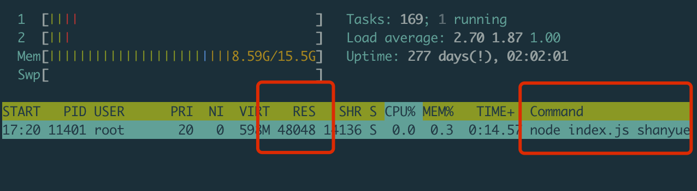

date: 2020-07-02 20:00

---

# 如何监控 Node 进程的内存

刚开始，先抛出一个问题：

> 你知道你们生产环境的 Node 服务平时占用内存多少吗？或者说是多少量级？

山月在面试 Node 候选人时，这个问题足够筛掉一半的自称Node精通者，不过没有回答上来，我往往会再补充一个问题，以免漏掉优秀的无线上经验的候选人：

> [如何知道某个进程消耗多少内存？](https://q.shanyue.tech/base/linux/4.html#%E6%80%BB%E7%BB%93)

**当使用 Node 在生产环境作为服务器语言时，并发量过大或者代码问题造成 OOM (out of memory) 或者 CPU 满载这些都是服务器中常见的问题，此时通过监控 CPU 及内存，再结合日志及 Release 就很容易发现问题。**

本章将介绍如何监控本地环境及生产环境的内存变化

## 一个 Node 应用实例

所以，如何动态监控一个 Node 进程的内存变化呢？

以下是一个 Node Server 的示例，并且是一个有内存泄漏问题的示例，并且是山月在生产环境定位了很久的问题的精简版。

> 那次内存泄漏问题中，导致单个容器中的内存从原先的 400M 暴涨到 700M，在 800M 的容器资源限制下偶尔会发生 OOM，导致重启。一时没有定位到问题 (发现问题过迟，半个月前的时序数据已被吞没，于是未定位到 Release)，于是把资源限制上调到 1000M。后发现是由 ctx.request 挂载了数据库某个大字段而致

``` js
const Koa = require('koa')
const app = new Koa()

function getData () {
  return Array.from(Array(1000)).map(x => 10086)
}

app.use(async (ctx, next) => {
  ctx.data = getData()
  await next()
})

app.use(ctx => {
  ctx.body = 'hello, world'
})

app.listen(3200, () => console.log('Port: 3200'))
```

## 进程内存监控

一些问题需要在本地及测试环境得到及时扼杀，来避免在生产环境造成更大的影响。那么了解在本地如何监控内存就至关重要。

`pidstat` 是 `sysstat` 系列 linux 性能调试工具的一个包，竟然用它来调试 linux 的性能问题，包括内存，网络，IO，CPU 等。

**这不仅试用与 `node`，而且适用于一切进程，包括 `python`，`java` 以及 `go`**

``` bash
# -r: 指输出内存指标
# -p: 指定 pid
# 1: 每一秒输出一次
# 100: 输出100次
$ pidstat -r -p pid 1 100
```

而在使用 `pidstat` 之前，需要先找到进程的 `pid`

### 如何找到 Node 进程的 pid

在 `node` 中可以通过 `process.pid` 来找到进程的 `pid`

``` js
> process.pid
16425
```

虽然通过写代码可以找到 `pid`，但是具有侵入性，不太实用。那如何通过非侵入的手段找到 `pid` 呢？有两种办法

1. 通过多余的参数结合 `ps` 定位进程
1. 通过端口号结合 `lsof` 定位进程

``` bash
$ node index.js shanyue

# 第一种方法：通过多余的参数快速定位 pid
$ ps -ef | grep shanyue
root     31796 23839  1 16:38 pts/5    00:00:00 node index.js shanyue

# 第二种方法：通过端口号定位 pid
lsof -i:3200
COMMAND   PID USER   FD   TYPE    DEVICE SIZE/OFF NODE NAME
node    31796 root   20u  IPv6 235987334      0t0  TCP *:tick-port (LISTEN)
```

## 使用 pidstat 监控内存


从以上代码中可以知道，node 服务的 pid 为 `31796`，为了可以观察到内存的动态变化，再施加一个压力测试

``` bash
$ ab -c 10000 -n 1000000 http://localhost:3200/
```

``` bash
# -r: 指输出内存指标
# -p: 指定 pid
# 1: 每一秒输出一次
# 100: 输出100次
$ pidstat -r -p 31796 1 100
Linux 3.10.0-957.21.3.el7.x86_64 (shuifeng)     2020年07月02日  _x86_64_        (2 CPU)

             UID       PID  minflt/s  majflt/s     VSZ    RSS   %MEM  Command
19时20分39秒     0     11401      0.00      0.00  566768  19800   0.12  node
19时20分40秒     0     11401      0.00      0.00  566768  19800   0.12  node
19时20分41秒     0     11401   9667.00      0.00  579024  37792   0.23  node
19时20分42秒     0     11401  11311.00      0.00  600716  59988   0.37  node
19时20分43秒     0     11401   5417.82      0.00  611420  70900   0.44  node
19时20分44秒     0     11401   3901.00      0.00  627292  85928   0.53  node
19时20分45秒     0     11401   1560.00      0.00  621660  81208   0.50  node
19时20分46秒     0     11401   2390.00      0.00  623964  83696   0.51  node
19时20分47秒     0     11401   1764.00      0.00  625500  85204   0.52  node
```

对于输出指标的含义如下

+ `RSS`: `Resident Set Size`，常驻内存集，可理解为内存，这就是我们需要监控的内存指标
+ `VSZ`: `virtual size`，虚拟内存

从输出可以看出，**当施加了压力测试后，内存由 19M 涨到了 85M。**

## 使用 top 监控内存

`pidstat` 是属于 `sysstat` 下的 linux 性能工具，但在 mac 中，如何定位内存的变化？

此时可以使用 `top/htop`

``` bash
$ htop -p 31796
```



## 内存监控原理

无论使用 `top/htop`，`pidstat` 及 `process.memoryUsage` 监控 Node 进程的内存，在 `linux` 中，其原理都是监听 `procfs` 文件变化

+ `cat /proc/100/stat`: 100 号进程的信息，以机器读的格式输出
+ `cat /proc/100/status`: 100 好进程的信息，以可读的格式输出

``` bash
# machine-readable
$ cat /proc/100/stat
100 (kauditd) S 2 0 0 0 -1 2105408 0 0 0 0 0 3455 0 0 20 0 1 0 63 0 0 18446744073709551615 0 0 0 0 0 0 0 2147483647 0 18446744072255378100 0 0 17 0 0 0 0 0 0 0 0 0 0 0 0 0 0

# human-readable
$ cat /proc/100/status
Name:   kauditd
Umask:  0000
State:  S (sleeping)
Tgid:   100
Ngid:   0
Pid:    100
PPid:   2
TracerPid:      0
Uid:    0       0       0       0
Gid:    0       0       0       0
FDSize: 64
Groups:
Threads:        1
SigQ:   0/63460
SigPnd: 0000000000000000
ShdPnd: 0000000000000000
SigBlk: 0000000000000000
SigIgn: ffffffffffffffff
SigCgt: 0000000000000000
CapInh: 0000000000000000
CapPrm: 0000001fffffffff
CapEff: 0000001fffffffff
CapBnd: 0000001fffffffff
CapAmb: 0000000000000000
Seccomp:        0
Speculation_Store_Bypass:       vulnerable
Cpus_allowed:   3
Cpus_allowed_list:      0-1
Mems_allowed:   00000000,00000000,00000000,00000000,00000000,00000000,00000000,00000000,00000000,00000000,00000000,00000000,00000000,00000000,00000000,00000000,00000000,00000000,00000000,00000000,00000000,00000000,00000000,00000000,00000000,00000000,00000000,00000000,00000000,00000000,00000000,00000001
Mems_allowed_list:      0
voluntary_ctxt_switches:        2353755
nonvoluntary_ctxt_switches:     26
```

## 生产环境内存监控

由于目前生产环境大都部署在 `k8s`，**因此生产环境对于某个应用的内存监控本质上是 k8s 对于某个 `workload/deployment` 的内存监控**，关于内存监控 `metric` 的数据流向大致如下:

`k8s` -> `metric server` -> `prometheus` -> `grafana`

架构图如下：


> 以上图片取自以下文章
> + [Kubernetes Monitoring with Prometheus](https://sysdig.com/blog/kubernetes-monitoring-prometheus/)
> + [Kubernetes monitoring architecture](https://github.com/kubernetes/community/blob/master/contributors/design-proposals/instrumentation/monitoring_architecture.md)

最终能够在 `grafana` 中收集到某一应用的内存监控实时图:

由于本部分设计内容过多，我将在以下的章节中进行介绍

**这不仅仅适用于 node 服务，而且适用于一切 k8s 上的 `workload`**

## 总结

本章介绍了关于 Node 服务的内存在本地环境及生产环境的监控

1. 本地使用 `htop/top` 或者 `pidstat` 监控进程内存及其原理
1. 生产环境使用 `k8s/metric-server/prometheus/grafana` 监控 node 整个应用的内存

当监控到某一服务发生内存泄漏后，如何解决问题？因此接下来的文章将会讲到

1. 生产环境是如何监控整个应用的内存的
1. 当生产环境发生 OOM 后，如何快速定位
1. 真实生产环境若干 OOM 的示例定位
