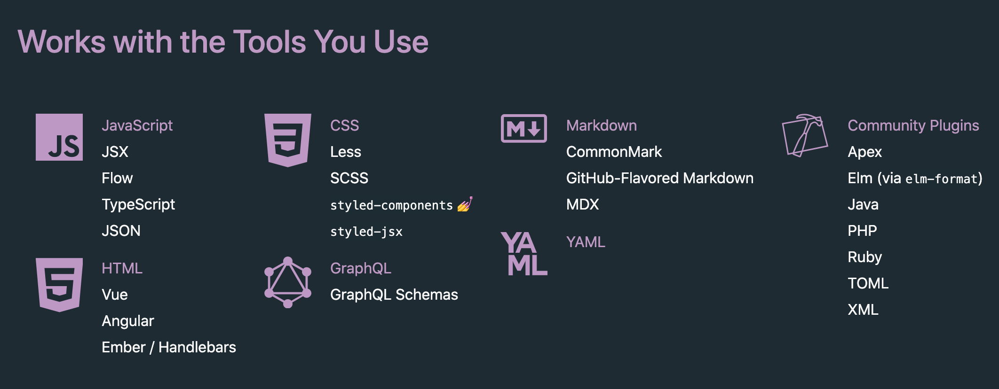

# 如何高效地组织 npm script

众所周知，一个 Javasript 项目的脚本类工具，可以使用 package.json 中的 `scripts` 字段来组织，简单来说，这就是 `npm script`。

最典型最常用约定俗成的一个是 `npm start`，用以启动项目：

``` json
{
  "scripts": {
    "start": "next"
  }
}
```

约定速成的还有很多，如下所列

+ npm install
+ npm test
+ npm publish
+ ...

约定速成的亲儿子脚本自然和其它第三方脚本不一样，如果需要执行它，直接使用 `npm` 前缀即可，如 `npm start`，那其它脚本呢？那就需要 `npm run` 前缀了。而 `yarn` 就没这么多讲究了，一视同仁。

``` bash
$ npm run <user defined>
$ npm run-script dev

# 为了简单方便，等同于
$ npm run dev

# yarn 
$ yarn dev
```

以上是众所周知的，以下讲一讲有可能不是众所周知的

## 装包: Install

+ [sharp](https://github.com/lovell/sharp)
+ [imagemin]()

``` json
{
  "install": "(node install/libvips && node install/dll-copy && prebuild-install) || (node-gyp rebuild && node install/dll-copy)"
}
```

## 配置: Config

## 运行: npm run dev 与 npm start 的区别

对于一个**纯生成静态页面打包**的前端项目而言，它们是没有多少区别的：生产环境的部署只依赖于构建生成的资源，更不依赖 npm scripts。可见 [如何部署前端项目](https://shanyue.tech/frontend-engineering/docker.html)。

使用 `create-react-app` 生成的项目，它的 npm script 中只有 `npm start`

``` json
{
  "start": "react-scripts start",
  "build": "react-scripts build",
  "test": "react-scripts test",
  "eject": "react-scripts eject"
}
```

使用 `vuepress` 生成的项目，它的 npm script 中只有 `npm run dev`

``` json
{
  "dev": "vuepress dev",
  "build": "vuepress build"
}
```

在一个**面向服务端**的项目中，如 `next`、`nuxt` 与 `nest`。dev 与 start 的区别趋于明显，一个为生产环境，一个为开发环境

+ dev: 在开发环境启动项目，一般带有 watch 选项，监听文件变化而重启服务，此时会耗费大量的 CPU 性能，不宜放在生产环境
+ start: 在生产环境启动项目

在 `nest` 项目中进行配置

``` json
{
  "start": "nest start",
  "dev": "nest start --watch"
}
```

## 运行：Script Hooks -> 如何把新项目快速跑起来

新人入职新上手项目，如何把它跑起来，这是所有人都会碰到的问题：所有人都是从新手开始的。

有可能你会脱口而出：`npm run dev/npm start`，但实际工作中，处处藏坑，往往没这么简单。

1. 查看是否有 `CI/CD`，如果有跟着 `CI/CD` 部署的脚本跑命令
1. 查看是否有 `dockerfile`，如果有跟着 `dockerfile` 跑命令
1. 查看 npm scripts 中是否有 dev/start，尝试 `npm run dev/npm start`
1. 查看是否有文档，如果有跟着文档走。为啥要把文档放到最后一个？原因你懂的

但即便是十分谨慎，也有可能遇到以下几个叫苦不迭、浪费了一下午时间的坑:

1. 前端有可能在**本地环境启动时需要依赖前端构建时所产生的文件**，所以有时需要**先正常部署一遍，再试着按照本地环境启动 (即需要先 `npm run build` 一下，再 `npm run dev/npm start`)**。(比如，一次我们的项目 npm run dev 时需要 webpack DllPlugin 构建后的东西）
1. 别忘了设置环境变量或者配置文件

因此，设置一个少的 script，可以很好地避免后人踩坑，更重要的是，可以避免后人骂你

``` json
{
  "scripts": {
    "start": "npm run dev",
    "config": "node assets && node config",
    "build": "webpack",
    // 设置一个 dev 的钩子，在 npm run dev 前执行，此处有可能不是必须的
    "predev": "npm run build",
    "dev": "webpack-dev-server --inline --progress"
  }
}
```

## Hooks

``` json
{
  "scripts": {
    "prebuild": "rimraf dist",
    "build": "webpack"
  }
}
```

## 构建

``` bash
$ npm run -p build
```

``` json
{
  "build": "next build"
}
```

## 测试: Script 后缀

``` json
{
  "test": "mocha",
  "test:coverage": "./test/coverage/report.sh",
  "test:e2e": "npm run cy:run --",
  "cy:run": "cypress run --config-file cypress/config.json",
  "cy:open": "cypress open --config-file cypress/config.json"
}
```

## 格式化: Prettier

[Prettier](https://npm.devtool.tech/prettier) 是一款支持多种编程语言，如 html、css、js、graphql、markdown 等并且可与编辑器 (vscode) 深度集成的代码格式化工具。



在 npm script 中配置代码格式化如下所示：

``` json
{
  // 配置文件: .prettierrc
  // 格式化: --write
  // 文件: *.js
  "prettier": "prettier --config .prettierrc --write {.,components,lib,pages}/*.js {components,lib,pages}/**/*.js",
}
```

`.prettierrc` 是 `prettier` 的配置文件，一般是比较简单的配置，可供配置的 [Prettier Options](https://prettier.io/docs/en/options.html#parser) 也没有很多。

``` json
{
  "singleQuote": true,
  "printWidth": 100,
  "semi": false,
  "arrowParens": "avoid"
}
```

## Lint: 代码格式化及质量检查

那 Prettier 与 ESLint/StyleLint/TSLint 有什么区别？

`Prettier` 仅仅作代码的格式化，如空格、是否添加分号之类。而 ESLint 之类对代码格式化外，还对代码进行**质量检查**，如 `no-unused-vars`, `no-implicit-globals` 等规则。

``` json
{
  "lint": "eslint ."
}
```

## Git: 你好，代码不合格，这里禁止提交

husky/lint-staged

## Outdated: 你的依赖已过期

## Audit: 你的依赖存在安全风险

``` bash
$ npm audit

$ npm audit fix
```

