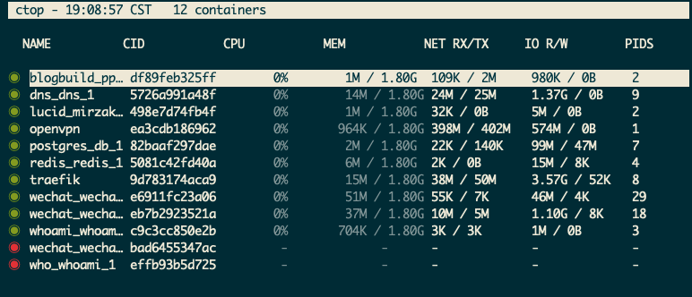
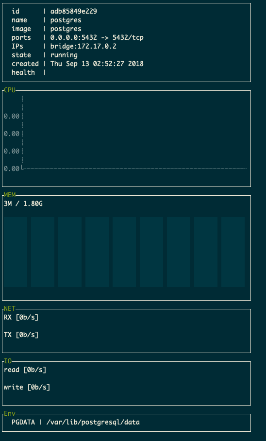

# 使用 ctop 监控容器指标

如果你经常在 `linux` 下工作，那你肯定对 `top` 以及它的增强版 `htop` 非常熟悉。如果说 `top` 是管理进程的，而 `ctop` 则是管理容器的。

你可以使用它监控容器的 `CPU`/`MEM`/`IO` 以及查看容器日志，查看容器状态等。相对于 `portainer` 等工具来说，它相当轻量，极其适合在个人服务器中使用

## 安装

在 `centos` 下安装 `ctop`

``` bash
$ wget https://github.com/bcicen/ctop/releases/download/v0.7.2/ctop-0.7.2-linux-amd64 -O /usr/local/bin/ctop

$ chmod +x /usr/local/bin/ctop
```

## 命令使用

直接使用 `ctop` 进入容器指标可视化界面



``` bash
ctop
```

当进入指标可视化界面后，可以使用快捷键进行筛选，排序，检索

+ `q`，退出或者返回上一级
+ `j/k`，同vi，上下移动
+ `a`，展示所有容器
+ `l`，查看某一容器日志
+ `f`，对所有容器进行筛选
+ `s`，查看单个容器状态
+ `S`: 保存当前配置

以下是查看单个容器状态的截图


