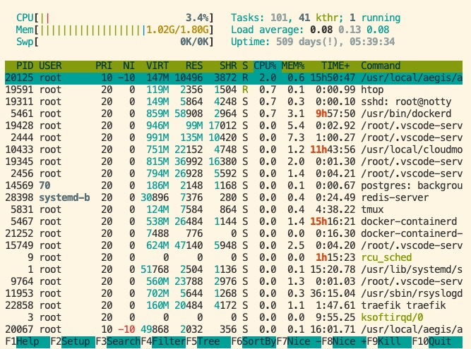

# docker-compose 编排架构简介

首先需要说一下服务器配置，只要你的服务器配置高于1核2G，均可使用该基础设施来管理你的个人服务器，你可以在服务中部署几个应用，并且把该服务器作为你的测试服务器来使用。但是你的应用过多，或者QPS稍大，可以相应地加强服务器配置。

现在来简述下一个低配置的个人服务器的基础设施架构图

<!--more-->

## Traefik

架构图的最核心位置是 `traefik`，一个 `Edge Router`，它也是该基础设施的重点。

服务器内的所有应用服务，如 `postgres`，`redis` 以及自己所写的应用服务，都与 `traefik` 置于一个网络下，**它们共同组成了一个集群**。

以下是我使用它的理由

+ 热更新配置，无需重启
+ 自动服务发现与负载均衡
+ TLS/SSL 证书的自动生成
+ 与 `docker` 的完美集成，基于 `container label` 的配置
+ 漂亮的 `dashboard` 界面

关于 `traefik` 可以参考文章 [Traefik 简易配置及入门](https://github.com/shfshanyue/op-note/blob/master/traefik.md)

## 请求路由

从图左侧可以看出，请求路由分为两大类。当然他们的路由规则都是通过 `traefik` 来控制

+ `shanyue.tech` 通过公有的域名提供公有的、可供互联网访问的服务。如博客，微信公众号开发，个人网站及后端服务等等
+ `shanyue.local` 通过私有的域名提供私有的、只供内部进群访问的服务，保证安全性。如数据库，redis等等

## 应用与服务

在图右侧，都是个人服务器里的应用，它们均是通过 `docker-compose` 部署。你可以在 [shfshanyue/op-note:compose](https://github.com/shfshanyue/op-note/tree/master/compose) 中找到所有的配置文件

只需要 `docker-compose up -d` 即可启动

+ `whoami`: 一个用以测试的服务，测试负载均衡及路由匹配等
+ `dns`: 集群内 DNS 服务，给自己的私有域名 `shanyue.local` 做解析
+ `openvpn`：与个人笔记本搭建局域网，方便访问个人服务器上服务以及调试页面
+ `postgres`
+ `redis`

本章将会讲述如何部署它们以及它们的配置文件。不过在此之前，你需要对 `docker` 以及 `docker-compose` 了解一些，参考以前文章

1. [docker 简易入门](https://github.com/shfshanyue/op-note/blob/master/docker.md)
1. [docker compose 简易入门](https://github.com/shfshanyue/op-note/blob/master/docker-compose.md)

## 私有服务

`shanyue.local` 路由所提供的服务都是私有服务，通过 `dnsmasq` 与 `openvpn` 在个人笔记本上进行访问。

+ [搭建集群内部 DNS 服务器](https://github.com/shfshanyue/op-note/blob/master/dnsmasq.md)
+ [使用 openvpn 访问集群私有服务](https://github.com/shfshanyue/op-note/blob/master/openvpn.md)

## 监控

个人服务器自然也需要监控，如负载，CPU，内存，网络，磁盘等。如果你服务器配置较高，且中有重要应用在跑时可以使用 `prometheus` 与 `grafana` 搭建一套监控系统，但是作为一个轻量的个人服务器，这样就显得小题大做，而且消耗极其资源。

关于该云服务器的 `metric` 可以直接在阿里云的监控面板上进行查看。但对于轻量的个人服务器，可以使用 `htop` 与 `ctop` 两个简单的命令行工具来搞定

+ `htop` 监控进程指标
+ `ctop` 监控容器指标

