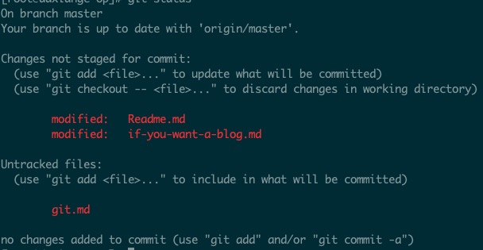

# 服务器上 git 的安装及基本配置

`git` 对于开发者来说属于必备工具中的必备工具了。何况，没有 `git` 的话，**面向github编程** 从何说起，如同一个程序员断了左膀右臂。

本篇文章将介绍如何在服务器(centos)上安装最新版本的 git 及其基本配置

+ 使用源码编译安装 git
+ 使用 ansible 自动化安装 git
+ git 基本配置

> 你对流程熟悉后，特别是了解 ansible 后，只需要一分钟便可以操作完成

<!--more-->

+ 原文地址: [服务器上 git 的安装及基本配置](https://github.com/shfshanyue/op-note/blob/master/git.md)
+ 系列文章: [山月的服务器运维笔记](https://github.com/shfshanyue/op-note)

## 安装

``` bash
$ yum install git
```

如果使用 `yum` 来安装 `git` 的话，那实在没有必要单开一篇文章了，但好事多磨。那使用 `yum` 的弊端在哪里？我们知道，`yum` 为了保证它的软件的稳定性，往往软件的版本都会很老，以至于非常不好用。

**而且最重要的是 `yum` 安装的 `git` 没有语法高亮！**

## 安装最新版本

安装最新版本，或者说稳定版本，可以充分体验新版本带来的特性，从而使自己更舒服一些。从源码安装 `git` 是最无拘无束最灵活的安装方法，但同时也是最繁琐的方法。

关于源码编译安装详细教程可以参考 [https://github.com/git/git](https://github.com/git/git)。

在编译之前需要先安装依赖如下

``` bash
gettext-devel
expat-devel
curl-devel
zlib-devel
perl-devel
openssl-devel
subversion-perl
make
gcc
```

随后根据文档进行源码编译安装：

``` bash
# 使用旧版本 git 下载源码
$ git clone https://github.com/git/git.git

$ git checkout v2.26.2

$ make prefix=/usr all

$ make prefix=/usr install
```

查看版本号，安装成功

`git version`，查看版本号，此时为 `2.26.2`

``` bash
$ git version
git version 2.26.2
```

再用它 `git status`，查看下语法高亮效果



## 使用 ansible 自动化安装

> 如果你对 ansible 不够了解，可以参考我的文章 [ansible 入门指南](https://mp.weixin.qq.com/s/t2fpzPJk3pCK3qBgo_SdyQ)。

而对于安装 git，如果采用以上源码编译方法则过于耗时及繁琐，而如果我们使用 `ansible` 进行自动化运维的话，选择一个好用的 `Ansible Role` 就可以了，此处我们选择 [geerlingguy.git](https://github.com/geerlingguy/ansible-role-git)。

``` bash
$ ansible-galaxy install geerlingguy.git
```

配置 `ansible playbook`，指定变量，从源码安装，并安装最新版本。

``` yaml
hosts: all
  roles:
    - role: geerlingguy.git
      vars:
        # 从源码安装
        git_install_from_source: true
        # 安装最新版本
        git_install_from_source_force_update: true
```

使用 `ansible-playbook` 对服务器进行批量安装

``` bash
$ ansible-playbook -i hosts git.yaml
```

> 关于我服务器所有的 ansible role 配置，可以参考我的配置文件 [shfshanyue/ansible-op](https://github.com/shfshanyue/ansible-op)

## 基本配置

在服务器中安装完 git 后，即可对它进行基础配置。全局配置邮箱及用户名，此时就可以愉快地在服务器中使用 `git` 管理代码了

``` bash
$ git config --global user.name shfshanyue
$ git config --global user.email xianger94@gmail.com
```

## 面向 github 编程

但是现在就可以面向 `github` 编程了吗？不！

使用 `ssh -T` 测试连通性

``` bash
$ ssh -T git@github.com
Permission denied (publickey).
```

此时需要配置 `ssh key` 来保证正确地面向 github 编程，请关注并查看下篇文章 [服务器上 ssh key 管理及 github 配置](https://github.com/shfshanyue/op-note/blob/master/ssh-setting.md)
