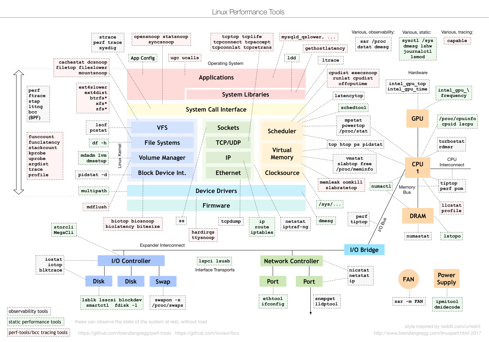
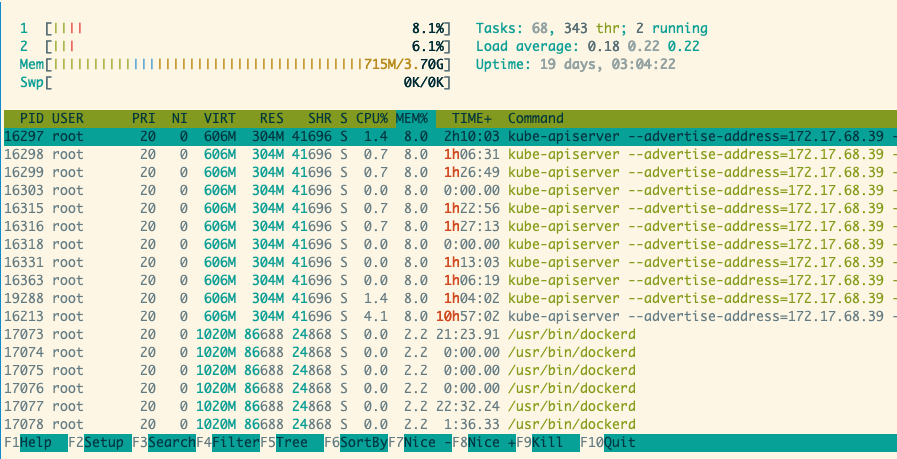

# linux 指标监控小记

自开始负责生产环境部署，中间遇到了若干线上环境内存以及CPU的问题。由于微服务以及容器的流行，现在已经可以很方便的使用 `K8s` + `prometheus` + `grafana` + `alert` 的方式进行监控，这足以覆盖大部分场景。

最重要的事情已经交由最适合的组件去做，然而了解一些在裸机上的命令以及指标也是必不可少的：

1. 了解监控什么指标
1. 平时写一些脚本也经常会 OOM 或者 CPU 使用率过高

先以一张来自 [linuxperf](http://www.brendangregg.com/linuxperf.html) 的图作为大纲，我试着对一些指标进行整理，以备不时之需。



<!--more-->

+ 原文地址: [linux 各项指标监控小记](https://shanyue.tech/op/linux-monitor.html) · [github](https://github.com/shfshanyue/op-note/blob/master/linux-monitor.md)
+ 系列文章: [服务器运维笔记](https://shanyue.tech/op/) · [github](https://github.com/shfshanyue/op-note)

## htop/top



htop 足以覆盖大多数指标，详细直接查看帮助即可。

> 这里的 TIME 指的是 CPU 时间
> htop 里的 task 数指的是进程树，top 里的 task 数指的是进程树 + 内核线程数，参考文章 <https://www.cnblogs.com/arnoldlu/p/8336998.html>

1. sort: by mem/cpu/state. 根据进程状态排序也至关重要，特别在 load average 过高的时候。根据内存以及CPU使用率排序用以定位高资源占用者。
1. filter
1. fields
1. process/ count
1. ...

## CPU 基本信息

在 linux 中一切皆文件，查看 `/proc/cpuinfo` 查看信息。另有衍生问题

+ 如何查看 CPU 个数
+ 如何查看 CPU model
+ 如何查看 CPU 主频

```shell
cat /proc/cpuinfo
cat /proc/stat
```

## 平均负载 (load average)

使用 `uptime` 和 `w` 可打印出系统过去 1, 5, 15 分钟内的平均负载。同时，你可以使用 `sar -q` 查看动态的平均负载。

```shell
$ uptime
 19:28:49 up 290 days, 20:25,  1 user,  load average: 2.39, 2.64, 1.55
$ w
 19:29:50 up 290 days, 20:26,  1 user,  load average: 2.58, 2.63, 1.61
USER     TTY      FROM          LOGIN@   IDLE   JCPU   PCPU WHAT
root     pts/0    172.16.0.1    19:27    6.00s  0.05s  0.00s tmux a
```

在 `uptime` 的 man 手册中这么解释平均负载

> System load averages is the average number of processes that are either in a runnable or uninterruptable state.

翻译过来就是指系统中处于可运行状态和不可中断状态的平均进程数。

对于 4 核的 CPU，如果平均负载高于 4 就代表负载过高

## 动态平均负载

```shell
$ sar -q 1 100
Linux 3.10.0-957.21.3.el7.x86_64 (shanyue)      10/21/19        _x86_64_        (2 CPU)

16:55:52      runq-sz  plist-sz   ldavg-1   ldavg-5  ldavg-15   blocked
16:55:53            0       464      0.07      0.11      0.13         0
16:55:54            0       464      0.06      0.10      0.13         0
16:55:55            0       464      0.06      0.10      0.13         0
16:55:56            0       464      0.06      0.10      0.13         0
16:55:57            0       464      0.06      0.10      0.13         0
16:55:57            0       464      0.06      0.10      0.13         0
Average:            0       464      0.06      0.10      0.13         0

```

## CPU 使用率

可以直接使用 `htop/top` 命令查看 CPU 使用率，`idle` 的cpu时间也可以直接通过 `top` 显示出来

`CPU 利用率 = 1 - cpu-idle-time / cpu-time`

```shell
$ top
%Cpu(s):  7.4 us,  2.3 sy,  0.0 ni, 90.1 id,  0.0 wa,  0.0 hi,  0.2 si,  0.0 st
```

+ user: 用户态，但不包括 nice
+ system: 内核态
+ nice: 低优先级用户态，nice 值为 1-19 的 CPU 时间
+ idle (id)
+ iowait (wa)
+ irq (hi)
+ softirq (si)
+ steal (st)

## 系统调用

`strace` 查看系统调用

+ `-p` 指定pid
+ `-c` 统计各项系统调用被调用了多少次以及CPU时间

```shell
# 用来看一个进程所用到的系统调用
# -p: 指定 7477 号进程
$ strace -p 7477

# 用来查看某命令需要用到的系统调用
$ strace cat index.js

# 关于系统调用的统计信息
$ strace -p 7477 -c
```

## 内存

`free` 用以查看系统内存。

如果查看进程内存，使用 `pidstat -r` 或者 `htop`

```shell
$ free -h
              total        used        free      shared  buff/cache   available
Mem:           3.7G        682M        398M        2.1M        2.6G        2.7G
Swap:            0B          0B          0B
```

## 页大小

``` bash
$ getconf -a | grep page
```

## 进程

衍生问题

+ 如何根据命令名找到进程
+ 如何根据参数名找到进程
+ 进程状态有哪些
+ 如何获取进程状态
+ 如何获取进程的CPU占用率
+ 如何获取进程的内存占用

```shell
# 查看 122 PID 进程
$ ps 122

# 根据命令名(command)找到 PID
$ pgrep -a node
26464 node /code/node_modules/.bin/ts-node index.ts
30549 node server.js

# 根据命令名以及参数找到 PID
$ pgrep -af ts-node
26464 node /code/node_modules/.bin/ts-node index.ts

# 查看 122 PID 进程的信息
$ cat /proc/122/status
$ cat /proc/122/*

# 打印父进程树
# -s --show-parents: 显示父进程
# -a --arguments: 显示参数，如 echo hello 中 hello 为参数
$ pstree 122 -sap
```

## procfs

<http://man7.org/linux/man-pages/man5/proc.5.html>

## 进程的状态

+ D    uninterruptible sleep (usually IO)
+ R    running or runnable (on run queue)
+ S    interruptible sleep (waiting for an event to complete)
+ T    stopped by job control signal
+ t    stopped by debugger during the tracing
+ W    paging (not valid since the 2.6.xx kernel)
+ X    dead (should never be seen)
+ Z    defunct ("zombie") process, terminated but not reaped by its parent

使用 `htop/top` 可以查看所有进程的状态信息，特别在几种情况下常用

+ 查看过多的僵尸进程
+ 当平均负载过大时

```shell
# 第二行可以统计所有进程的状态信息
$ top
...
Tasks: 214 total,   1 running, 210 sleeping,   0 stopped,   3 zombie
...
```

## 进程内存

`ps -O rss` 指定 rss 可以查看进程的内存，另外还有命令 `top/htop` 与 `pidstat -r`

```shell
# 查看 2579 PID 的内存
# -O rss 代表附加 RSS 信息进行打印
$ ps -O rss 2579
 PID   RSS S TTY          TIME COMMAND
 2579 19876 S pts/10   00:00:03 node index.js
```

## 实时查看进程内存

`pidstat -sr`

```shell
# 查看 23097 PID 的内存信息，每隔一秒打印一次
# -r: 查看进程的内存信息
# -s: 查看进程的 stack 信息
# -p: 指定 PID
# 1: 每间隔 1s 打印一次
# 5: 共打印 5 组
$ pidstat -sr -p 23097 1 5
Linux 3.10.0-693.2.2.el7.x86_64 (shanyue)       07/18/19        _x86_64_        (2 CPU)

18:56:07      UID       PID  minflt/s  majflt/s     VSZ    RSS   %MEM StkSize  StkRef  Command
18:56:08        0     23097      0.00      0.00  366424  95996   2.47    136      80  node

18:56:08      UID       PID  minflt/s  majflt/s     VSZ    RSS   %MEM StkSize  StkRef  Command
18:56:09        0     23097      0.00      0.00  366424  95996   2.47    136      80  node

18:56:09      UID       PID  minflt/s  majflt/s     VSZ    RSS   %MEM StkSize  StkRef  Command
18:56:10        0     23097      0.00      0.00  366424  95996   2.47    136      80  node

18:56:10      UID       PID  minflt/s  majflt/s     VSZ    RSS   %MEM StkSize  StkRef  Command
18:56:11        0     23097      0.00      0.00  366424  95996   2.47    136      80  node

18:56:11      UID       PID  minflt/s  majflt/s     VSZ    RSS   %MEM StkSize  StkRef  Command
18:56:12        0     23097      0.00      0.00  366424  95996   2.47    136      80  node

Average:      UID       PID  minflt/s  majflt/s     VSZ    RSS   %MEM StkSize  StkRef  Command
Average:        0     23097      0.00      0.00  366424  95996   2.47    136      80  node
```

## 页表与缺页异常

`pidstat -s` 中 `minflt` 与 `majflt` 代表缺页异常

```shell
$ pidstat -s -p 23097 1 5
Linux 3.10.0-693.2.2.el7.x86_64 (shanyue)       07/18/19        _x86_64_        (2 CPU)

18:56:07      UID       PID  minflt/s  majflt/s     VSZ    RSS   %MEM StkSize  StkRef  Command
18:56:08        0     23097      0.00      0.00  366424  95996   2.47    136      80  node

18:56:08      UID       PID  minflt/s  majflt/s     VSZ    RSS   %MEM StkSize  StkRef  Command
18:56:09        0     23097      0.00      0.00  366424  95996   2.47    136      80  node
```

## 标准输出定位到文件中


## 列出打开的文件

`lsof`, list open files

```shell
# 列出打开的文件
$ lsof
COMMAND     PID   TID     USER   FD      TYPE             DEVICE    SIZE/OFF       NODE NAME
systemd       1           root  cwd       DIR              253,1        4096          2 /
systemd       1           root  rtd       DIR              253,1        4096          2 /
```

## 容器中 namespace PID -> global PID 映射

换一个问题就是，**如何找出 docker 容器中的 pid 在宿主机对应的 pid**

```shell
# 容器环境

# 已知容器中该进程 PID 为 122
# 在容器中找到对应 PID 的信息，在 /proc/$pid/sched 中包含宿主机的信息
$ cat /proc/122/sched
node (7477, #threads: 7)
...
```

```shell
# 宿主机环境

# 7477 就是对应的 global PID，在宿主机中可以找到
# -p 代表指定 PID
# -f 代表打印更多信息
$ ps -fp 7477
UID        PID  PPID  C STIME TTY          TIME CMD
root      7477  7161  0 Jul10 ?        00:00:38 node index.js
```

## global PID -> namespace PID 映射

换一个问题就是， **已知宿主机的 PID，如何找出对应的容器**

**常见的场景就是使用 `top/htop` 定位到占用内存/CPU过高的进程，此时需要定位到它所在的容器**

```shell
# 通过 docker inspect 查找到对应容器
$ docker ps -q | xargs docker inspect --format '{{.State.Pid}}, {{.ID}}' | grep 22932

# 通过 cgroupfs 找到对应容器
$ cat /etc/22932/cgroup
```

幸运地是有人已经在 stackoverflow 上总结出来了

+ [https://stackoverflow.com/questions/24406743/coreos-get-docker-container-name-by-pid](https://stackoverflow.com/questions/24406743/coreos-get-docker-container-name-by-pid)

## SWAP

```shell
# 查找关于
$ vmstat -s
```

## inode

```shell
# -i: 打印 inode number
$ ls -lahi
```

## 网络吞吐量

+ 带宽: 指网络链路的最大传输速率
+ 吞吐量: 代表单位时间内成功传输的数据量，单位为 b/s (KB/s, MB/s)
+ PPS: pck/s (Packet Per Second)，以网络包为单位的传输速率

```shell
# 查看网卡信息
$ ifconfig eth0

$ sar -n DEV 1 | grep eth0
#                IFACE   rxpck/s   txpck/s    rxkB/s    txkB/s   rxcmp/s   txcmp/s  rxmcst/s
16:34:37         eth0      8.00      2.00      0.69      1.90      0.00      0.00      0.00
16:34:38         eth0     39.00     27.00      2.91     38.11      0.00      0.00      0.00
16:34:39         eth0     13.00     11.00      0.92     13.97      0.00      0.00      0.00
16:34:40         eth0     16.00     16.00      1.21     20.86      0.00      0.00      0.00
16:34:41         eth0     17.00     17.00      1.51     15.27      0.00      0.00      0.00
Average:         eth0     18.60     14.60      1.45     18.02      0.00      0.00      0.00
```

## socket 状态

## socket 信息

推荐使用 `ss`，不过 `netstat` 仍需要掌握，在特定条件 (docker 中) 有可能没有 `ss` 命令。

```shell
# -t TCP
# -a 所有状态
# -n 显示数字地址和端口号
# -p 显示 pid
$ netstat -tanp
Active Internet connections (servers and established)
Proto Recv-Q Send-Q Local Address           Foreign Address         State       PID/Program name
tcp        0      0 127.0.0.11:35283        0.0.0.0:*               LISTEN      -
tcp        0      0 192.168.112.2:37344     172.18.0.1:6379         ESTABLISHED 78/node
tcp        0      0 :::80                   :::*                    LISTEN      78/node
```

+ `Recv-Q` 与 `Send-Q` 不为0时，表示网络包堆积，需要注意

## 协议信息

```shell
# 展示对每个协议的统计信息
$ netstat -s

# 展示对每个协议的统计信息
$ ss -s
Total: 1468 (kernel 1480)
TCP:   613 (estab 270, closed 315, orphaned 0, synrecv 0, timewait 41/0), ports 0

Transport Total     IP        IPv6
*         1480      -         -
RAW       0         0         0
UDP       30        22        8
TCP       298       145       153
INET      328       167       161
FRAG      0         0         0

# 也可以这样统计 estab socket 的数量
$ netstat -tanp | grep ESTAB | wc -l

```

## TCP 连接数

## PostgresSQL 的最大连接数与当前连接数

```sql
-- 最大连接数
show max_connections;

-- 当前连接数
select count(*) from pg_stat_activity;
```

## mysql 的最大连接数与当前连接数

```sql
-- 最大连接数
show variables like 'max_connections';

-- 当前连接数
show full processlist;
```

