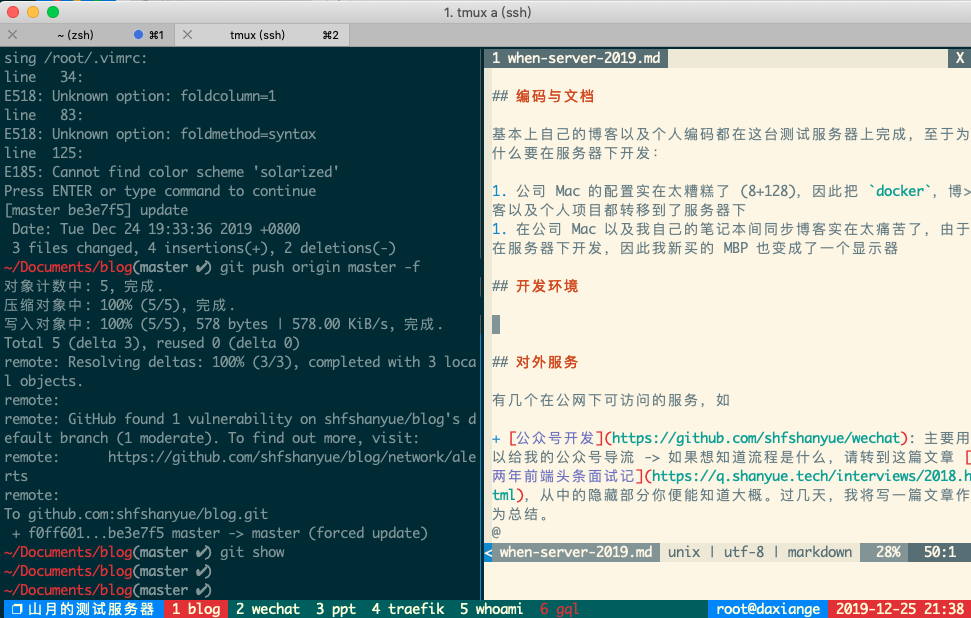
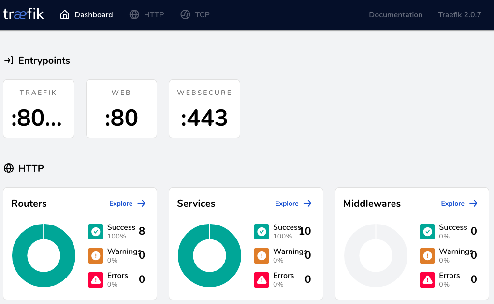

# 当我有一台服务器时我做了什么

当一八年末的时候，我写了一篇文章 [当我有一台服务器时我做了什么](https://github.com/shfshanyue/op-note/blob/master/when-server.md)

又是年末，我服务器的架构也发生了一些变化，因此总结一番

<!--more-->

+ 原文地址: [当我有一台服务器时我做了什么](https://github.com/shfshanyue/op-note/blob/master/when-server-2019.md)
+ 系列文章: [当我有一台服务器时我做了什么](https://github.com/shfshanyue/op-note)

## 概览

去年服务器有两台，一台 2C4G，一台 1C2G

今年服务器有三台，以以下名称作为 `hostname`，配置如下

+ `dev`: 1C2G，不到一百块钱。用以日常编码，简单的反向代理以及项目部署
+ `shanyue`: 2C4G，k8s master node
+ `shuifeng`: 4C16G，k8s work node

由于 `dev` 的机器与去年列举出来的事情相似，这里只介绍下在这台1C2G的服务器上做了什么

简单画了这台服务器的架构图（不太会画，所以建了一个仓库 [shfshanyue/graph](https://github.com/shfshanyue/graph) 用以学习各种架构图画法）


## 博客与编码

基本上自己的博客以及个人编码都在这台测试服务器上完成，至于为什么要在服务器下开发：

1. 在公司 Mac 及我自己的笔记本间同步博客实在太痛苦了，而使用服务器作为中介则方便很多

由于在服务器下写博客以及一些个人的代码，因此我新买的 MBP 也变成了一个显示器

### 开发环境

`zsh` + `tmux` + `vim`，截图如下



大部分时间都在这个模式下，如果写博客过程中需要截图，则先下载到随便一个目录，然后使用 `rsync` 复制到目标路径

``` bash
$ rsync ~/Documents/tmux.png dev:/path/Documents/blog/op/assets/dev-env.png
```

`vscode remote`

如果需要调试代码，或者在写 `typescript`，则使用 `vscode remote` 来完成工作

在 vscode 插件中关键字搜索，安装下载最多的三个插件就是了

### 开发调试

如果调试前端页面需要在浏览器中打开地址，比如 `IP:8000`，一般采用两种方案

1. `nginx`镜像 + `volume`挂载 + `docker-compose` + `traefik`服务发现。略微麻烦
1. `npm run dev` + `openvpn`。在本地环境中的浏览器通过 `openvpn` 连接局域网

如果调试后端接口，需要打断点直接使用 `vscode remote`

## 对外服务

有几个在公网下可访问的服务，如

+ [公众号开发](https://github.com/shfshanyue/wechat): 主要用以给我的公众号导流 -> 如果想知道流程是什么，请转到这篇文章 [两年前端头条面试记](https://q.shanyue.tech/interviews/2018.html)，从中的隐藏部分你便能知道大概。过几天，我将写一篇文章作为总结。
+ <https://whoami.shanyue.tech/>: 用以测试 `traefik` 的负载均衡及服务发现
+ 若干 `reveal.js` 页面

## 对内服务

主要以数据库为主，使用 `local DNS` + `traefik` + `openvpn` 暴露在本地环境，使用禁掉公网端口以及仅在内网访问的IP白名单保证安全

+ `postgres`，主要是一个关于诗词的数据库
+ `redis`
+ `traefik dashboard`，管理流量

另外，这些对内对外的服务均是通过 `docker` 以及 `docker-compose` 部署

## 博客去了哪里？

以下是我博客的历程

1. 个人服务器，后来服务器部署了 `k8s` 就把博客挪出了
1. `netlify`，但是网络不好
1. `alioss` + `github actions`，速度挺好，但是对 `http rewrite` 支持的不是很好

以后将会考虑 `serverless`

你可以发现，我现在更多的转向了一些免费的云服务，如

1. `serverless` 可以写后端服务，我将把我的公众号的服务迁移过来。国内可用阿里云以及腾讯云，国外 aws
1. `dynomodb` 与 `tablestore` 免费的数据存储
1. `oss` 很便宜的对象存储服务
1. `netlify` 免费的静态网站托管托管服务
1. `github actions` 免费的CICD及构建服务器
1. `sentry` 免费的错误日志收集系统
1. `github` 免费的私有仓库服务
1. `prerender.io` 免费的预渲染服务

嗯，有了这些都可以做一个自由开发者了 (自惭形秽中...)

## openVPN

数据库放在公网访问有点危险，用docker建了vpn在本地开发访问。使用了以下镜像

[docker-openvpn](https://github.com/kylemanna/docker-openvpn)

## traefik



前后端需要做一个反向代理，选择了 traefik，更方便的服务配置以及服务发现，只需要配置容器的 `labels` 就可以部署成功

另外 `traefik` 可以很方便的自动生成 ssl/tls 证书，为你提供 https 服务

## DNS server

有了这么多的服务，但有的东西不好放在公网，如 `redis`，`postgres` 一些私有服务以及开发待调试的服务，又记不住端口号，所以又搭了一个 `dns server`，方便在本地访问

## 自动化运维

初期折腾服务器的时候经常需要重装系统，并且我有三台服务器，自动化运维是必不可少的了。

必备工具如 `docker`，`git`，`vim`，`tmux`，`jq` 都是通过 `ansible` 进行的安装

可以参考我的配置

+ <https://github.com/shfshanyue/ansible-op>

当你有了一台新服务器时，你可以遵循以下步骤

1. 使用 ansible-role 预配置环境
1. 如果没有 ansible-role，则自己写 role
1. 对于一些服务使用 docker 进行安装
1. 如果以上都无法解决，手动安装

## 监控

没有像去年那样使用 `prometheus` 一套，只简单了使用了两个命令以及阿里云自带的监控

+ `ctop`: 监控容器
+ `htop`: 监控进程

## 对比

如果说与去年有对比的话，体现在两方面

1. 更彻底的容器化
1. 更加拥抱云服务，如 `github actions`，serverless，netlify 等

另外，还有一方面是自建了 k8s 集群 (真是烧钱)，将会在另一个仓库中介绍它的体系。但是如果你对 k8s 没有什么兴趣的话，**这一台1C2G的服务器完全满足你的要求**
