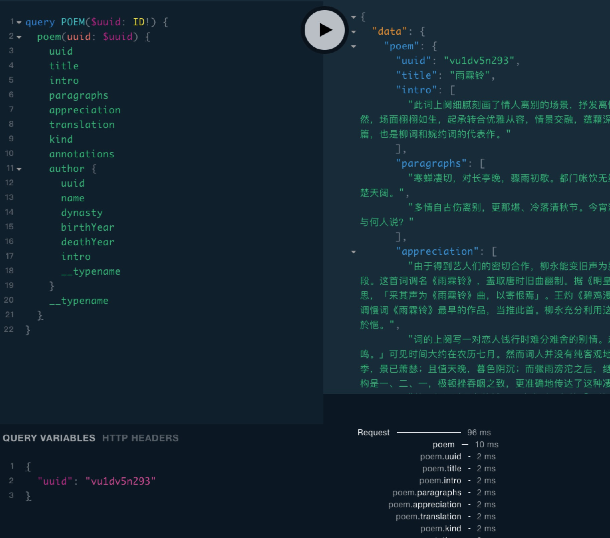
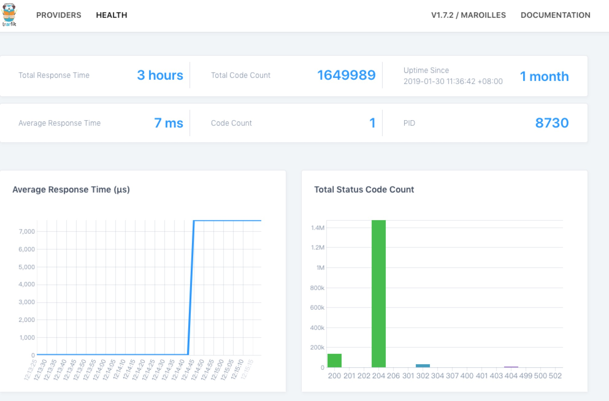
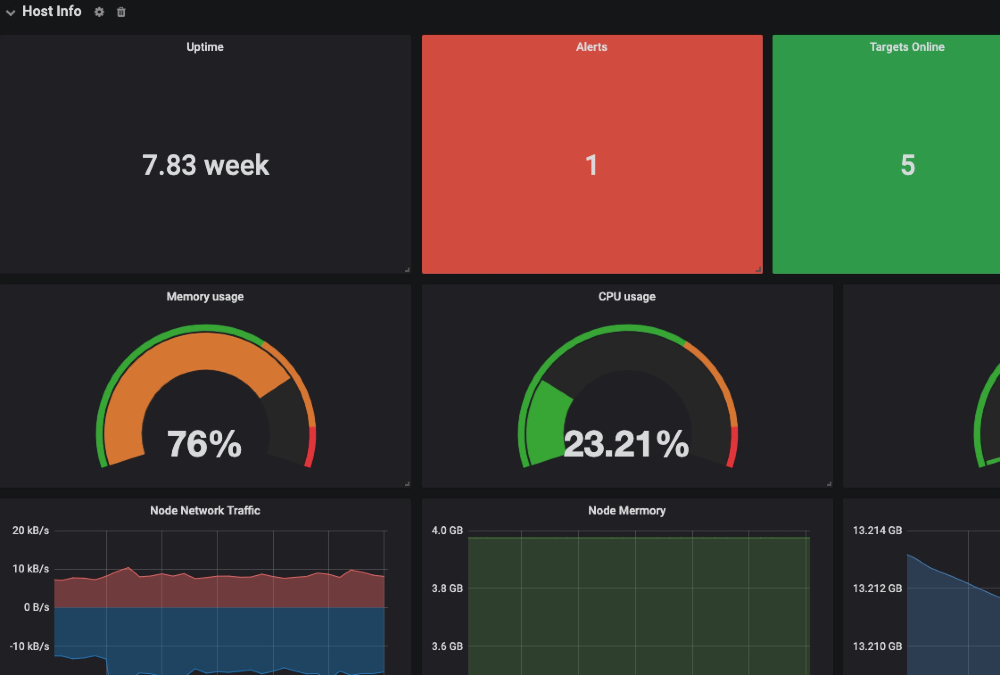

> 记于一八年末

+ 原文地址: [当我有一台服务器时我做了什么](https://shanyue.tech/op/when-server.html)
+ 系列文章: [当我有一台服务器时我做了什么](https://shanyue.tech/op)

## 前端调研

刚开始调研服务器渲染写了一个 demo，正好对诗词感兴趣，就做了一个关于诗词的站点，越写越大，demo 变成了 DEMO，总的来说还是特别简单。随手挂到了服务器下。

<!--more-->

技术栈 👉 `Next.js` + `React` + `ApolloClient` + `Docker` + `Docker Compose`

网址如 👉 [诗词弦歌](https://shici.xiange.tech)

后来又把自己的博客挂了上去 👉 [山月的博客](https://shanyue.tech)

## 后端支持

有了前端自然需要服务器端支持，遵循着简单方便好用易于上手的原则，在 parse-server 与 graphql 直接做抉择，最后选了 graphql。并做了一个半成品的脚手架。支持以下功能

> 半成品脚手架挂到了github https://github.com/shfshanyue/graphql-sequelize-starter

+ N+1 query
+ 对数据库字段的按需加载
+ 对特定 field 缓存的中间件
+ 接入 Sentry
+ 接入 Consul kev/value store
+ jwt 做身份认证
+ 结构化错误信息，并使用 sentry 报警
+ 结构化日志信息，方便 elk 分析
+ Docker 与 Docker Compose
+ Traefik 做负载均衡(并没有)与反向代理

> 这个脚手架在这里有一个活的示例 <https://todos.xiange.tech/playground>
> 你需要先使用 shanyue/shanyue 做账号密码登录，登录的 mutation 是 createUserToken

那时候顺手写了一个前端的半半半半半成品脚手架，[shfshanyu/react-apollo-starter](https://github.com/shfshanyue/react-apollo-starter)，不知道现在还能不能跑得起来......

技术栈 👉 Graphql + ApolloServer + Sequelize + Docker + JWT + (Traefik + Sentry + Consul)



## Docker

部署的时候使用 docker + docker-compose，拉代码重启解决。也经常在上边做一些 docker 的测试

## 数据库

后端依赖于数据，于是又用 docker 部署了 redis 与 postgres

当你接入监控后你会发现 postgres 从刚开始到使用所占内存越来越大，这是有一部分数据从磁盘走到了内存。

## VPN

数据库放在公网访问有点危险，于是又用docker建了vpn在本地开发访问。使用了以下镜像

[docker-openvpn](https://github.com/kylemanna/docker-openvpn)

虽然配好了，但还是很懵逼，目前只控制了某个 cidr 段走 vpn

## 配置服务

后端需要配置服务，用 docker 部署了 consul，只用它的 key-value 存储，它的服务发现功能就这么被浪费掉了

直接裸机安装下载

``` shell
$ consul agent -data-dir=/consul/data -config-dir=/consul/config -server -data-dir=/consul/data -advertise 172.17.68.39 -bootstrap-expect=1 -node=consul-server -bind=0.0.0.0 -client=0.0.0.0 -ui
```

## 错误收集系统

无论前端还是后端都需要一个错误收集系统，于是又用 docker 部署了 sentry

sentry 依赖于 redis，postgres，我直接把依赖指向了与我的站点公用的 redis 和 postgres。一来以后迁移是一个问题，二来错误日志过多甚至有可能把数据库给弄爆掉。不过不管了，我的站点也就我一个用户，没有人用就没有错误，没有错误就没有问题。

## 反向代理

前后端需要做一个反向代理，偶然选择了 traefik，至少比 nginx 多个漂亮的界面，更方便的服务配置，还可以做服务发现，缺点就是文档少

traefik 也直接在裸机安装，docker 起的直接配置 label，代理端口号直接使用 file。后来写了篇文章简单介绍了它

[Traefik 入手及简单配置](https://github.com/shfshanyue/blog/blob/master/Articles/Traefik/Readme.md)



至于图上为什么有这么多请求，那是因为 `gitlab runner` 每秒请求一次 gitlab。

## 日志系统

搭建了 elk。但鉴于目前访问最多的三个小伙伴分别是谷歌小蜘蛛，百度小蜘蛛以及我自己，自从搭建起来就没有使用过

> 参考搭建: <https://github.com/deviantony/docker-elk>

有可能还需要一个 file beats，但是还没弄过

## 代码仓库

一些个人代码，学习记录，以及自己一些关于山水花草的笔记需要一个地方放，搭了一个 gitlab，不过 gitlab 吃了我两个多G的内存...

注意关掉 gitlab 的 `prometheus` 等依赖，不然会吃很多内存

## CI

搭建了 gitlab 以后，为了配套 gitlab，后又搭建了 gitlab-runner，做 CI/CD。

不过目前只有博客接入了 CI，因为只有博客是 CI 之后才搭建的，感觉最先开始的前后端项目要废掉...

## DNS server

有了这么多的服务，但有的东西不好放在公网，如 consul，redis，postgres以及gitlab，又记不住端口号，所以又搭了一个 dns server，方便在本地访问

```shell
yum install dnsmasq
```

## 文件编辑与窗口管理

vim 和 tmux 在linux上是标配，提高在服务器的工作效率，建议使用源码编译安装。yum即使配置了epel，装的包版本也过低，且缺少很多功能。如 vim 打开文件目录。以下是我自己 vim 和 tmux 的配置

+ https://github.com/shfshanyue/vim-config
+ https://github.com/shfshanyue/tmux-config


## 自动化运维

初期折腾服务器的时候经常需要重装系统，并且我有两台服务器，自动化运维是必不可少的了。一般我用 ansible 做一些服务器的预配置，一些必备工具如 docker，git，vim，tmux，jq，auto-jump 的安装。

由于我的服务器都是 centos，playbook 写的有点糟糕。

+ https://github.com/shfshanyue/ansible-op

不过服务器里大部分服务通过 docker-compose 管理，小部分工具通过 ansible role 管理，实在没有再自己写 ansible-playbook。

当你有了一台新服务器时，你可以遵循以下步骤

1. 使用 ansible-role 预配置环境
1. 如果没有 ansible-role，则自己写 ansible-playbook
1. 对于一些服务使用 docker 进行安装
1. 如果以上都无法解决，手动安装

## 监控

使用 `prometheus` + `node-exporter` + `cadvisor` 监控主机以及容器，使用 `grafana` 做可视化

当你需要监控主机，容器或者数据库时，可以采用以下步骤

1. 在 grafana 找一个 star 多的 Dashboard
2. 根据需要微改一下



自从用上了时序数据库，我的磁盘空间也日渐缩小

## 小结

简而言之，服务器还是以测试，学习和实践居多，后续应该会加入 k8s。
