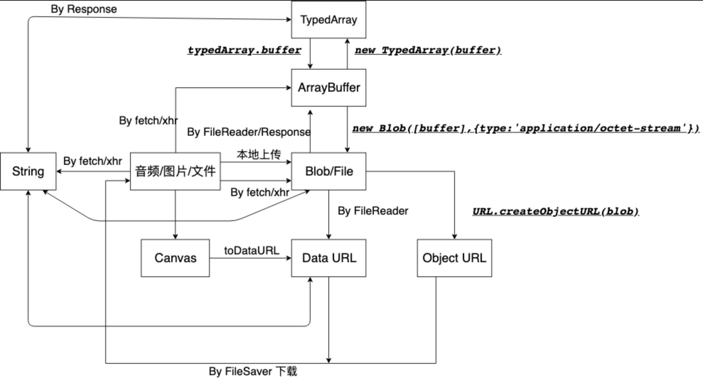

# 浏览器中的二进制以及相关转换

作为一名前端，在工作中也会遇到很多有关二进制处理的需求，如EXCEL表格的导出，PDF的生成，多个文件的打包，音频的处理。

从前后端整体上来说前端代表 UI 层，它的外在表现是 `human readable` 的，而服务端代表数据层，所表现出来的是 `machine readable`。如果 EXCEL 以及 PDF 的处理交由服务端处理，服务端免不了要做一层格式化的逻辑处理，以便与前端保持一致。一来增加了复杂度，二来容易造成前端与服务器端的数据不一致。此时为了减少复杂度，工作量有可能都尽可能在浏览器端完成。

本篇文章总结了浏览器端的二进制以及有关数据之间的转化，如 `ArrayBuffer`，`TypedArray`，`Blob`，`DataURL`，`ObjectURL`，`Text` 之间的互相转换。为了更好的理解与方便以后的查询，特意做了一张图做总结。



## 二进制相关数据类型

在介绍常见的二进制数据处理之前，先简单介绍下几种二进制相关的数据类型

### ArrayBuffer && TypedArray

`TypedArray` 是 ES6+ 新增的描述二进制数据的类数组数据结构。但它本身不可以被实例化，甚至无法访问，你可以把它理解为 `Abstract Class` 或者 `Interface`。而基于 `TypedArray`，有如下数据类型：

+ `Uint8Array`
    `Uint` 及 `Unsigned Int` 代表数组的每一项是无符号整型
    `8` 代表数据的每一项占 8 个比特位，即一个字节
+ `Int8Array`
+ `Uint16Array`
+ `Int16Array`
+ ...

通过 `Uint8Array`，即可知道 `Uint16Array`，`Int8Array` 所代表的意义。

``` javascript
const array = new Int32Array([1, 2, 3])

// .length 代表数组的大小
// 3
array.length

// .btyeLength 代表数据所占字节大小
// 12
array.byteLength
```

`ArrayBuffer` 代表二进制数据结构，**并且只读**，需要转化为 `TypedArray` 进行写操作。

```javascript
const array = new Int16Array([1, 2, 3])

// TypedArray -> ArrayBuffer
array.buffer

// ArrayBuffer -> TypedArray
new Int16Array(array.buffer)

// buffer.length 代表数据所占用字节大小
array.buffer.length === array.byteLength
```

### 连接多个 TypedArray

`TypedArray` 没有像数组那样的 `Array.prototype.concat` 方法用来连接多个 `TypedArray`。不过它提供了 `TypedArray.prototype.set` 可以用来间接连接字符串

> 可以参考 MDN 文档：https://developer.mozilla.org/en-US/docs/Web/JavaScript/Reference/Global_Objects/TypedArray/set

```javascript
// 在位移 offset 位置放置 typedarray
typedarray.set(typedarray, offset)
```

原理就是先分配一块空间足以容纳需要连接的 `TypedArray`，然后逐一在对应位置叠加

```javascript
function concatenate(constructor, ...arrays) {
  let length = 0;
  for (let arr of arrays) {
    length += arr.length;
  }
  let result = new constructor(length);
  let offset = 0;
  for (let arr of arrays) {
    result.set(arr, offset);
    offset += arr.length;
  }
  return result;
}

concatenate(Uint8Array, new Uint8Array([1, 2, 3]), new Uint8Array([4, 5, 6]))
```

同时您还需要对资源的获取有大致的了解，如 XHR，fetch，通过文件上传。

### Blob

`Blob` 是浏览器端的类文件对象。操作 `Blob` 需要使用数据类型 `FileReader`。

`FileReader` 有以下方法，可以把 `Blob` 转化为其它数据

+ FileReader.prototype.readAsArrayBuffer
+ FileReader.prototype.readAsText
+ FileReader.prototype.readAsDataURL
+ FileReader.prototype.readAsBinaryString

```javascript
const blob = new Blob('hello'.split(''))

// 表示文件的大小
blob.size

const array = new Uint8Array([128, 128, 128])
const blob2 = new Blob([array])

function readBlob (blob, type) {
  return new Promise(resolve => {
    const reader = new FileReader()
    reader.onload = function (e) {
      resolve(e.target.result)  
    }
    reader.readAsArrayBuffer(blob)
  })
}

readBlob(blob, 'DataURL').then(url => console.log(url))
```

## 数据输入

数据输入或者叫资源的请求可以分为以下两种途径

+ 通过 url 地址请求网络资源
+ 通过文件上传请求本地资源

### fetch

`fetch` 应该是大家比较熟悉的，但大多使用环境比较单一，一般用来请求 json 数据。其实， **它也可以设置返回数据格式为 `Blob` 或者 `ArrayBuffer`。**

`fetch` 返回一个包含 `Response` 对象的 Promise，`Response` 有以下方法

+ Response.prototype.arrayBuffer
+ Response.prototype.blob
+ Response.prototype.text
+ Response.prototype.json

> 详情可以查看MDN文档 https://developer.mozilla.org/en-US/docs/Web/API/Response

```javascript
fetch('/api/ping').then(res => {
  // true
  console.log(res instanceof Response)
  // 最常见的使用
  return res.json()

  // 返回 Blob
  // return res.blob()

  // 返回 ArrayBuffer
  // return res.arrayBuffer()
})
```

另外，万能的 `Response API` 既可以可以使用 `TypedArray`，`Blob`，`Text` 作为输入，又可以使用它们作为输出。

**这意味着关于这三种数据类型的转换完全可以通过 Response**

### xhr

**xhr 可以设置 responseType 接收合适的数据类型**

```javascript
const request = new XMLHttpRequest()
request.responseType = 'arraybuffer'
request.responseType = 'blob'
```

### File

本地文件可以通过 `input[type=file]` 来上传文件。

```html
<input type="file" id="input">
```

当上传成功后，可以通过 `document.getElementById('input').files[0]` 获取到上传的文件，即一个 File 对象，它是 Blob 的子类，可以通过 `FileReader` 或者 `Response` 获取文件内容。

## 数据输出

或者叫数据展示或者下载，数据经二进制处理后可以由 url 表示，然后通过 image, video 等元素引用或者直接下载。

### Data URL

Data URL 即 Data As URL。所以， **如果资源过大，地址便会很长。** 使用以下形式表示。

```
data:[<mediatype>][;base64],<data>
```

先来一个 hello, world。把以下地址粘入地址栏，会访问到 hello, world

```
data:text/html,<h1>Hello%2C%20World!</h1>
```

#### Base64 编码与解码

Base64 使用大小写字母，数字，+ 和 / 64 个字符来编码数据，所以称为 Base64。经编码后，文本体积会变大 1/3

在浏览器中，可以使用 `atob` 和 `btoa` 编码解码数据。

```javascript
// aGVsbG8=
btoa('hello')
```

### Object URL

可以使用浏览器新的API `URL` 对象生成一个地址来表示 `Blob` 数据。

```javascript
// 粘贴生成的地址，可以访问到 hello, world
// blob:http://host/27254c37-db7a-4f2f-8861-0cf9aec89a64
URL.createObjectURL(new Blob('hello, world'.split('')))
```

### 下载

`data:application/octet-stream;base64,5bGx5pyI`

资源的下载可以利用 [FileSaver](https://github.com/eligrey/FileSaver.js) 。

这里也简单写一个函数，用来下载一个链接

```javascript
function download (url, name) {
  const a = document.createElement('a')
  a.download = name
  a.rel = 'noopener'
  a.href = url
  // 触发模拟点击
  a.dispatchEvent(new MouseEvent('click'))
  // 或者 a.click(
}
```

## 二进制数据转换


以上是二进制数据间的转换图，有一些转换可以直接通过 API，有些则需要代码，以下贴几种常见转换的代码

### String to TypedArray

根据上图，由字符串到 TypedArray 的转换，可以通过 **String -> Blob -> ArrayBuffer -> TypedArray** 的途径。

关于代码中的函数 `readBlob` 可以回翻环节 [数据类型 - Blob](https://shanyue.tech/post/binary-in-frontend/#blob)

```javascript
const name = '山月'
const blob = new Blob(name.split(''))

readBlob(blob, 'ArrayBuffer').then(buffer => new Uint8Array(buffer))
```

也可以通过 Response API 直接转换 **String -> ArrayBuffer -> TypedArray**

```javascript
const name = '山月'

new Response(name).arrayBuffer(buffer => new Uint8Array(buffer))
```

这上边两种方法都是直接通过 API 来转化，如果你更像了解如何手动转换一个字符串和二进制的 TypedArray

### String to TypedArray 2

使用 enodeURIComponent 把字符串转化为 utf8，再进行构造 TypedArray。

```javascript
function stringToTypedArray(s) {
  const str = encodeURIComponent(s)
  const binstr = str.replace(/%([0-9A-F]{2})/g, (_, p1) => {
    return String.fromCharCode('0x' + p1)
  })
  return new Uint8Array(binstr.split('').map(x => x.charCodeAt(0)))
}
```

## 实践

### 1. 如何上传本地图片并在网页上展示

由以上整理的转换图得出途径

`本地上传图片 -> Blob -> Object URL`

### 2. 如何拼接两个音频文件

由以上整理的转换图得出途径

`fetch请求音频资源 -> ArrayBuffer -> TypedArray -> 拼接成一个 TypedArray -> ArrayBuffer -> Blob -> Object URL`

### 3. 如何把 json 数据转化为 demo.json 并下载文件

json 视为字符串，由以上整理的转换图得出途径

`Text -> DataURL`

除了使用 DataURL，还可以转化为 Object URL 进行下载。关于下载的函数 `download`，可以参考以上环节 [数据输出-下载](https://shanyue.tech/post/binary-in-frontend/#%E4%B8%8B%E8%BD%BD) 

`Text -> Blob -> Object URL`

可以把以下代码直接粘贴到控制台下载文件

```javascript
const json = {
  a: 3,
  b: 4,
  c: 5
}
const str = JSON.stringify(json, null, 2)

// 方案一：Text -> DataURL
const dataUrl = `data:,${str}`
download(dataUrl, 'demo.json')

// 方案二：Text -> Blob -> ObjectURL
const url = URL.createObjectURL(new Blob(str.split('')))
download(url, 'demo1.json')
```
