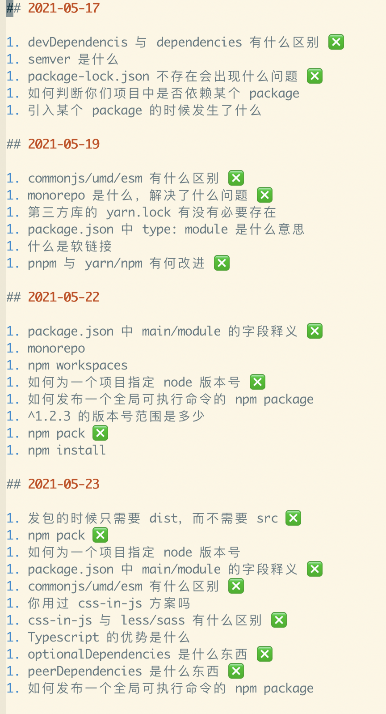
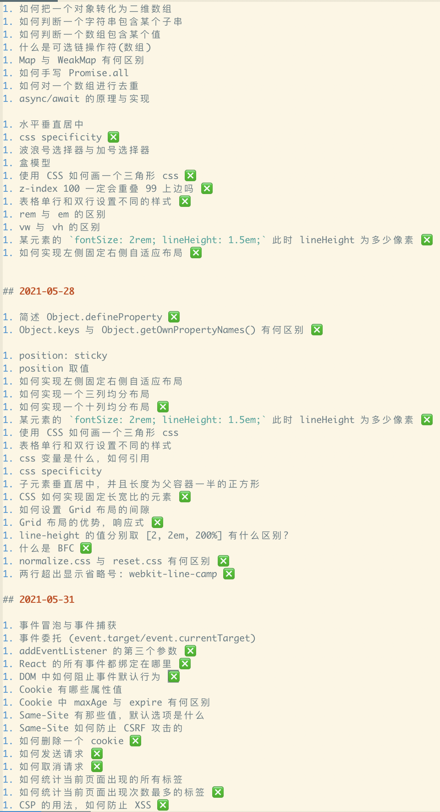

# 关于最近我的一些面试情况及总结

山月，你最近又面试了，去了哪家公司啊，工资几何啊？

停停停，打住，这次不是我面试，而是我面试别人。

而关于我为什么在面试别人，根本原因在于去年的某一次彩票事件，直接原因在于他人对我的建议，鸡蛋不要放在一个篮子里。

如同在浏览器上开启一个实验性 Flag，一个月前我在甜鱼上挂了一个 67 元一小时简历修改及模拟面试。


“67，这不白嫖吗，哪天我和你唠嗑一小时。”

“可以预定五个小时吗？”

在大家的谆谆善诱下，我改成了 73 块钱，人还是络绎不绝，一段时间后，我改成了市场价。

面试前的充分准备程度能够很大决定于你是否能够入职你所期望的公司，当然，大佬除外。

**一个小白，系统地模块化地准备面试两个月，加以捕捉简历项目中的闪光点，剖析简历背后的所有可能面试题，甚至适当放饵，引诱面试官问出你准备好的问题，是有大概率可以进入大厂的。**

## 面试

面试于我而言驾轻就熟，已经面试他人三年多，也被他人面试了五年，拥有丰富的面试经验。

在公司面试候选人时，一般无需向候选人反馈每一道面试题的解答情况，对一个小公司而言无人才库的需求，也就没有必要把此次面试内容逐一记录到招聘系统中。但在为公司实际招人过程中，如果候选人无法答出来，也尽可能地加以讲解及提示，或告知候选人可搜索某些关键字。

但是对于模拟面试而言，更加注重面向候选人，而非公司。这就要求做到以下几点

1. 尽可能把每一道问题中可引申的亮点向候选人拓展下
1. 尽可能把每一道候选人不会的问题解释清楚，并提供其资源。
1. 尽可能通过问问题把项目中难点总结出来

### 引申

面试时的一些普通问题通过引申也可能让面试官眼前一亮，加深印象，这时面试通过率大幅提高，即使有几道题不会。试举两个基础问题:

> Q: 什么是事件委托?
>
> A: 大量子元素的事件触发，委托到父元素，提升性能。
> 
> Q: 好。面试的时候可以提及 React，React 使用了事件委托自动优化性能，它把所有的事件监听器都移到了 document，但是在 React 17 的时候事件监听器移到了 root element。可以看看这个 [Event delegation in React](https://github.com/facebook/react/issues/13635) 与 [React17 Changes to Event Delegation](https://reactjs.org/blog/2020/10/20/react-v17.html#changes-to-event-delegation)

> Q: 如何删除一个 Cookie？
> 
> A: 把该 Cookie 的过期时间设置为过去的时间
> 
> Q: 好。目前新出了 Cookie Store API，你可以使用 `cookieStore.delete('token')` 来删除该 cookie

### 反馈

前期大概一两天安排一个面试，对一些问题做一些讲解，面试结束之后抛出几个相关链接。直到后来……

“山月老师，这个包月不，我最近找工作，想系统复习一遍。” 

自此以后，我找回了我高三的错题本，习惯性记录候选人每次的面试情况，方便最终真实面试之前进行追溯。每次面试之后，面试记录反馈给候选人，并在下次面试之前清除以前的问题。

以下是项目经验剖析阶段的面试与反馈



``` md
## 2021-05-17

1. devDependencis 与 dependencies 有什么区别 ❎
1. semver 是什么
1. package-lock.json 不存在会出现什么问题 ❎
1. 如何判断你们项目中是否依赖某个 package

## 2021-05-19

1. commonjs/umd/esm 有什么区别 ❎
1. monorepo 是什么，解决了什么问题 ❎
1. 第三方库的 yarn.lock 有没有必要存在
1. package.json 中 type: module 是什么意思
1. 什么是软链接
1. pnpm 与 yarn/npm 有何改进 ❎
```

以下是关于基础阶段的面试与反馈



## 系统准备

1. 十年磨一剑，霜刃未曾试
1. 江湖中人人渴求九阴真经

前端面试前是否充分系统化准备，是稳定通过大厂面试的决定因素。

在资源流通发达的今天，只需依靠网络上的免费资源便可以获益匪浅，以下均是我总结的面试路线中涉及到的免费资源，准备时间一个月左右时间即可。

你已有九阴真经在手，更无须十年磨剑，愿春风得意马蹄急，一日看尽长安花。

1. CSS
    + [Learn CSS](https://web.dev/learn/css/)
    + [CSS Diner](https://flukeout.github.io/)
    + [Flex Forggy](https://flexboxfroggy.com/)
    + [Grid Garden](https://cssgridgarden.com/)
1. JS/ES6+/Code
    + [ES6 入门教程](https://es6.ruanyifeng.com/)
    + [数组](https://developer.mozilla.org/zh-CN/docs/Web/JavaScript/Reference/Global_Objects/Array)
    + [对象](https://developer.mozilla.org/zh-CN/docs/Web/JavaScript/Reference/Global_Objects/Object)
    + [字符串](https://developer.mozilla.org/zh-CN/docs/Web/JavaScript/Reference/Global_Objects/String)
    + [Promise](https://developer.mozilla.org/zh-CN/docs/Web/JavaScript/Reference/Global_Objects/Promise)
    + [lodash](https://lodash.com/docs/4.17.15)
    + [You Dont Need Lodash Underscore](https://github.com/you-dont-need/You-Dont-Need-Lodash-Underscore)
1. DOM 及 Web API
    + [DOM API Reference - MDN](https://developer.mozilla.org/en-US/docs/Web/API/Document_Object_Model)
    + [Web API Reference - MDN](https://developer.mozilla.org/en-US/docs/Web/API)
    + [Event](https://developer.mozilla.org/zh-CN/docs/Learn/JavaScript/Building_blocks/Events)
    + [Cookie](https://developer.mozilla.org/en-US/docs/Web/API/Document/cookie)
    + [HTTP Cookie](https://developer.mozilla.org/zh-CN/docs/Web/HTTP/Cookies)
1. HTTP
    + [MDN: HTTP Guide](https://developer.mozilla.org/zh-CN/docs/Web/HTTP)
    + HTTPS
    + HTTP2
1. Security
    + [安全清单](https://cheatsheetseries.owasp.org/cheatsheets/AJAX_Security_Cheat_Sheet.html)
    + [Security - MDN](https://developer.mozilla.org/en-US/docs/Web/Security)
1. React/Vue
    + [React Documentation](https://reactjs.org)
    + [Vue Documentation](https://vuejs.org/)
1. 性能优化
    + [Google 加载性能优化](https://web.dev/fast/)
    + [Google 性能优化指南](https://developers.google.com/web/fundamentals/performance/get-started)
    + [MDN 性能优化指南](https://developer.mozilla.org/en-US/docs/Web/Performance)
1. 项目经验及涉及到的所有基础问题与工程化问题
    + 反复总结
    + 反复推敲

> 东方不败把《葵花宝典》免费公开了，谁都能练。你说你练呢还是不练呢？不练吧，一出门脑袋就没了。练吧，下面又没了。比起下面，脑袋显然更重要。

东方不败把葵花宝典公开之后，人人都是东方不败吗？

不会。

进大厂的路上并不拥挤，因为能够坚持的人不多。
