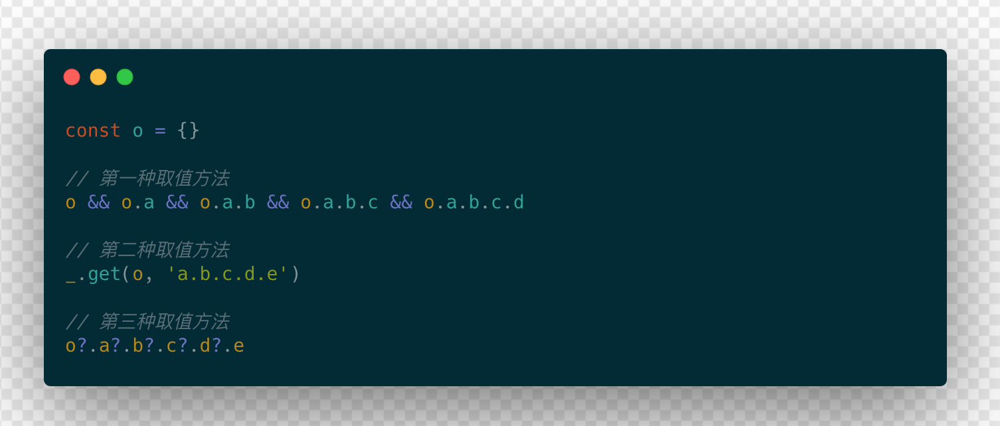

# 如何实现 lodash.get 函数及可选链操作简化取值

本篇文章简介 `lodash.get` 函数的实现以及可替代的可选链操作，源于我自己的仓库 [面试每日一题](https://github.com/shfshanyue/Daily-Question/issues)，其中记录了关于前端进阶及工程化的各种问题。心灵鸡汤之所以被抵制就是因为只有鸡汤没有勺子，别人也开始问我的仓库有没有答案了。因此我将写一大堆文章来捎带回答这些问题 ---- 如果有时间的话。

最近整理了我的 github 中的博客，[山月的博客](https://github.com/shfshanyue/blog) 欢迎订阅

---

`lodash` 基本上成为了 js 项目的标配工具函数，广泛应用在各种服务端以及前端应用中，但是它的包体积略大了一些。对于服务端来说，包的体积并不是十分的重要，或者换句话说，不像前端那样对包的体积特别敏感，一分一毫都会影响页面打开的性能，从而影响用户体验。

正因为前端打包体积对于用户体验的重要性，因此有各种各样减小包体积的方法。针对 `lodash` 来说，你完全不必要引入 `lodash` 的所有工具函数，你只需要按需引入或者直接使用单函数包。关于按需引入你可以参考以下文章:

> [Lessons on tree-shaking Lodash with Webpack and Babel](https://www.azavea.com/blog/2019/03/07/lessons-on-tree-shaking-lodash/)

另一方面，随着 `ES6+` 的发展，以及浏览器与 Node 对 ES 标准的支持增强，很多 `lodash` 的函数都很容易实现或者说已被 ES6+ 实现。如 `_.assign`，`_.trim`，`_.startsWith` 等等已被 ES6+ 实现，而 `_.uniq` 又很容易通过 `new Set()` 来解决。

有人就在 github 上总结了 [you-dont-need/You-Dont-Need-Lodash-Underscore](https://github.com/you-dont-need/You-Dont-Need-Lodash-Underscore)，其中囊括了很多工具函数很简易的实现。

<!--more-->

根据山月浸淫 JS 项目的多年经验，使用 `lodash` 的大多数场景都是在 `lodash.get`，其频繁程度就好比 `redis` 界的 `set/get`。那为什么 `lodash.get` 会使用如此频繁呢，这要从它解决什么问题开始。

## lodash.get 解决什么问题


如上所示，当我们无法正确获取数据时将会报错，那如果我们想要避免错误的发生呢？那只能写一条很长很长的判断了

在 js 中经常会出现嵌套调用这种情况，如 `a.b.c.d.e`，但是这么写很容易抛出异常。你需要这么写 `a && a.b && a.b.c && a.b.c.d && a.b.c.d.e`，但是显得有些啰嗦与冗长了。特别是在 `graphql` 中，这种嵌套调用更是难以避免。

``` javascript
const o = {}

o && o.a && o.a.b && o.a.b.c && o.a.b.c.d
```

恩，光是想一想每次取数据都要这么长就很难受...

而 `lodash.get` 就是解决这个问题的，这时就需要一个 `get` 函数，使用 `get(a, 'b.c.d.e')` 简单清晰，并且容错性提高了很多。

``` bash
_.get(o, 'a.b.c.d.e')
```

## 如何实现 `lodash.get`

``` ts
get(object: object, path: [never]): never
```

实现 `lodash.get` 的函数功能之前，先标明它的测试用例。它除了可以应用在嵌套对象上，还可以应用在嵌套数组中:

``` javascript
get({ a: null }, 'a.b.c', 3)
// output: 3

get({ a: undefined }, 'a', 3)
// output: 3

get({ a: null }, 'a', 3)
// output: 3

get({ a: [{ b: 1 }]}, 'a[0].b', 3)
// output: 1
```

`path` 中也可能是数组的路径，全部转化成 `.` 运算符并组成数组

```javascript
// a[3].b -> a.3.b
const paths = path.replace(/\[(\d+)\]/g, '.$1').split('.')
```

然后层层迭代属性即可，另外注意 `null` 与 `undefined` 取属性会报错，所以使用 `Object` 包装一下。

``` javascript
function get (source, path, defaultValue = undefined) {
  // a[3].b -> a.3.b
  const paths = path.replace(/\[(\d+)\]/g, '.$1').split('.')
  let result = source
  for (const p of paths) {
    result = Object(result)[p]
    if (result === undefined) {
      return defaultValue
    }
  }
  return result
}
```



## You Dont Need Lodash: 可选链

``` javascript
const o = {}

o && o.a && o.a.b && o.a.b.c && o.a.b.c.d
```

可选链，(`optional chaining`)，操作符表示为 `?.`，属于 ES2020 新增的内容，另外在 `Typescript 3.7` 中也添加了可选链的操作，大大简化了对象的访问。通过获取对象属性获得的值可能是undefined或null时，可选链操作符提供了一种方法来简化被连接对象的值访问。

``` javascript
const o = {}

o?.a?.b?.c?.d
```

当引入可选链之后，`_.get` 就不是很必要了