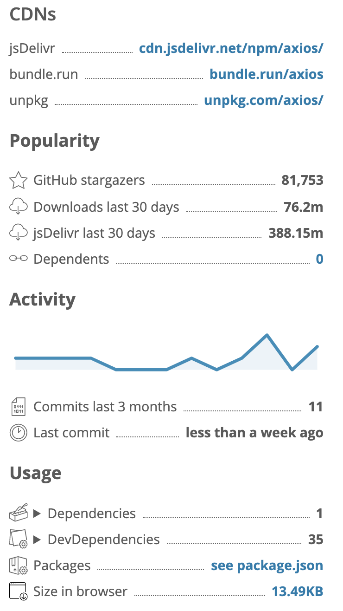
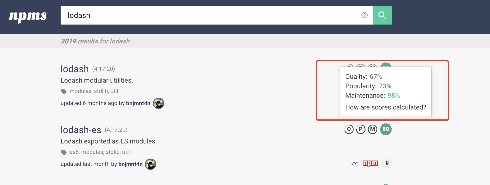

# 谈技术选型，如何找到一个高质量 npm 轮子

<npmjs.com> 是 npm 的官方仓库，目前已经有 150+ 万个仓库发布在了 npm，数量巨大也造就了 package 的参差不齐，这里整理了一些 分析 npm package 各个维度的网站 API，方便从代码质量、安全性与维护性多维度来选择一个 package。

工作业务的繁忙、排期的紧急中，开发者很难有时间有精力真的去读源码来改变这件事情，唯一能做的就是多参考几个指标。

很多新入行的同学喜欢搞高仿版的抖音或者美团，这里提供一个新的思路，有兴趣的同学可以基于此搞一个 <npmjs.com> 的高仿版或者加强版。

以下列举了几个网站及其 API，并作备忘:

+ npmjs.com
+ npms.io
+ unpkg.com/js
+ jspm.dev/skypack.dev/esm.run
+ bundlephobia.com
+ yarnpkg.com

## 01. NPM 官网: npmjs.com

+ 官网: <https://npmjs.com>
+ API: <https://www.npmjs.com>，发送请求时需要携带请求头 `x-spiferack:1`

这是 `npm` 的官方网站，由 `npm` 公司进行管理，拥有全球最大最多的 npm 仓库。开发者可以在上管理自己的公有 package，由于私有 package 需要付费管理，因此很多厂会搭建 npm 私有服务。

由于在国外，国内 `npm i` 的速度有很明显的延迟，因此国内习惯使用淘宝的镜像仓库: <https://registry.npm.taobao.org>

这里有 `npm` 的官方 API，但不对外提供服务，因此也没有文档，正因如此，第三方客户端请求需要**设置代理处理跨域问题**。由于没有官方文档，下边我对它的 API 稍作整理，以备不时之需

### Search Package List

根据关键词进行搜索

``` bash
curl 'https://www.npmjs.com/search?q=keywords:front-end&page=0&ranking=optimal' -H 'x-spiferack: 1'
```

> 注: x-spiferack 是必须的字段

### Package Info

每一个 package 的详情信息

``` bash
curl 'https://www.npmjs.com/package/ms' -H 'x-spiferack: 1'
```

> 注: x-spiferack 是必须的字段

Response 重要字段:

+ `downloads`: 每周下载数据
+ `readme.data`: 文档
+ `packageVersion.devDependencies`
+ `packageVersion.dependencies`
+ `packageVersion.typings`: 是否支持 TS
+ `packument.name`
+ `packument.description`
+ `packument.homepage`
+ `packument.repository`
+ `packument.version`
+ `packument.versions`: 各个版本及大小

## 02. Yarn 官网: yarnpkg.com

+ 官网: <https://yarnpkg.com/>
+ Package: <https://yarnpkg.com/package/webpack>
+ API: <https://ofcncog2cu-3.algolianet.com/1/indexes/*/queries>

`yarn` 是 npm 的可替换工具，也维护了一份仓库，API 的查询使用了 `Algolia` 提供搜索服务。npm 包的详情信息比 `npmjs.com` 更加翔实与具体，比 `npmjs.com` 也拥有更多的指标进行参考:

1. Security: 查看是否有安全风险
1. Popularity: 根据 Github 的星星与周下载量查看受欢迎度
1. Activity: 根据 Commit 情况查看是否活跃



## 03. 最好用的 CDN: jsdelivr.com

**`Jsdeliver` 在中国有 CDN 节点！**
**`Jsdeliver` 在中国有 CDN 节点！**
**`Jsdeliver` 在中国有 CDN 节点！**

## 04. Snyk: 为你的下一个项目挑选最好的轮子

+ 官网: <https://snyk.io/advisor/>
+ Package: <https://snyk.io/advisor/npm-package/webpack>
+ API: <https://snyk.docs.apiary.io/>

Snyk 的口号是 `Find the best package for your next project.`，相比 `yarn` 它对于一个 package 有着更细粒度的判定，并且学会了一个重要的事情: 打分。

## 05. NPM Unoffical API: npms.io

该 API 在 `https://api.npms.io/v<version>` 下提供服务，当前版本是 v2

由于对官方 API 的不满意，`npmsio` 借助 `ElasticSearch` 单独整了个 API，并提供更好的搜索体验。

## 06. UNPKG API: unpkg.com

UNPKG 是一个服务于 NPM 仓库的 CDN，用以快速使用发送请求的方式加载文件。另外，还提供一些基础信息查询的 API

官方文档: <https://unpkg.com/>



### Meta

``` bash
$ curl https://unpkg.com/react@17.0.1/index.js?meta | jq
{
  "path": "/index.js",
  "type": "file",
  "contentType": "application/javascript",
  "integrity": "sha384-uYepeL3qyzb/7G5T1fizoxPoKmV6ftFXdz4jeQlBff4HqMuNVJPqiNjvN38BeHUk",
  "lastModified": "Sat, 26 Oct 1985 08:15:00 GMT",
  "size": 190
}
```

## 07. BundlePhobia: bundlephobia.com

用以查询一个 package 的打包体积有多大

``` bash
$ curl 'https://bundlephobia.com/api/size?package=react@17.0.1' | jq
{
  "assets": [
    {
      "gzip": 2908,
      "name": "main",
      "size": 7128,
      "type": "js"
    }
  ],
  "dependencyCount": 2,
  "dependencySizes": [
    {
      "approximateSize": 6320,
      "name": "react"
    },
    {
      "approximateSize": 1236,
      "name": "object-assign"
    }
  ],
  "description": "React is a JavaScript library for building user interfaces.",
  "gzip": 2908,
  "hasJSModule": false,
  "hasJSNext": false,
  "hasSideEffects": true,
  "name": "react",
  "repository": "https://github.com/facebook/react.git",
  "scoped": false,
  "size": 7128,
  "version": "17.0.1"
}
```

## NPM Trends