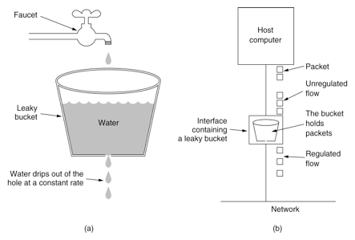
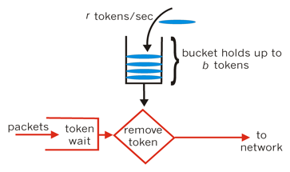

# 邮件发送中的限流算法: 漏桶与令牌桶

前段时间，我使用了 jwt 来实现邮箱验证码的校验与用户认证与登录，还特别写了[一篇文章](https://juejin.im/post/5cc459976fb9a032212cc73b)作为总结。

在那篇文章中，提到了一个点，如何限速。

在短信验证码和邮箱验证码，如果不限速，被恶意攻击造成大量的 QPS，不仅拖垮了服务，也会心疼如水的资费。鉴于君子固穷的原则，在我的邮箱服务里加上限速。

关于如何限速，有两个比较出名的算法，漏桶算法与令牌桶算法，这里对其简单介绍一下，最后再实践在我发邮件的API中

<!--more-->

以下是发送邮件的 API，已限制为一分钟两次，你可以通过修改 `email` 进行试验。你也可以在[我的站点](https://shici.xiange.tech/register)直接试验

```shell
curl 'https://graphql.xiange.tech/graphql' -H 'Content-Type: application/json' --data-binary '{"query":"mutation SEND($email: String!) {\n  sendEmailVerifyCode (email: $email)\n}","variables":{"email":"xxxxxx@qq.com"}}'
```

以下是我关于登录实践的系列文章

1. [【登录那些事】实现 Material Design 的登录样式](https://juejin.im/post/5cc2d983f265da03a436d6b7)
1. [【登录那些事】使用 jwt 登录与校验验证码](https://juejin.im/post/5cc459976fb9a032212cc73b)
1. [【登录那些事】邮件发送，限流，漏桶与令牌桶](https://juejin.im/post/5cceafe5f265da039d32966d)

本文地址：<https://shanyue.tech/post/rate-limit/>

## Leaky Bucket (漏桶算法)



漏桶算法表示水滴（请求）先进入到漏桶里，漏桶（bucket）以一定的速度出水，当漏桶中水满时，无法再加水。

+ 维护一个计数器作为 bucket，计数器的上限为 bucket 的大小
+ 计数器满时拒绝请求
+ 每隔一段时间清空计数器

用 `option` 代表在 `option.window` 的窗口时间内最多可以通过 `option.max` 次请求

以下是使用 redis 的计数器实现限流的伪代码

```javascript
const option = {
  max: 10,        // window 时间内限速10个请求
  window: 1000    // 1s
}

function access(req) {
  // 根据请求生成唯一标志
  const key = identity(req)
  // 计数器自增
  const counter = redis.incr(key)
  if (counter === 1) {
    // 如果是当前时间窗口的第一个请求，设置过期时间
    redis.expire(key, window) 
  }
  if (counter > option.window) {
    return false
  }
  return true
}
```

> 这里有 Redis 官方使用 INCR 实现限流的文档 https://redis.io/commands/INCR

此时有一个不算问题的问题，就是它的时间窗口并不是滑动窗口那样在桶里出去一个球，就可以再进来一个球。而更像是一个固定时间窗口，从桶里出去一群球，再开始进球。正因为如此，它可能在固定窗口的后一半时间收到 `max-1` 次请求，又在下一个固定窗口内打来 `max` 次请求，此时在一个随机的窗口时间内最多会有 `2 * max - 1` 次请求。

另外还有一个redis的 `INCR` 与 `EXPIRE` 的原子性问题，容易造成 `Race Condition`，可以通过 `SETNX` 来解决

```javascript
redis.set(key, 0, 'EX', option.window, 'NX')
```

另外也可以通过一个 `LUA` 脚本来搞定，显然还是 `SETNX` 简单些

```lua
local current
current = redis.call("incr",KEYS[1])
if tonumber(current) == 1 then
    redis.call("expire",KEYS[1],1)
end
```

为了解决 2N 的问题，可以由维护一个计数器，更改为维护一个队列。代价是内存占用空间过高，且更难解决 `Race Condition`

以下是使用 redis 的 set/get string 实现的限流

```javascript
const option = {
  max: 10,        // window 时间内限速10个请求
  window: 1000    // 1s
}

function access(req) {
  // 根据请求生成唯一标志
  const key = identity(req)
  const current = Date.now()
  // cache 视为缓存对象
  // 筛选出当前时间窗口的请求个数，每个请求标志为时间戳的格式
  // 为了简单这里不做 json 的序列化和反序列化了...
  const timestamps = [current].concat(redis.get('timestamps')).filter(ts => ts + option.window > current)
  if (timestamps.length > option.max) {
    return false 
  }
  // 此时读写不同步，会有 Race Condition 问题
  redis.set('timestamps', timestamps, 'EX', option.window)
  return true
}
```

这里再使用一个 LUA 脚本解决 `Race Condition` 的问题

TODO

## Token Bucket (令牌桶算法)



由图先看一看令牌桶与漏桶的不同

1. 令牌桶初始状态 bucket 是满的，漏桶初始状态 bucket 是空的
1. 令牌桶在 bucket 空的时候拒绝新的请求，漏桶在 bucket 满的时候拒绝新的请求
1. 当一个请求来临时，假设一个请求消耗一个token，令牌桶的 bucket 减少一个 token，漏桶增加一个 token

以下使用 redis 实现令牌桶

TODO
