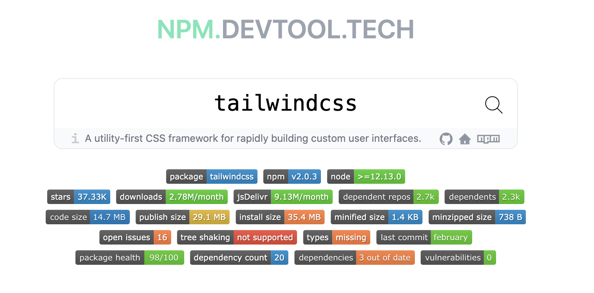
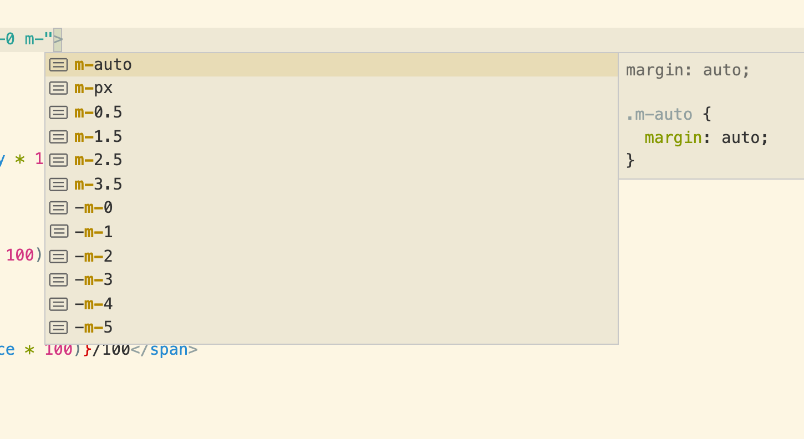
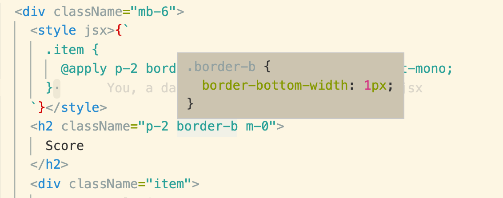
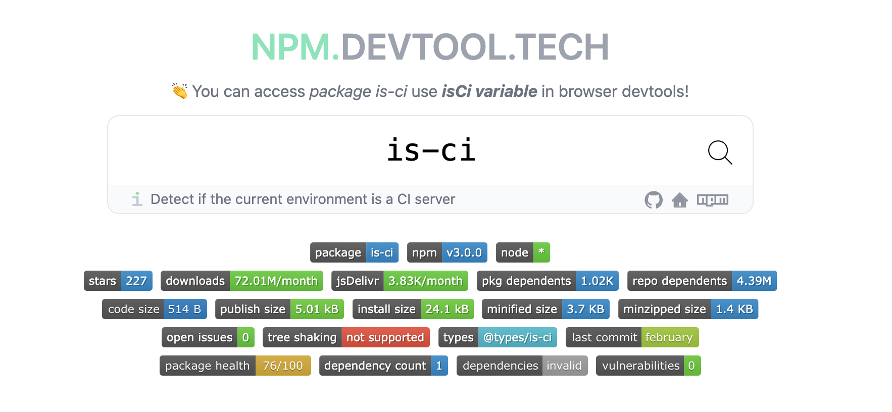

# 谈一谈对 TailwindCSS 的看法



本人的 CSS 方案常用 `TailwindCSS`，在这里谈一点感受，并对一些常见的问题解答一下

TailwindCSS 因为一个 `class` 代表一个 CSS 属性这种原子化 CSS (Atomic CSS)，这种细粒度的 CSS 方案备受争议。

这里把 CSS 样式的方案分为四种粒度

## 一、四种粒度

``` html
<div style="{ borderRadius: '0.5rem', padding: '1rem' }"> Click </div>
```

``` html
<div class="rounded-lg p-4"> Click </div>
```

``` html
<div class="button"> Click </div>
```

``` jsx
<Button> Click </Button>
```

越往下走，颗粒度越来越大，约束性变高，自由性不足。而 `TailwindCSS` 位于第二层。

## 二、一些问题的解答

Tailwindcss 为啥受欢迎，在我看来无非是**更好用的原子化的CSS**。在国外如火如荼，但是在国内论坛上争议很大，前几天在我的博客上写了一篇关于 Tailwindcss 的文章，但是底下评论很多了各种问题，于是再总结一下

### Q1: 这和行内 CSS 有何区别，不就少写几个字吗？

大部分人的想法应该是这样的: 仅仅对于 `text-center` 而言，虽然提供了些许方便，但是不足以拉开差距。

如果说它仅仅是简单的原子化 CSS，好用却不亮眼。但是它却不仅仅止于此。

#### 1. 方便性: `text-center`、`grid-cols-3`

或许一个 `text-center` 不足以使你觉得提供了多大的方便性，但对于一个三等分的 Grid 属性来说，一个 `grid-cols-3` 和 `shadow` 绝对方便

``` css
.grid-cols-3	{
  grid-template-columns: repeat(3, minmax(0, 1fr));
}
```

**或者你还能记得 `box-shadow` 各个位置的参数吗？** 我敢保证看这篇文章的人至少有 93% 说不上来

在 tailwind 中，直接用 `.shadow` 简单方便

``` css
.shadow {
  box-shadow: 0 1px 3px 0 rgba(0, 0, 0, 0.1), 0 1px 2px 0 rgba(0, 0, 0, 0.06);
}
```

#### 2. 语义化: `text-lg`、text-white`、`ring`、`animate-spin`

`text-lg`，一个较大字体，如果设置行内样式，肯定有诸多麻烦的事: `我想设计一个较大的字体，那我应该设计多大尺寸、使用什么单位`

同样还有:

1. `text-white`: 白色的色值是哪个来着?
1. `ring`: 我想给这个按钮加一个圈圈？
1. `animate-spin`: 怎么做一个动画？

#### 3. 约束性: `bg-gray-500`、`text-lg`、`p-4`

**新人总容易弄出一种大红大绿的新人风格网页**，有了一些约束就很难出现这种很糟糕的色彩控制

另外，有了 `text-lg` 此类，一个页面上就不会出现**几十种参差不同的字体大小**

#### 4. 响应式: 

先来看一个在工作中会遇到的响应式布局问题，这也是我上一次在头条面试时的一道题目

> [响应式布局，一大堆子元素，在大屏幕三等分，中等屏幕二等分，小屏幕一等分？](https://q.shanyue.tech/fe/css/473.html)

``` html
<div class="container">
  <div class="item"></div>
  <div class="item"></div>
  <div class="item"></div>
  <div class="item"></div>
  <div class="item"></div>
  <div class="item"></div>
</div>
```

通过 `grid` 布局很容易实现，但未免繁琐

``` css
@media (min-width: 1024px) {
  .container {
    grid-template-columns: repeat(3,minmax(0,1fr));
  }
}

@media (min-width: 768px) {
  .container {
    grid-template-columns: repeat(2,minmax(0,1fr));
  }
}

.conainer {
  display: grid;
  gap: 1rem;
}
```

那使用 `tailwind` 呢? **只要一行，就问你高效不高效**

``` html
<div class="grid grid-cols-1 md:grid-cols-2 lg:grid-cols-3 gap-4"></div>
```
#### 5. 修饰符

把修饰符，如各种伪类、暗黑模式、响应式设计至于前缀的设计简直深得我心

``` html
<div class="focus:ring-2 hover:bg-red-700 dark:bg-gray-800"></div>
```

### Q2: 既然 TailwindCSS 这么好用，那岂不是可以摆脱手写 CSS 了

很遗憾，不能。不过虽然你无法摆脱手写 CSS，但是你基本上也写不了几行，说以下几种很常用的情况

#### 1. 复杂选择器

当父级元素鼠标悬浮时的，子级元素的样式控制

``` css
.container:hover .item {

}
```

#### 2. CSS function

``` css
.body {
  height: calc(100vh - 6rem)
}
```

#### 3. 多种属性复用

``` css
.item {
  @apply p-2 border-b flex justify-between font-mono;
}
```

### Q3: 造成新的记忆负担

这个问题就仁者见仁智者见智了，在 Vue 的 `template` 语法中也经常出现此类问题，很多人会对一些命名上的约定，特别是自己不太喜欢的约定天然排斥，这也无可厚非。

我在初期确实会一边开发网页，一边瞅着文档全局搜索: [TailwindCSS 属性查找](https://tailwindcss.com/docs/border-radius)，现在借助浏览器插件及熟能生巧的经验已经不太需要翻文档了

1. [Tailwind CSS IntelliSense](https://marketplace.visualstudio.com/items?itemName=bradlc.vscode-tailwindcss)






初期经常花时间翻文档而不手写 CSS，而其中的原因不外乎两个:

1. 多写几个字母，确实有点嫌麻烦，有这时间还不如看看文档，全局搜索下也不费事
1. 自己设置一个 fontSize，padding、margin 实在不知道设置多少尺寸，tailwindcss 有较大的约束

**过了多久就会觉得: 嗯，真香**

### Q4: 仅仅是实现一个原子化的 CSS，怎么这么多 Star？

因为他确实比较方便，算是解决了痛点。而且 Star 也和功能复杂度无关

使用 Gihub Star 数和 npm 周下载量来表明一个库的受欢迎程度，那么你会发现有的库只有几十行，下载量比 React/Vue/Angular 加起来都要多

1. [mime](https://npm.devtool.tech/mime): 获取 Mime Type。几十行代码，每周 3700 万次下载，1.6K Star
1. [classnames](https://npm.devtool.tech/classnames): 根据条件连接 class 类名。一百几十行代码，每周 580 万次下载，13.5K Star
1. [js-cookie](https://npm.devtool.tech/js-cookie): 操作 cookie。**一百多行代码，每周 200 万次下载，17K Star，但是在 Jsdelivr 每月有上亿次下载**
1. [ms](https://npm.devtool.tech/ms): `ms('2 days')` 可读性的时间转化为秒数。几十行代码，每周 7300 万次下载，3.3K Star
1. [isMobile](https://npm.devtool.tech/is-mobile): 检测当前 web 环境是否为移动端。几十行代码，每周 15 万下载，2K Star
1. [isci](https://npm.devtool.tech/is-ci)



### Q5: 初期很爽，但是后期维护困难，特别是人员调动后

我算是 TailwindCSS 中度使用者吧，目前还没有后期维护困难方面的困惑。**甚至可以说，维护比以前的方案还要容易**

至于调试，可轻松使用 `chrome devtools`，还是可以一眼望到底的，而且**没有以前各种 class 存在属性重复覆盖，造成调试困难，从下图可看出 tailwindcss 调试一目了然**


即使实在有过多的 CSS Class，也可以**通过 `Computed` 面板中的小箭头跳转过去找到相对应的 class**


### Q6: 虽然 CSS 体积大幅降低，但是 HTML 体积却变大了

Facebook 经过重构后 CSS 体积已经从 413Kb 减至 74Kb。


gzip 的核心是 Deflate，而它使用了 LZ77 算法与 Huffman 编码来压缩文件，重复度越高的文件可压缩的空间就越大。

即使 HTML 因为类名过多造成体积增大，由于 class 高度相似，gzip 也将会得到一个很大的压缩比例。

## 三、谈谈我遇到的几个问题

### Q1: PurgeCSS 有可能过多删除 class

tailwind 使用了 `purgecss` 删除无用的 class，但有时候会吧有用的 class 也给删掉。道理也很简单，它并不能动态执行代码，你计算后的 class 他不认识就给你删了

比如:

``` html
<div class="text-{{  error  ?  'red'  :  'green'  }}-600"></div>
```

所以我强烈推荐使用 [classnames](https://npm.devtool.tech/classnames)

上面这段在文档里有描述: [如何正确书写能够被 purgecss 识别的样式](https://tailwindcss.com/docs/optimizing-for-production#writing-purgeable-html)

### Q2: 样式覆盖问题

以下 red 与 blue 两个样式哪个会生效？无法确定。

``` html
<div class="red blue"> </div>
```

`class` 在样式表中的顺序决定，而非在 class 中的先后顺序。这使得通过 className 扩展样式时遭遇问题，示例如下

``` jsx
import cx from 'classnames'

function Input ({ classname }) {
  // 默认居中，提供外层扩展 class 的功能
  return <input className={cx('text-center', classname)} />
}

function ExtendInput () {
  // 扩展失败
  return <Input className="text-left" />
}
```

## 实践

再来谈几个实践的点
### 与 classnames 搭配使用

``` js
classNames('text-center transition-opacity', showTip ? 'opacity-100' : 'opacity-0')
```

### 与 styled-jsx 搭配使用

此时样式由大量的 `tailwind` 及少量的 `styled-jsx`组成。需要注意此时需要搭配 styled-jsx 的 postcss 插件使用

``` jsx
<style jsx>{`
  .item {
    @apply p-2 border-b flex justify-between font-mono;
  } 
`}</style>
```