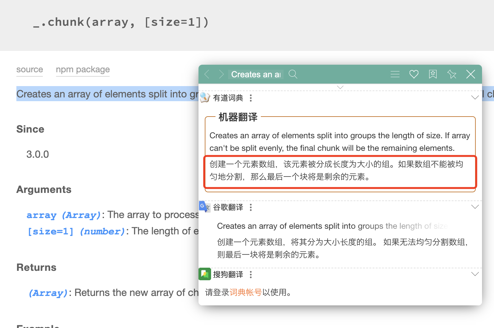
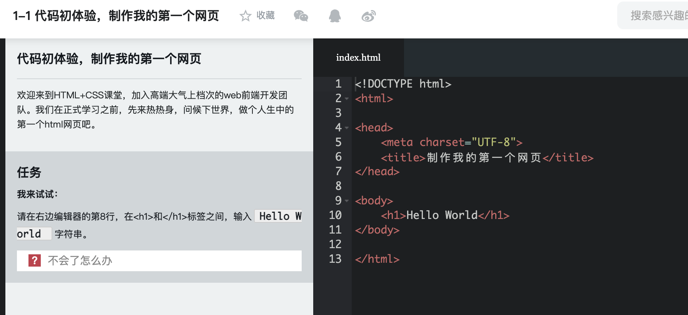
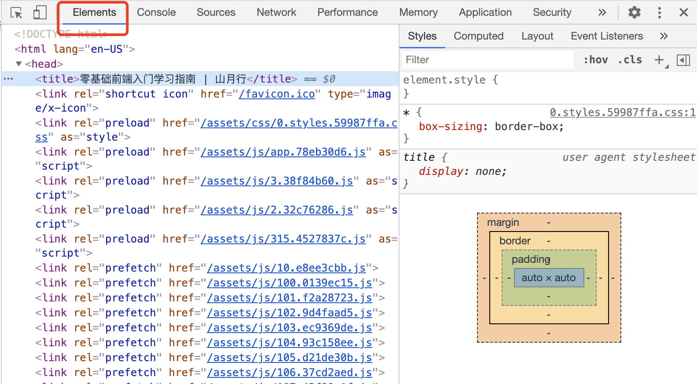
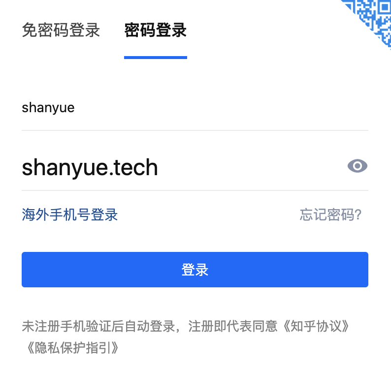
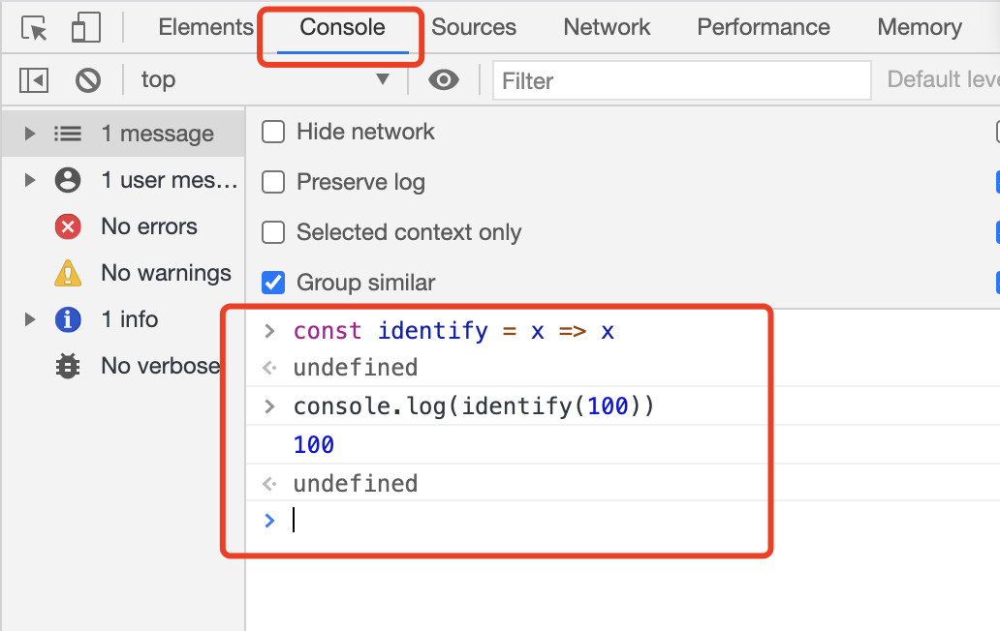
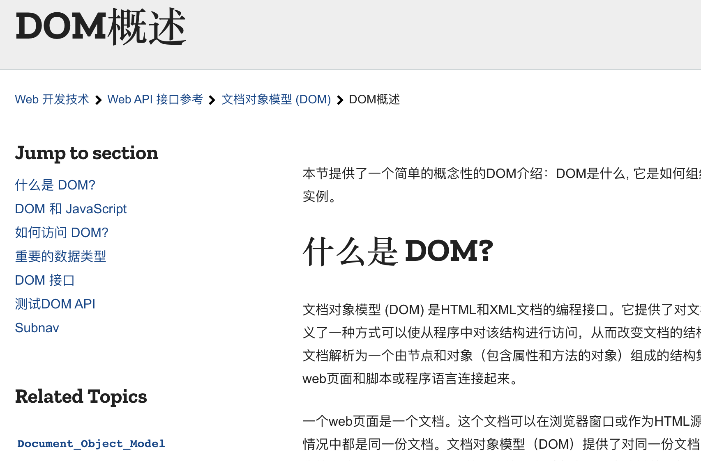

# 零基础前端入门学习指南

本篇文章写给那些想初窥编程门径却不知如何下手的零基础非计算机科班的同学们。

## 准备工作

### 心态

> 既不妄自尊大想着一口吃成胖子，也不妄自菲薄觉得自己写不了代码

零基础者学习编程或者前端，最重要的一点在于心理。

许多人一看代码二字就吓住了，想起了大学时被C语言二级支配的痛苦，于是刚听到编程俩字，就已被劝退，心里便想着：我不行，敲不了代码。于是未战先败。不过你放心，相对于C语言来说，前端入门可以称得上既简单又好玩。

相对于其它转专业来学前端的，前端实在过于简单。相比机械电子来说，前端不费材料，不用机床不用电路板，没有高价的设施要求，也无生命安全之忧。(话说，山月在大学见别人车零件时总怕切到手)

还有一些人会问：写代码是不全是写英文，英文不好可以吗？如果说代码和英文相关，那估计只有几个关键字的单词吧。学习编程只要你有英语四级的水平，正常的英文阅读水平，但大部分时候是用来去阅读英文文档。**你需要养成阅读英文文档的习惯。**



下载地址: <https://saladict.crimx.com/>

### 坚持

> 贵有恒，何必三更起、五更眠；最无益，只怕一日曝、十日寒。

保证每天可以至少学习两个小时，挤一挤上下班通勤时间应该是比较容易做到的。每天起早贪黑牺牲睡眠时间就没有必要，毕竟贵有恒。

对于前端，所见即所得，如同嗑瓜子一样，可以快速得到学习效果的正反馈，也更容易坚持。

### 工具

> 工欲善其事，必先利其器。

这里介绍三款山月认为的**必备必备必备工具**吧:

+ [VSCode](https://code.visualstudio.com/): VSCode 是一款编辑器。在我开始学习编程时，Sublime Text 都给人眼前一亮。而随着编辑器的发展，对于前端而言，VSCode 无疑是最流行最好用的那款。在学习前端之前，务必装好这个软件。
+ [Github](https://github.com/): Github 是全球最大的开源平台，你可以在上边找到你想要的代码及学习资料。如果离开了 Github，很多程序员将面临失业，这并不是夸夸其谈。
+ [DevDocs](https://devdocs.io/): 文档，可理解为官方学习资料，贯穿编程的每一天，基本与文档随影随行，**学习编程的最重要一步就是养成看文档的习惯**。devdocs 有可能是最全的文档库。
+ Chrome: 谷歌浏览器

### 终端 (命令行工具)

+ iterm2 (Mac)
+ cmd (Windows)

### 存疑

1. 百度/Google/Segmentfault
1. 博客园/掘金/CSDN

知乎？别去知乎问，怕被喷。

## 基础: HTML/CSS/JS

一切准备就绪，这时候要接触代码了，不过这一部分并不困难。

HTML/CSS/JS 被称为前端网站编写三剑客，也是常说的前端所需编写的代码。对于目前大部分互联网前端岗位而言，Javascript 是无可争议的大头。

+ [慕课网](https://imooc.com)
+ [网易云课堂](https://study.163.com/)
+ [MDN](https://developer.mozilla.org/zh-CN/docs/learn)

## HTML: 一天时间



+ 学习资料: [初识HTML(5)+CSS(3)-2020升级版](https://www.imooc.com/learn/9)，包含了 HTML 和 CSS 的教程。
+ 文档协助: [MDN](https://developer.mozilla.org/zh-CN/docs/learn)，MDN 是服务于开发者最齐全的文档，也是前端**必不可少翻得最多的文档**

目前这个阶段敲代码在教程所提供的代码编辑器中运行即可，**无需使用 VSCode**。**花费一天时间照着以上教程至少过一遍，如果遇到无法理解的问题，深思三遍仍不得其解，不要硬磕，容易引来挫败感，直接跳过即可。**为了加深记忆，可以过三遍。

即使最后忘记了所有标签，只要记得以下这些标签及整体框架即可:

``` html
<!DOCTYPE html>
<html lang="en">
<head>
  <meta charset="UTF-8">
  <title>Document</title>
</head>
<body>
  <div>hello, world</div>
</body>
</html>
```

如果连以上标签也无法记得，那就记住以下这个标签:

``` html
<div>hello, world</div>
```

## CSS: 三天时间


+ 学习资料: [初识HTML(5)+CSS(3)-2020升级版](https://www.imooc.com/learn/9)，包含了 HTML 和 CSS 的教程。

目前这个阶段敲代码在教程所提供的代码编辑器中运行即可，无需使用 VSCode。在 CSS 中涉及到的知识点比 HTML 章节要多少很多，**此时必然会有一些属性无法牢记，比如 animate、transform 等，无需理会，此时仅仅需要知道他们能够实现什么样的效果即可，并在以后项目实践中不断加强**

### CSS 趣味练习

+ [CSS Diner](https://flukeout.github.io/)
+ [EnjoyCSS](https://enjoycss.com/)

## 插曲: Chrome Devtools



学习完 HTML/CSS 后，可以发送一下，学点 Devtools 的用法，以下不需要掌握，多看一点是一点

一个前端每天有一半的时间在敲代码、另一半的时间在点 Devtools。从中可以看到 Devtools 在前端中的地位及重要性。

参考两篇文章学起来:

1. [Chrome 开发者工具官方文档](https://developers.google.cn/web/tools/chrome-devtools?hl=zh-cn)
1. [Chrome 开发者工具非官方小册子](https://legacy.gitbook.com/book/leeon/devtools)

### 练习一: 更改网页内容

在我初学 Chrome 的开发者工具后，最爱改一些数字，然后截图给我的朋友和发到朋友圈，你也来试一试吧


### 练习二: 查看密码明文

当忘记密码时，浏览器仍然记得你的密码，在开发者工具中修改 `input.type` 即可做到


## Javascript: 七天

相对于 HTML/CSS 而言，Javascript 才可以称得上是一门编程语言。**从这里开始你要开始使用编辑器 VSCode**

### 第一阶段: 语言基础



学习资料: [MDN 上的 Javascript 入门篇](https://developer.mozilla.org/zh-CN/docs/Learn/JavaScript/First_steps)

在 MDN 作为教程，并在 Chrome Devtools 或者在 VS Code 中练习

+ 变量: const/let
+ 数据类型: number/string/boolean/null/undefined/object(Object, Array, Date)
+ 流程控制: IF/FOR/WHERE
+ 函数: Function、`() => {}`

### 第二阶段: DOM API



学习资料: [MDN 上的 DOM API 概述](https://developer.mozilla.org/zh-CN/docs/Web/API/Document_Object_Model/Introduction)

DOM API，及 DOM 赋予 Javascript 的各种操作 HTML 的 API。现代前端框架对于 DOM 手动操作已经很少很少了，但是了解还是必不可少的。

在 Chrome Devtools 中输入以下变量观察挂在上边的所有属性:

``` js
// 一: 了解 document 对象
> document

// 二: 了解 window 对象
> window
> window.localStorage
> window.location

// 三: 了解 Event 事件
> document.addEventlistener('click', () => {})
> element.onClick = () => {}
```

### 第三阶段: ES6+

学习资料: 

1. [ES6入门教程](https://es6.ruanyifeng.com/)
1. [Javascript 参考](https://developer.mozilla.org/zh-CN/docs/Web/JavaScript/Reference)

可速查[浏览器兼容性表](https://kangax.github.io/compat-table/es6/)

### 第四阶段: npm/(lodash/moment)

写代码的经常有几句话挂在嘴边: **不要重复造轮子**别人实现过的功能，你无需再实现。

npm 是 js 的包管理工具，你可以通过它下载各种各样的库(即各类别人实现的函数的集合)。

这里介绍两个只要你工作就肯定会用到的库: lodash/moment。lodash 拥有着各种各样方便的工具函数，而 moment 计算时间特别便利。

``` bash
# 安装一个库
$ npm install lodash
```

## 插曲: Git

学习资料: [Git 教程](https://www.liaoxuefeng.com/wiki/896043488029600)

Git 也是工作中必不可少的，但敲的最多的就是以下几条命令了。

``` bash
$ git pull origin master
$ git add -u
$ git commit -m 'update'
$ git push origin master
```

## 插曲: VsCode Plugins

为了使你的 VSCode 更加好用，现在可以开始安装插件了，以下我只强烈安装一个

+ GitLens

## 框架: React 十天

此时，你要学的不仅仅是 React，而是一种现代化框架绑定的各种方法论，你至少需要对以下有所了解

+ React
+ Sass/Less/Stylus
+ Webpack

### Create React App

+ [Create React App](https://github.com/facebook/create-react-app)

1. 通读 CRA 的文档
1. 在本地跑起来项目
1. 了解文件目录结构，并了解每个文件的配置

### Playground

强烈推荐一下两个 Playground，类似线上的 VSCode，让你更加关注于 React 的学习。

+ [CodeSandBox](https://codesandbox.io/s/new)
+ [stackblitz](https://stackblitz.com/edit/react-armlqx)

## 框架生态圈: React/React Router/Ant Design

1. 看文档
1. 跑Demo

+ [React](https://reactjs.org/)
+ [React Router](https://reactrouter.com/)
+ [Next](https://nextjs.org/)
+ Redux/Mobx
+ [Ant Design](https://ant.design/)

## HTTP: 前后端交流桥梁

+ fetch API
+ axios

## 简单 Server

你现在终于可以知道别人经常念叨的 Java、Python 是做什么的，他们大部分是用来做服务器端。

+ C++
+ Java
+ Python
+ Go
+ PHP

但是，作为一个初窥门径的 FEer，使用 Koa 吧

``` js
const Koa = require('koa')
const app = new Koa()

app.use(ctx => {
  ctx.body = 'hello, world'
})

app.listen(3000)
```

## 项目实战: 已毕业 ? Github Projects : 实习

## 面试

几个必问题目吧:

1. [什么是防抖和节流，场景在哪里，如何实现](https://q.shanyue.tech/fe/js/3.html)
