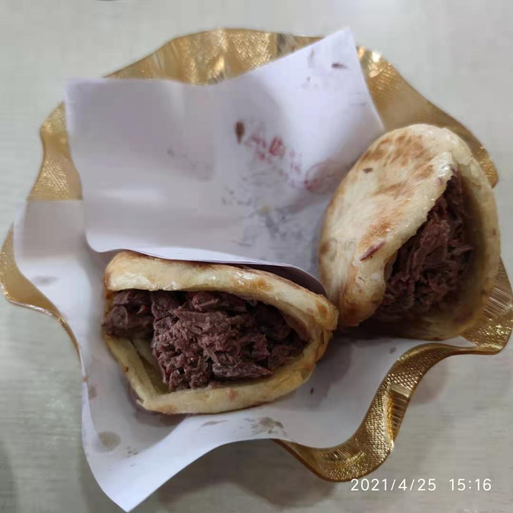
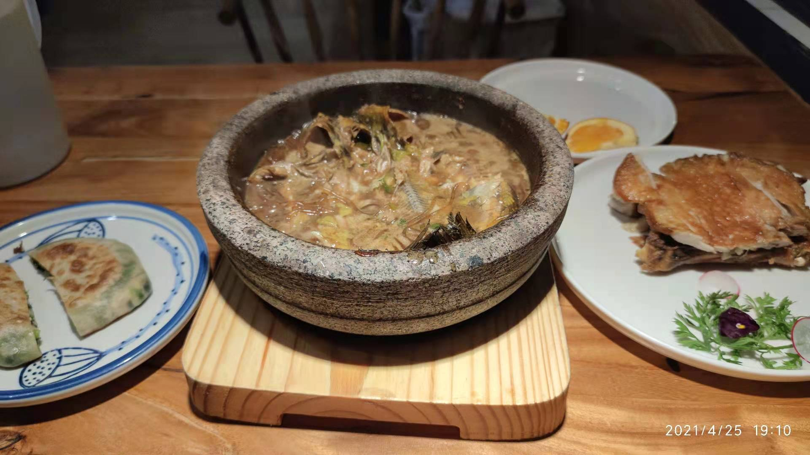

# 为了吃一个驴肉火烧，来到保定是什么体验

大家好，我是山月。我知道你们有问题问我。是，我还没有工作。

今天早上我驱车一小时赶到了保定，来尝试一下这里的驴肉火烧。

保定，就是那个当了几百年河北省会但最近不是河北省会的地方。

有人问我，你真只是为吃一个驴肉火烧吗，当然不，至少要两个。

刚下火车附近找地，按照大众点评走，结果吃了不太好吃的驴火。

要吃那种有肥有瘦、肉质细腻、方方长长的饼饼加了肥油的火烧。

罢罢罢，先回宾馆敲代码，明天早上另找一家驴肉火烧店尝一尝。

上一次来保定吃驴肉火烧是一八年，那时候我充实快乐精力旺盛。

第一天打早赶到保定吃了火烧、逛一圈直隶总督署找一酒店下榻。

第二天七点大巴到白洋淀，下午四点出租大巴公交高铁地铁回京。

而如今的我在保定，只有吃饭、酒店、遛弯、酒店、吃饭、遛弯。

说到吃饭，今晚又在号称炒菜界中的海底捞点了一个饼加两个菜。

一份白洋淀石锅嘎鱼和一份神仙鸡，话说白杨店里的鱼还真不错。

当然最后没吃完，但是我一贯勤俭节约不浪费，便打包带回酒店。

就差服务员在我对面抱了小熊，一个人吃饭总归有麻烦需要克服。

话说明天我去太原吃一碗刀削面一碗剔尖，想必这应该能吃完了。

晚安，祝各位大佬工作顺利、跳槽成功，并点赞再看转发和打赏。