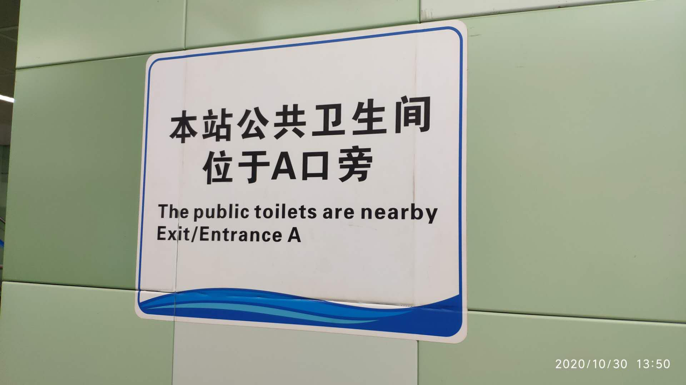
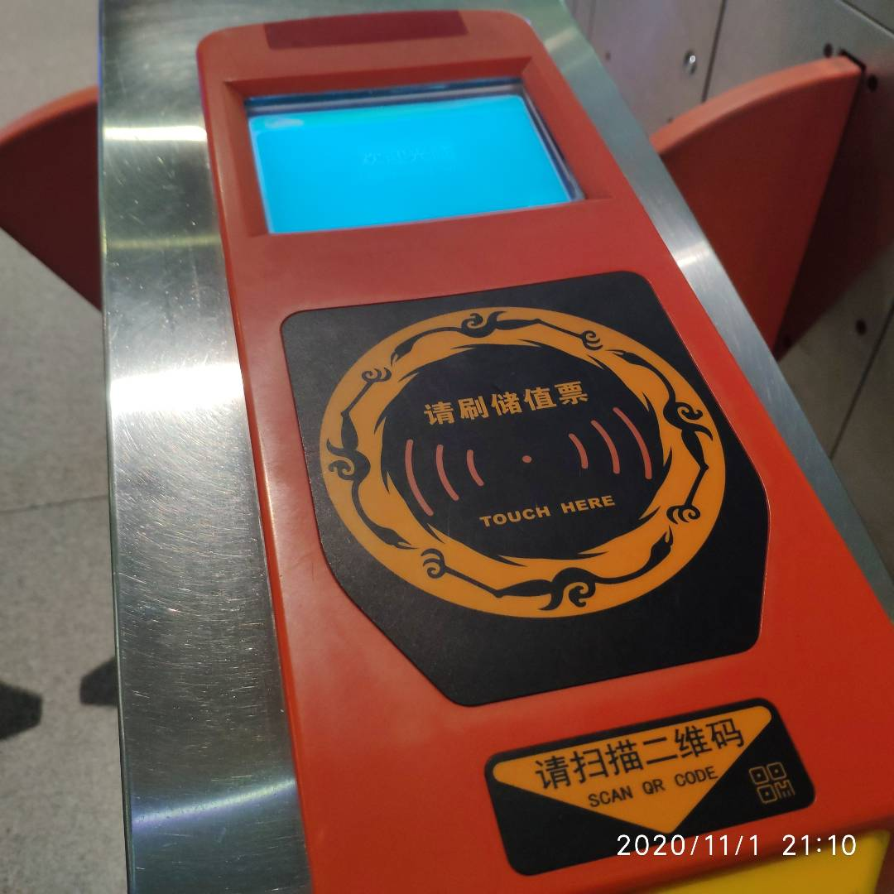
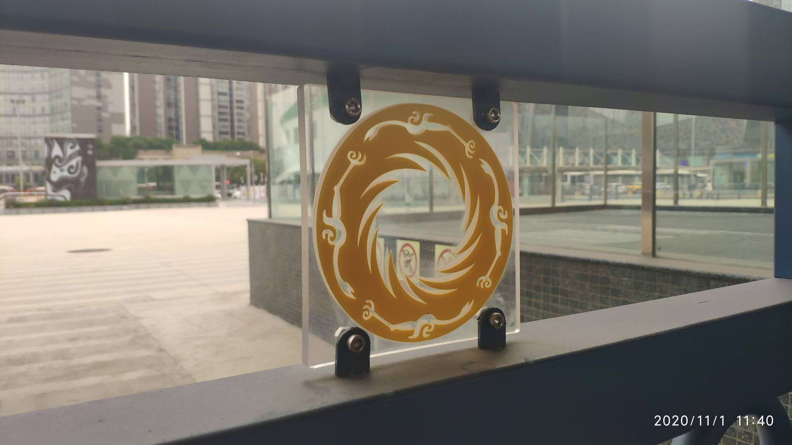

# 成都地铁与太阳神鸟

> 成都地铁标识的寓意是”巴山蜀水织锦绣“，恕我眼拙，这实在是看不出来...

## 卫生间

人有三急，三急并不可怕，可怕的是无地可寻与三急相应的配套设施。如果此时恰好碰到了地铁站，那便是万幸：地铁中总是有厕所。

我不远处就是地铁，眼里泛着希望，希望使人脚下敏捷。我匆匆下楼、刷卡、进站一气呵成，飞一般来到了地铁站厅中。

我在站厅中，望着左右两侧的指示牌，没有发现卫生间标志。然而我运气依然很好，我一下站厅，就在地铁的其中一侧，而这边没有厕所，如果厕所不在站厅的这一侧，那就会在另外一侧。我怀着心中的希望，飞快跑向对侧。

然而生活与经验欺骗了我，竟然会有地铁把厕所放到站外，这极大地开阔了我的视野颠覆了我的常识。

成都地铁站，除了卫生间可以拓展视野外，还有处处可见的太阳神鸟图案。如果你在成都坐过地铁，并足够细心，就会发现刷卡时的太阳神鸟图案。

## 太阳神鸟

进入成都地铁，仿佛置身于成都三千年前的金沙文明，处处可见太阳神鸟图案。铁栅栏、地铁站厅顶部、连各个地铁站口闸机的刷卡处也是太阳神鸟的图案。

电影哪吒中的结界兽这分明是对着三星堆的青铜人面具照着画的，而三星堆文化就发展在成都平原，金沙遗址属于晚期的三星堆文化。

成都市区锦江旁边的望江楼公园，以唐女诗人薛涛纪念馆和竹子而闻名，属于中国文化遗产。前几天去观景各式竹子时，景区门口赫然立着中国文化遗产的石碑，分明可见是太阳神鸟图案：太阳神鸟图案已经成为中国文化遗产的标志。

太阳神鸟金箔，出土于成都市区的金沙遗址，代表了商周之交的古蜀文明。两毫米的金箔材质，刚出土时还被揉作一团，**四只神鸟围绕着十二道光芒的太阳，是传说中的金乌负日**。独特的材质及图案，也使它成为了**全国一级文物并限制出国展出**。

> 太阳神鸟，由金沙遗址博物馆收藏，地铁可直达，门票八十元，实在囊中羞涩...

## 最后

如果你在成都还没有见过太阳神鸟，快来转转，毕竟一进地铁口就能看到。

另外，成都有哪些好吃的小吃？