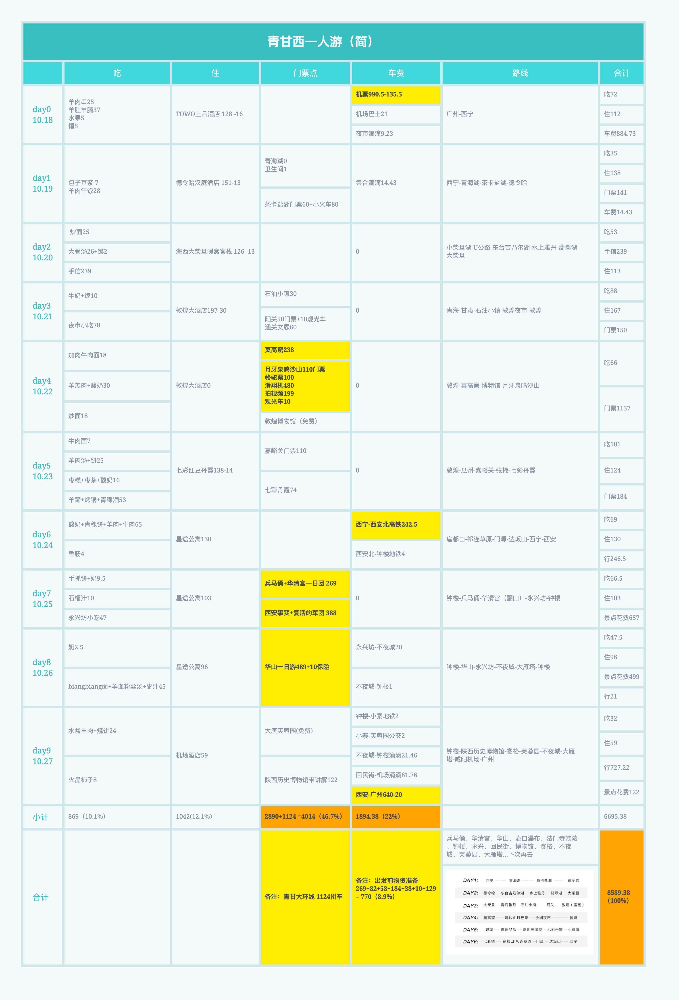
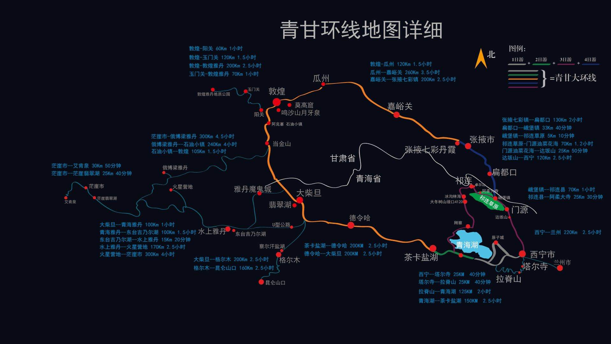

---
- date: 2020-11-10 22:17
- title: 山月的裸辞旅游：十天西北之行需要花费多少钱
- loc: 乐山大佛脚下
- spend: 3

--- 

# 十天的西北之行需要花费多少钱

自我裸辞之后，有很多人私信问起我这路上能花多少钱，也有很多私信的小伙伴响应我的号召，也开始了旅行。

我前往你去过的城市，沿着你的足迹，走着你走过的路。人生苦短，及时行乐。

我大概比较懒的，粉丝的详细费用清单与我差不多，我把它列出来，与我相比较，总结一番，见下图

## 概述

+ **总计: 8589.38**，日均 860
+ **景点: 4014**，日均 400
+ **交通: 1894**，日均 189
+ **住宿: 1042**，日均 104
+ **吃饭: 869**，日均 87

我与他的费用相比，吃饭会贵些，景点及交通费会便宜些，比如我没有做骆驼和滑翔机，也没有来回飞机票，大概在 7000 左右。

关于景点则是景点的西北大环线加两天的西安之行，大致如下

## 推荐

关于新疆、甘肃和西藏三地，我非常推荐西北大环线。

1. 这个星球上除了海洋以外的所有地形地貌，都在这条大环线上呈现：雪山，草原、湖泊、冰川、峡谷、沙漠、戈壁。
1. 没有高原反应，没有头痛欲裂，天朗气清，心情舒畅。
1. 河西走廊之地，连接中亚及欧洲的交通枢纽，沉重的历史感及汉唐强大的气息扑面而来。