---
- date: 2020-10-13 20:24
- title: 山月的裸辞旅游：在新疆有什么好吃的
- loc: 敦煌
- spend: 8

--- 

# 山月的裸辞旅游：在新疆有什么好吃的

新疆并不是刚开始就被叫做新疆的，在古时一般称作西域。近代时期，也就是晚清，左宗棠力排众议，矢志不渝，抬着自己的棺材就去收复新疆，开始建立新疆省。取其*他族逼处，故土新归*之意。

季羡林说过：世界上历史悠久、地域广阔、自成体系、影响深远的文化体系只有四个：*中国、印度、希腊、伊斯兰，再没有第五个；而这四个文化体系汇流的地方只有一个，就是中国的敦煌和新疆地区，再没有第二个。*

> 讲到这里，推荐季羡林作为总顾问的《敦煌》纪录片，在B站可以搜到，目前我正在看这部纪录片，为去莫高窟之前打好文化背景

张骞出使西域，考察得知西域有三十六国，如著名的楼兰古国便是其一。如今，三十六国的名字已经融入新疆的各个城市，如鄯善、高昌、且末、若羌、疏勒、轮台、于田等等。

由于历史的融合，民族的多样性，地理的独特条件，造就了新疆诸多美食。十月初，山月在新疆去了哈密、鄯善、吐鲁番、乌鲁木齐、昌吉等地，呆了十余天，真是不去新疆不知中国之美，不去新疆不知中国之大。神的后花园喀纳斯、巴音布鲁克大草原天鹅湖、帕米尔高原、大西洋的最后一滴眼泪赛里木湖，这些天堂般的景点，我一个都没有去...主要原因还是又远又偏又没车。

> 以下图片出自马蜂窝

山月在新疆的这十来天，主要就是吃了大盘鸡，辣子鸡，椒麻鸡，薄皮包子，烤包子，油塔子，米肠子，面肺子，面包羊腿，酥皮羊腿，羊羔肉，缸子肉，纳仁，汤饭，拌面，鸽捞面，抓饭，馕，胡辣羊蹄，丸子汤，卡瓦斯，红柳烤肉，烤羊肉串，黄面，吐鲁番焖饼，羊肉焖饼子等等等。嗯，不要问我体重！

这十天来几乎没有一天不在吃羊肉，也几乎没有一天不在吃烤包子，过油肉拌面、羊肉串、烤馕也最少两天吃一次。如今人在敦煌，党河边已经住了几天，望着满城的驴肉黄面及胡羊焖饼，十分怀念烤包子、肉馕、椒麻鸡以及过油肉拌面！

尽管如此，新疆的食物一般油重淀粉多，需要减肥或者饮食清淡的同志需要慎重来新疆！

## 烤包子

馅一般是烤包子，刚出炉热腾腾的烤包子吃起来最是好吃。刚进了新疆时，饭菜总是点多总是吃不完，一次打包回去了几个烤包子，第二天吃时已没有了第一天的香味。看来吃烤包子，就和出去旅游一样，时机很重要，旺季与淡季有截然不同的体验。

在新疆之前，北京的四通桥旁也吃过一次烤包子，往往去迟点到了六点后烤包子就已经卖光了。在店内做一个火坑就可以用来烤包子，撒上盐水，把捏好的包子贴在坑的内壁，盖上盖子，不过一会，热腾腾的烤包子就出炉了。

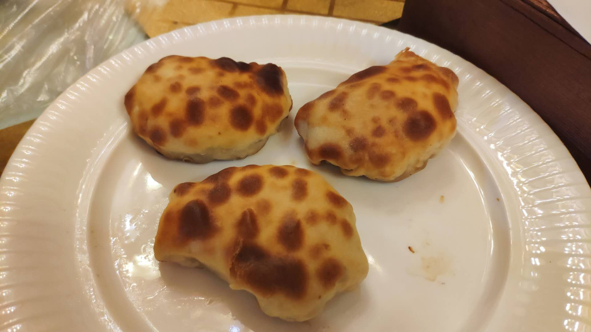

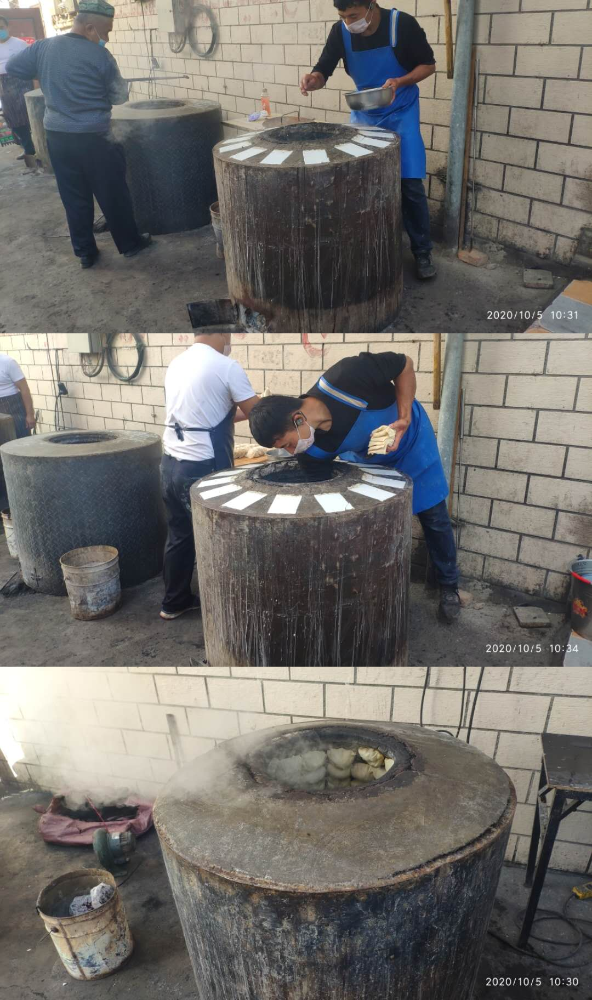

## 抓饭

碎肉抓饭，同样需要热腾腾的吃，一般分为羊腿抓饭和碎肉抓饭。抓饭，也是手抓饭，传统吃法是直接用手去抓着吃，不够现在一般都会用筷子及勺子。

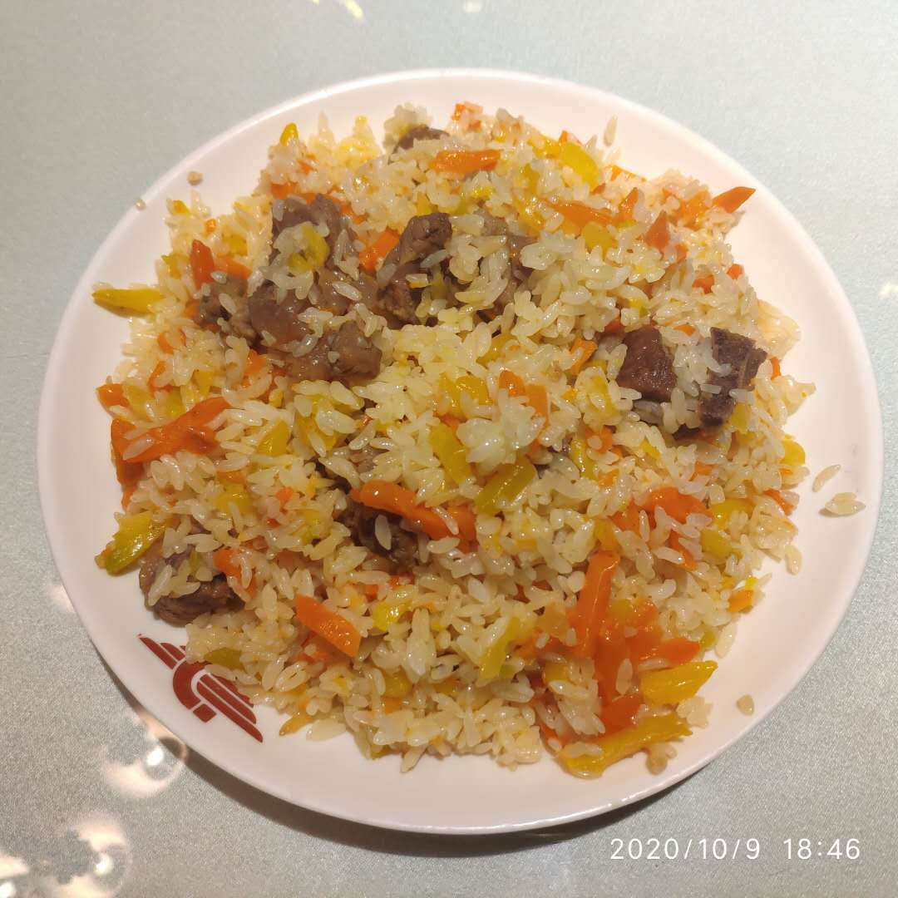

## 拌面

一碗韧性十足的面条，各式各样的一碗卤子，拌起来就构成了新疆的拌面，也叫拉条子。出了新疆来到敦煌前几天，吃了几次黄面，过于软过于嫩并不是很喜欢，于是又全城搜了一家拉条子面馆。

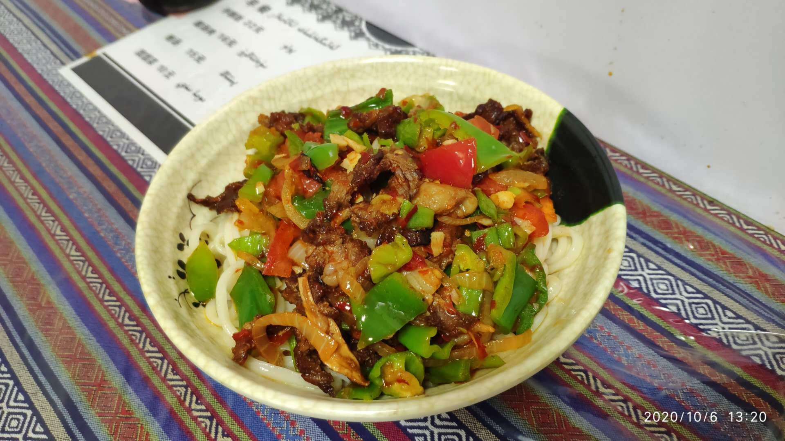

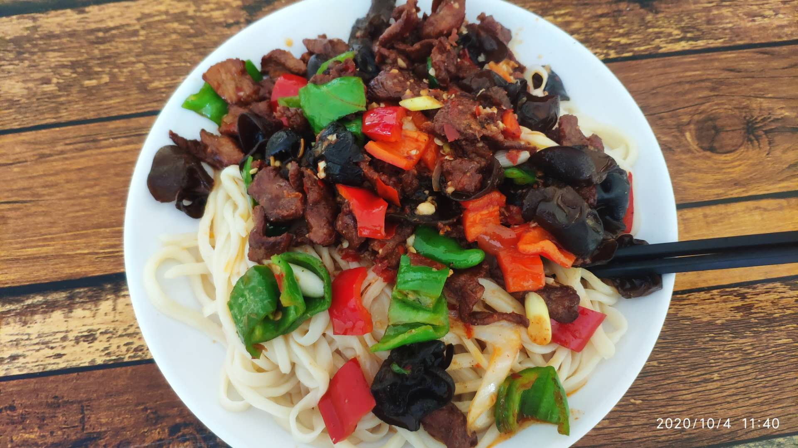

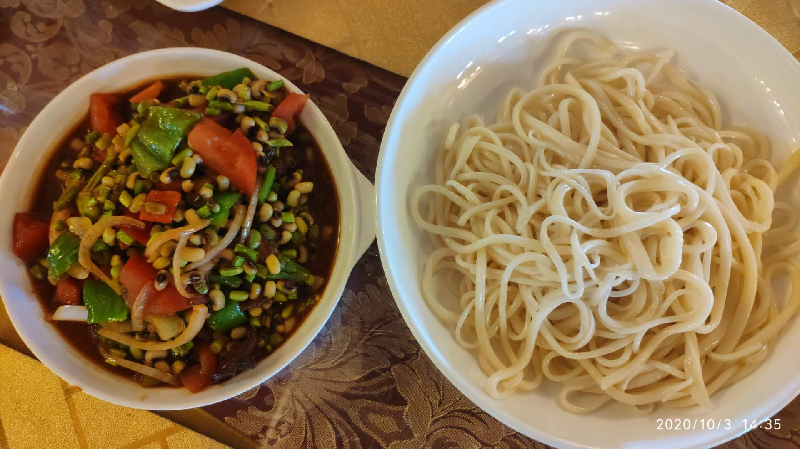

## 椒麻鸡

一般鸡肉来说会比较柴，印象中总是不好吃，不如猪牛羊肉，每次同学聚会，若点一个大盘鸡，最后肯定会把土豆块吃光，剩下一堆几块。对于鸡肉各地有各式的做法，如西安的葫芦鸡、新疆的大盘鸡和椒麻鸡，但只有椒麻鸡吃起来念念不忘。

新疆胖老汉的椒麻鸡远近闻名，纪录片中《新疆味道》关于椒麻鸡的制作都是取材于胖老汉

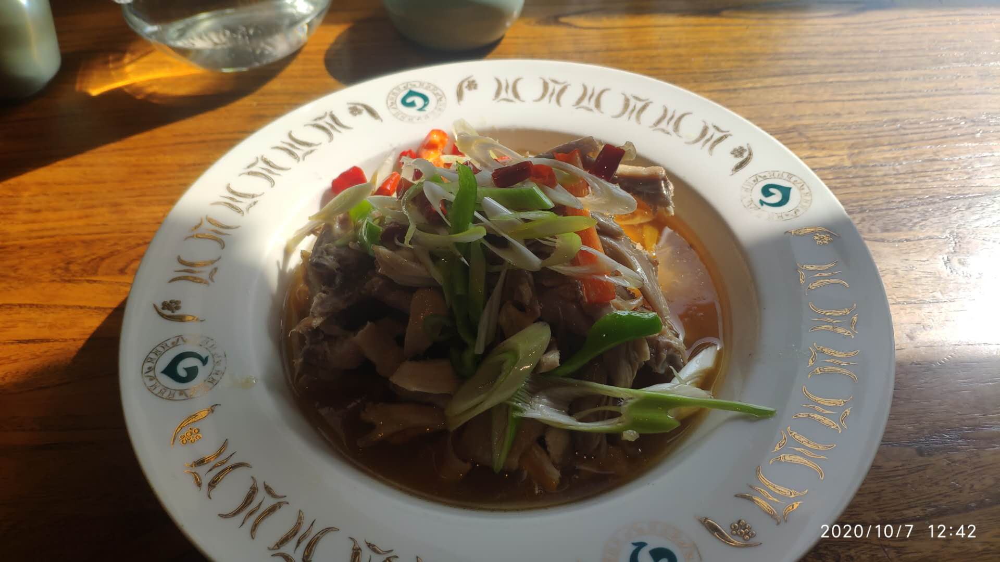

## 葡萄

> 新疆吐鲁番有个地方叫葡萄沟。那里出产水果。五月有杏子，七八月有香梨、蜜桃、沙果，到九十月份，人们最喜爱的葡萄成熟了。

> 葡萄种在山坡上。茂密的枝叶向四面展开，就像搭起了一个个绿色的凉棚。到了秋季，葡萄一大串一大串挂在绿叶底下，有红的、白的、紫的、暗红的、淡绿的，五光十色，美丽极了。要是这时你到葡萄沟去，热情好客的维吾尔族老乡，准会摘下最甜的葡萄，让你吃个够。

> 收下来的葡萄有的运到城市去，有的运到晾房里制成葡萄干。晾房修在山坡上，样子有点儿像碉堡。晾房的四壁留着许多小孔，里面有许多木架子。人们把成串的葡萄挂在架子上，利用流动的空气，使水分蒸发，晾成葡萄干。葡萄沟生产的葡萄干颜色鲜，味道甜，非常有名。

来葡萄沟的最大好处大概是让我知道了葡萄的诸多品种吧：无核白、绿香妃、红香妃、香妃王、黑美人、马奶子等等，葡萄干相比内地的也大很多。

来到吐鲁番也可以不去葡萄沟，周边的乡村遍地都是葡萄藤架，遍地也都是晾房。吐鲁番除了葡萄，还有火焰山，因此十分干燥，去之前做好特别特别干燥嗓子冒烟的准备。

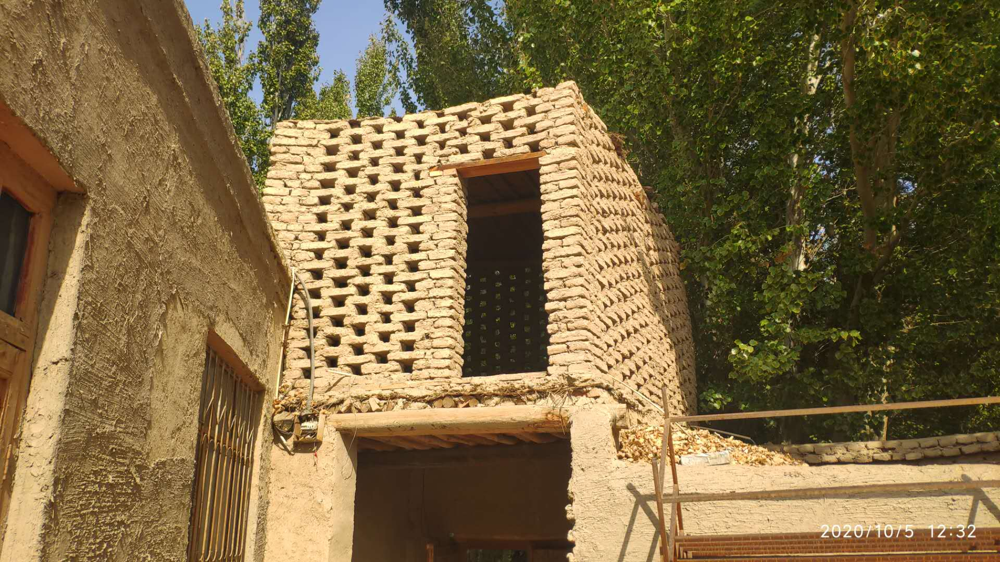

## 其它

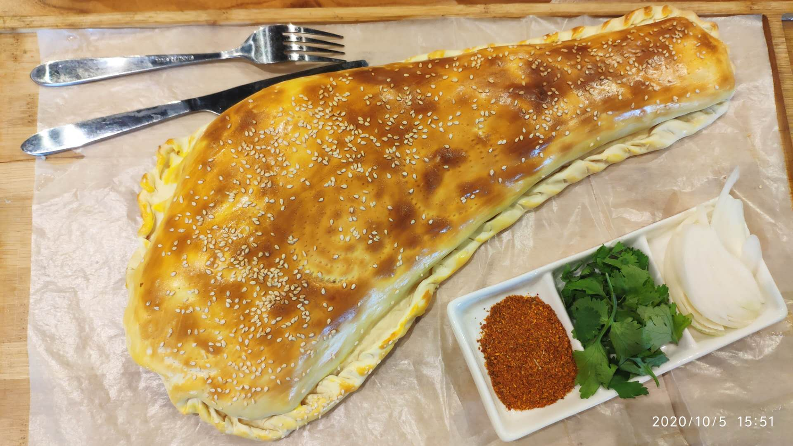

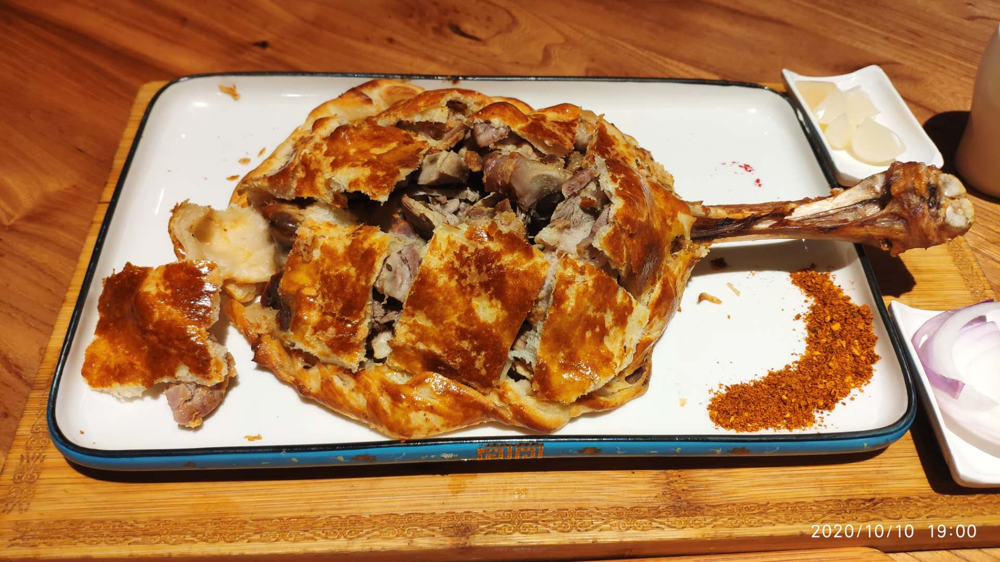

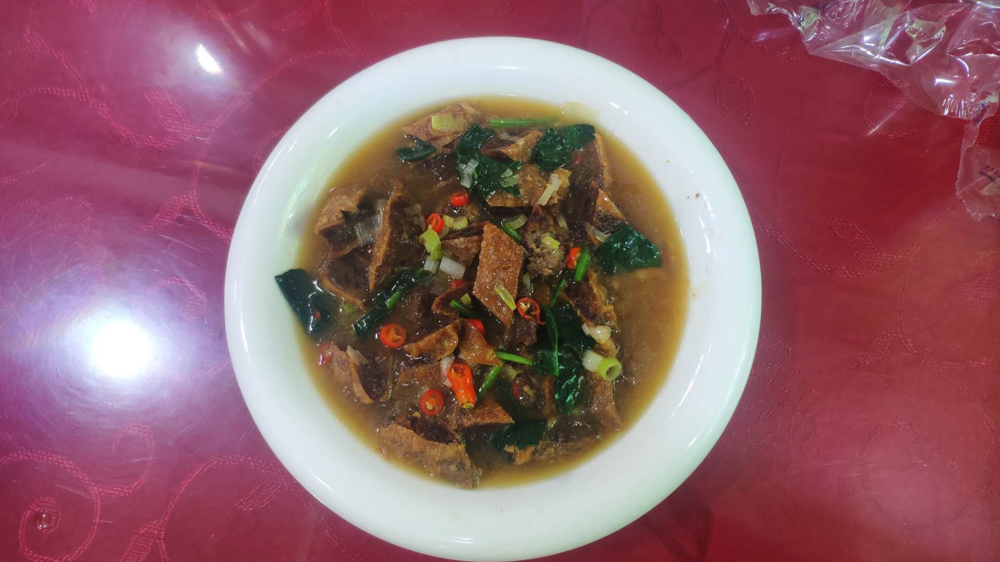

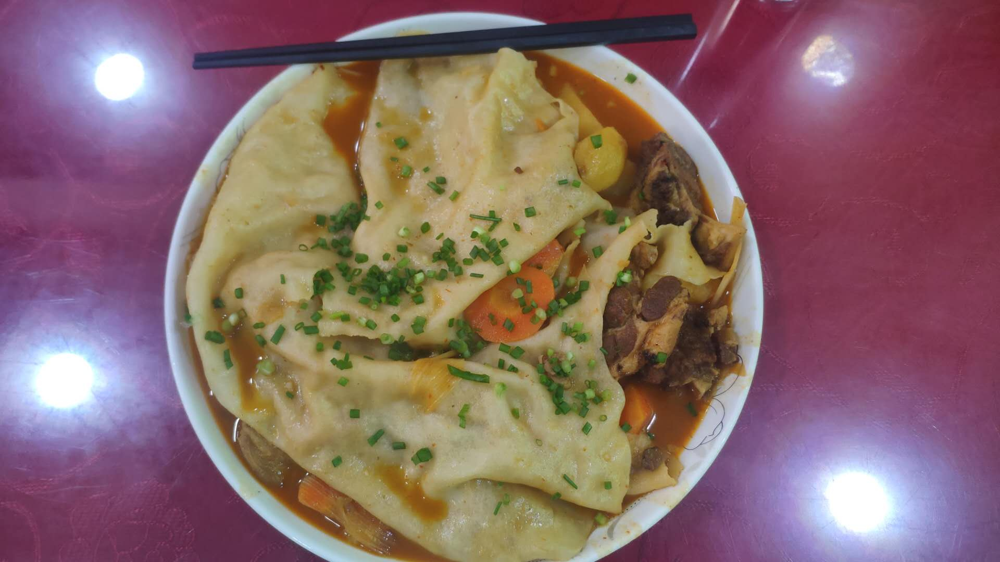

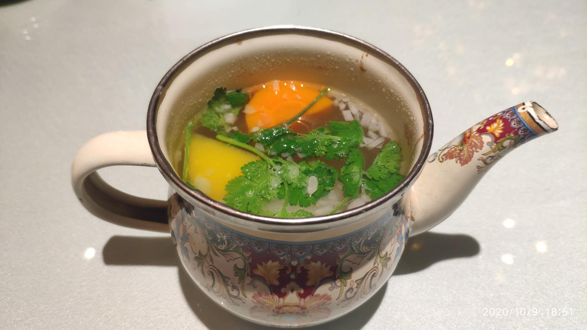

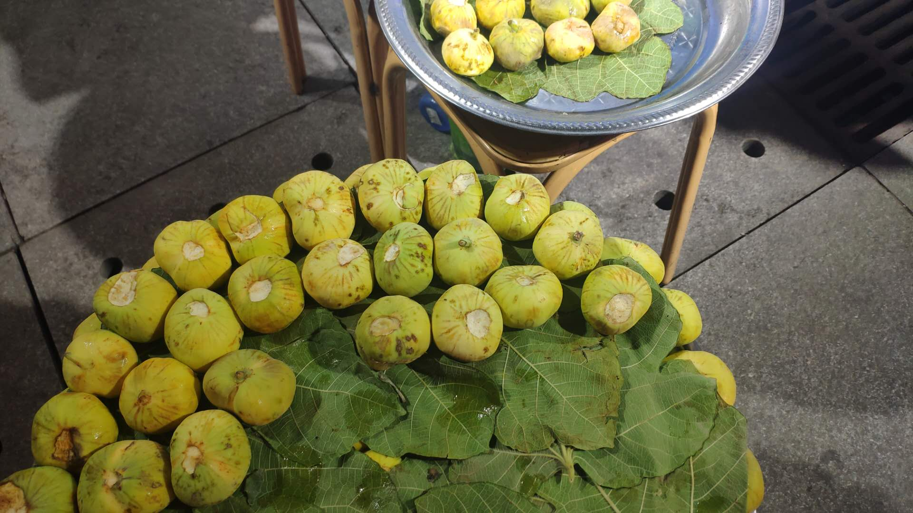

## 最后

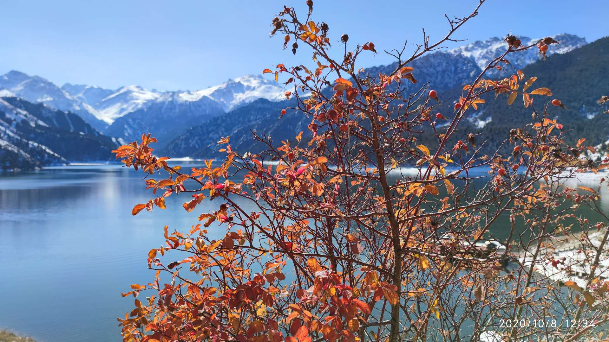

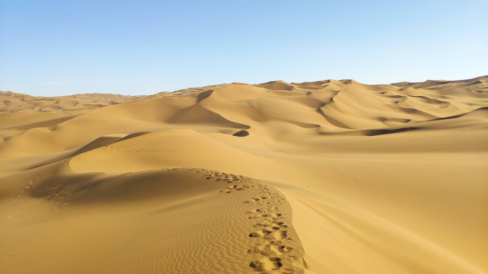

目前，新疆的大部分景点都已经免费，冬季也是旅游淡季人刚刚很少，喜欢旅游的人可以打飞的直接去新疆玩上几天。

南疆看风情，如果你想感受浓厚的异域风情，吃各种各样的民族没事，可以去南疆的喀什和田走一趟。
