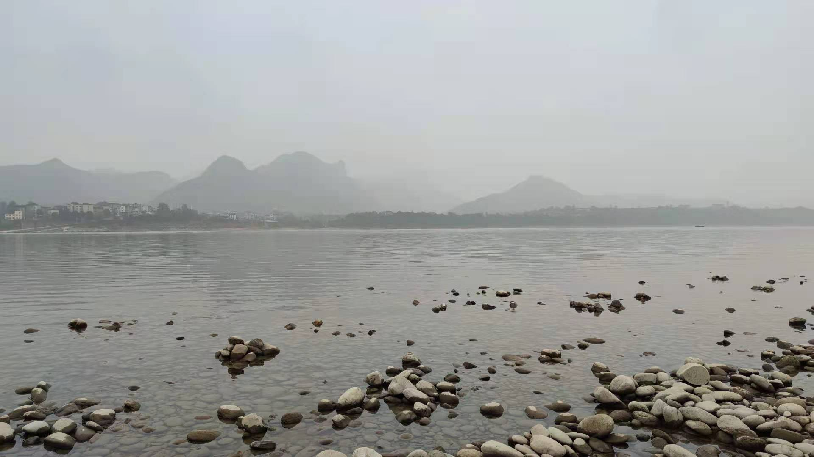
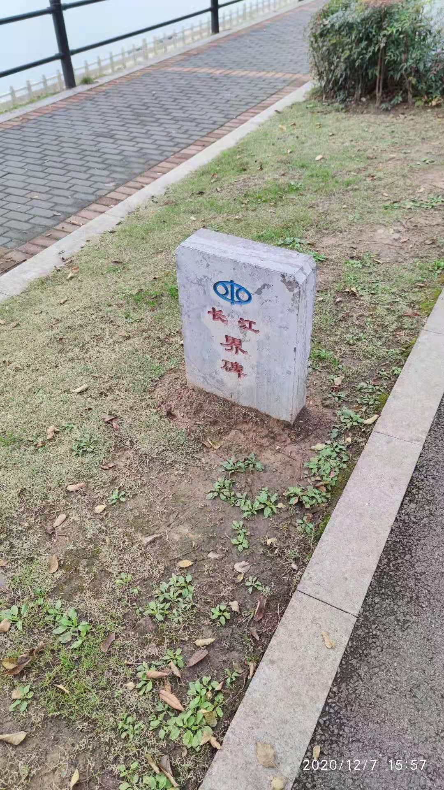
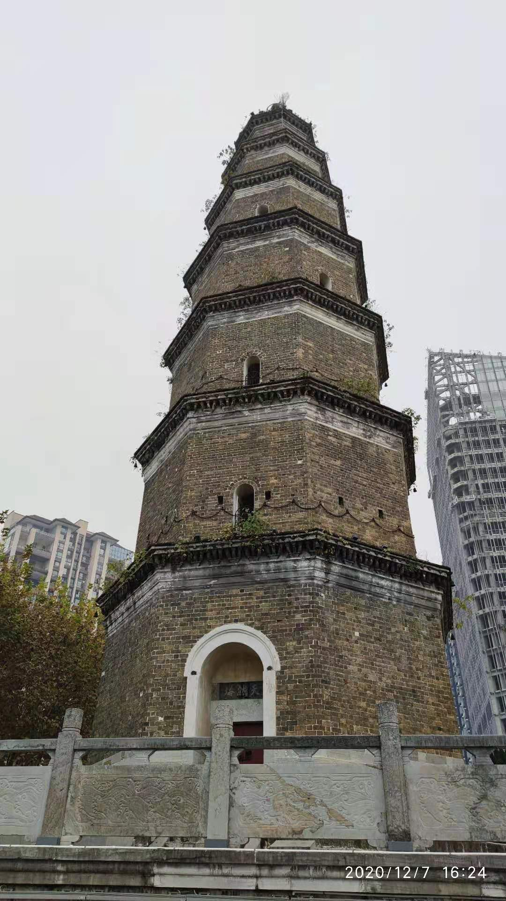
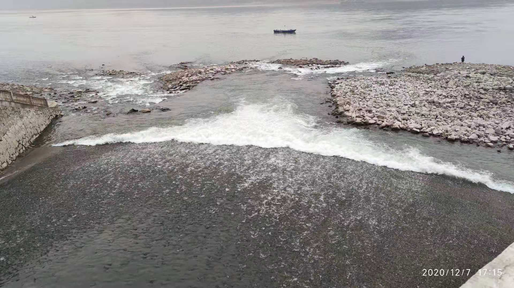
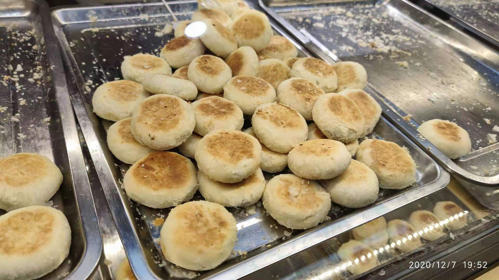

# 宜昌沿江行

十二月七号，宜昌沿江行，晚上下雨，有点小冷。

今天本来计划去宜昌博物馆转一圈，去看看沉底于长江三峡下数百万年的各式石头。被司机师傅载到门口，看到紧闭的大门后才意识到今天周一：博物馆往往在周一进行闭馆。

博物馆位于偏僻地界，附近无地可去，而长江在一公里外。索性沿长江岸看江看山看水看鸟，走一下午。黄昏时分下了雨，又冒雨走了半个小时，直到走到了市区万达广场。

长江上中下岸有多条人行步道，来来往往有行人散步、遛狗及跑步。长江对岸是山，山上有雾。

长江时有飞鸟略过，是白鹡鸰，白鹡鸰又叫点水雀，叫声与飞行轨迹很有特色。第一次见白鹡鸰就很兴奋，在四川广元的嘉陵江畔，也就是一两个月前，刚从大凉州武威赶到广元。后来才知道它是一种在南方很常见的鸟，如同在北京看到喜鹊一般。

> 以下白鹡鸰图片出自[鸟网](https://www.birdnet.cn/thread-806740-1-1.html)

此外，还有一种不知名尾巴略带黄色羽毛的麻雀般大小的雀儿，并未看清楚，也没有拍张照片。

**还有一个惊喜是老鹰，如果你从未看到过老鹰，可来宜昌长江边上一走，时时可看到长江上空盘旋的老鹰。**

走过高铁大桥时，会碰见一座塔：天然塔。天然塔的来头不小，它是*全国重点文物保护单位*。

> 天然塔相传为晋代大玄学家郭璞于西晋末侨居夷陵时修建。直至清乾隆五十五年(1790年)春，才由东湖县当时的士绅徐经业、王永言、卢鸿儒、覃永泰、张文学等10余人捐资重建天然塔，历时3年，终于建成。现存的天然塔便是清乾隆时这次重建的古建筑。

即将走到万达广场时，有一条小运河注入长江，虽然比不上岷江、嘉陵江这些大型支流，但身临其境，还是被浪涛声覆盖，颇为壮阔。

走到万达广场，吃了宜昌著名的矮子馅饼与萝卜饺子，坐上公交，结束了今天的旅程。

