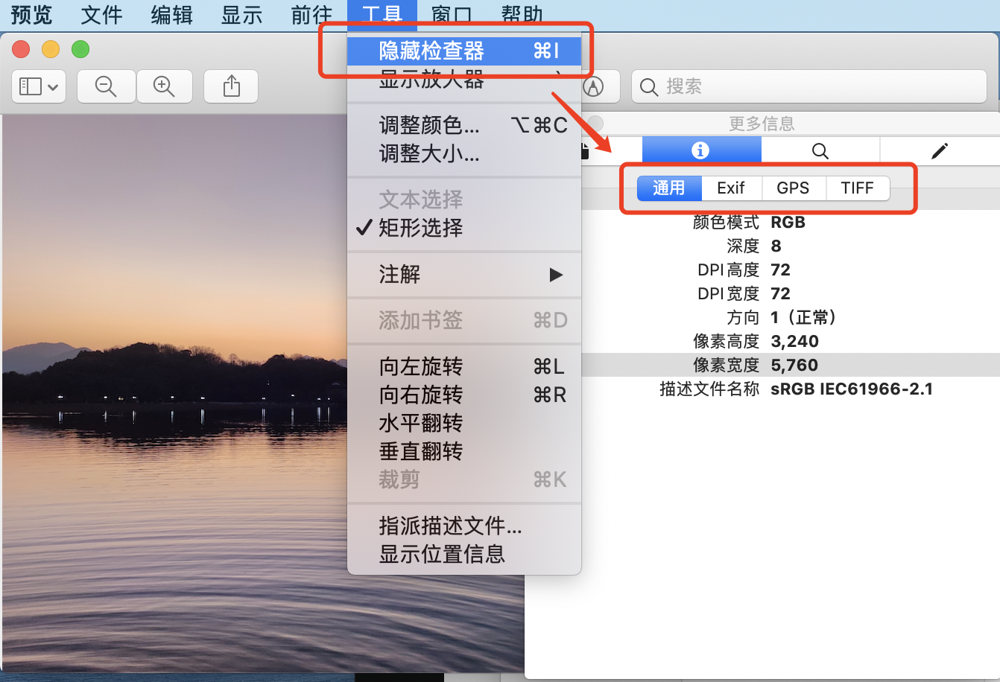

#  图片的 Metadata 与网站性能优化

当你拿出自己的智能手机，来一张美美的自拍时，这张自拍就包含了**拍摄时间、位置、机型信息、拍摄参数等等信息**，称作这个图片的 `Metadata`。越来越多的国产手机支持把 各式各样的 `Metadata` 作为水印，同时有一些产品根据这些信息制作水印相机。据说去年有个人开发者的水印小程序大火，山月也曾跃跃欲试去开发一个。嗯，跑远了...

由于位置信息可能泄露，把照片暴露在互联网存在安全性问题。由于有诸多信息隐藏在照片，比如 Thumbnail 等造成照片臃肿，据统计每张 JPEG 这种 15% 的体积就是 Metadata，因此它存在潜在的性能问题。

1. Performance: Metadata 占用过多的 JPEG 体积
1. Securty: Location 及机型信息泄露

以下图片是山月在杭州的苏堤拍摄，从中可以读取到拍摄时间及特别精准的经纬度，体积大小 6.83 Mb


## Metadata

首先看看有哪些 Metadata，以下是一张 JPEG 最主要的类型

+ `EXIF`: 主要是摄像设备的参数，如 ISO、焦距、快门时间、白平衡等等。由于 JPEG 主要由摄像设备提供，这也是 JPEG 中最主要的信息
+ `XMP`: XML stuff Adobe inserts into pics
+ `8BIM`: 使用 PhotoShop 处理过，会携带一些 PS 的信息
+ `IPTC`: 用户添加的信息
+ `ICC`: 色彩相关的信息

## EXIF 信息读取

> EXIF(Exchangeable Image File format)是可交换图像文件的缩写，是专门为数码相机的照片设定的，可以记录数码照片的属性信息和拍摄数据。EXIF可以附加于JPEG、TIFF、RIFF、RAW等文件之中，为其增加有关数码相机拍摄信息的内容和索引图或图像处理软件的版本信息。

EXIF 是 Metadata 中最重要的信息，如何设计一个读取 `EXIF` 信息的网站呢？传统方案在服务端进行。后端解析图片二进制数据，并向外提供 API，同时为了避免大流量的恶意访问及价格策略，会配置 RateLimit 及 Auth 等等。但作为网络传输，如果网站位于境外，加之过大的图片体积，极有可能延迟过大。

现代方案可在浏览器端进行，天然的分布式解决方案，不怕大量的访问量，也不用维护服务器，没有网络的传输，解析速度更快，用户也无文件隐私问题。

作为一名合格的 CV 工程师，当然要面向 Github 编程，毕竟离开了它可能一行代码都敲不了，以下是关于读取 Exif 信息的几个仓库。阅读源码，对于理解 JPEG 及 EXIF 格式都极有裨益

两个前端的仓库:

1. [Javascript-Load-Image](https://github.com/blueimp/JavaScript-Load-Image): 4K Star，周 200K Download
1. [exif-js](https://www.npmjs.com/package/exif-js): 周 86K Download

三个后端的仓库:

1. [exif reader](https://github.com/devongovett/exif-reader): 97 Star，周 3K Download, Node
1. [metatdata extractor](https://github.com/drewnoakes/metadata-extractor): 1.8K Star, Java
1. [goexif](https://github.com/rwcarlsen/goexif): 464 Star, Go

一个命令行工具:

1. [exiftool](https://github.com/exiftool/exiftool): 753 Star, Perl

## Metadata 信息读取可视化工具

为了对 JPEG 图片中的 Metadata 信息有一个大概的初步印象，可以下载本篇文章开头的那张照片，并且使用以下方式可视化查看:

Mac笔记本:



可视化网站:

+ [EXIF 可视化工具](https://devtools.tech/exif)
+ [metapicz](http://metapicz.com/)
+ [jimpl](https://jimpl.com/)

命令行工具:

``` bash
$ brew install exiftool
$ exiftool ../Desktop/WechatIMG12.jpeg 
ExifTool Version Number         : 11.85
File Name                       : WechatIMG12.jpeg
Directory                       : ../Desktop
File Size                       : 9.3 MB
File Modification Date/Time     : 2021:01:14 15:29:32+08:00
File Access Date/Time           : 2021:01:18 23:04:18+08:00
File Inode Change Date/Time     : 2021:01:18 22:28:52+08:00
File Permissions                : rw-------
File Type                       : JPEG
File Type Extension             : jpg
MIME Type                       : image/jpeg
ISO                             : 50
...
```

## Metadata 信息读取原理

读取 JPEG 图片的 Metadata 信息，就要了解并解析 JPEG 的二进制格式。**JPEG 由许多 `Segement` 组成，而每个 `Segement` 以 `Marker` 打头，每一个 `Marker` 以字节 `0XFF` 打头。**

其中每一个 JPEG 图片以 SOI (Start Of Image) 开头并 EOI (End Of Image) 结尾。即每一个 JPEG 图片的前两个字节是 `0XFFD8`，最后两个字节是 `0XFFD9`。

| Short Name | Bytes | Payload | Name | Comments |
| --- | --- | --- | --- | --- |
| SOI | 0xFF, 0xD8 | none | Start of Image |  |
| S0F0 | 0xFF, 0xC0 | variable size | Start of Frame |  |
| S0F2 | 0xFF, 0xC2 | variable size | Start fo Frame |  |
| DHT | 0xFF, 0xC4 | variable size | Define Huffman Tables |  |
| DQT | 0xFF, 0xDB | variable size | Define Quantization Table(s) |  |
| DRI | 0xFF, 0xDD | 4 bytes | Define Restart Interval |  |
| SOS | 0xFF, 0xDA | variable size | Start Of Scan |  |
| RSTn | 0xFF, 0xD//n//(//n//#0..7) | none | Restart |  |
| APPn | 0xFF, 0xE//n// | variable size | Application specific |  |
| COM | 0xFF, 0xFE | variable size | Comment |  |
| EOI | 0xFF, 0xD9 | none | End Of Image |  |

其中的 `AppN` Segement 中，包含了图像的 EXIF 信息，解析 EXIF 格式如下:

## Metadata 信息去除

根据文章 [Impact of metadata on Image Performance](https://dexecure.com/blog/impact-of-metadata-on-image-performance/)，Metadata 信息会占到一个图片大小的 15%，不可不忽略，且藏有设备信息及位置信息等敏感信息。

通过对 JPEG 中 Metadata 信息的抹除，可以对图片大小及网络性能起到一个不错的优化:
## 参考链接

1. [An Overview of Image Metadata - How It Affects Web Performance and Security](https://www.keycdn.com/blog/image-metadata)
1. [Impact of metadata on Image Performance](https://dexecure.com/blog/impact-of-metadata-on-image-performance/)
1. [JPEG文件格式解析(一) Exif 与 JFIF](https://cloud.tencent.com/developer/article/1427939)
1. [What is a JPEG file?](https://docs.fileformat.com/image/jpeg/)
1. [What is an EXIF file?](https://docs.fileformat.com/image/exif/)
1. [Exif - wikipedia](https://en.wikipedia.org/wiki/Exif)
